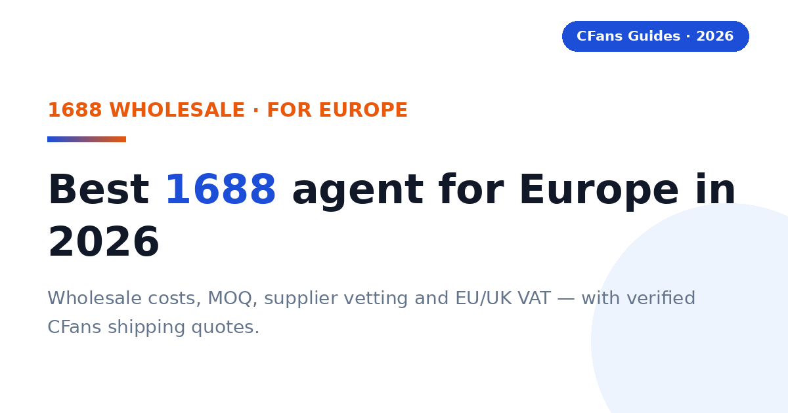
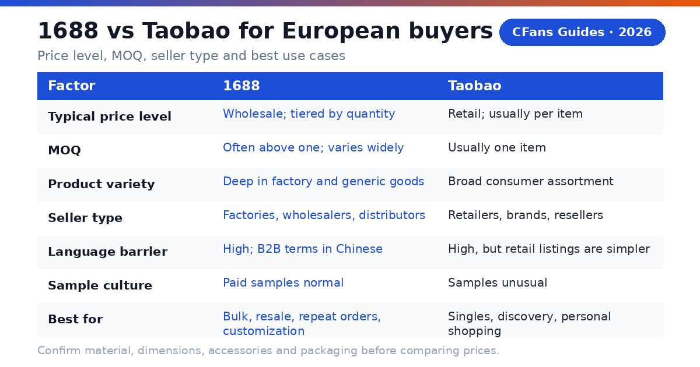
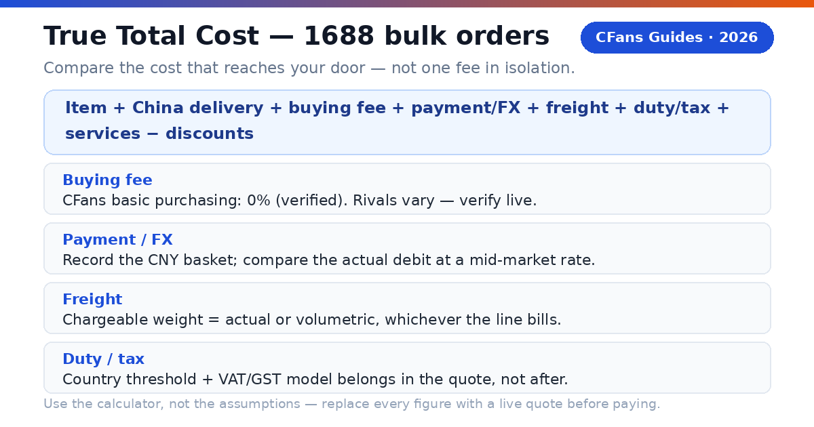
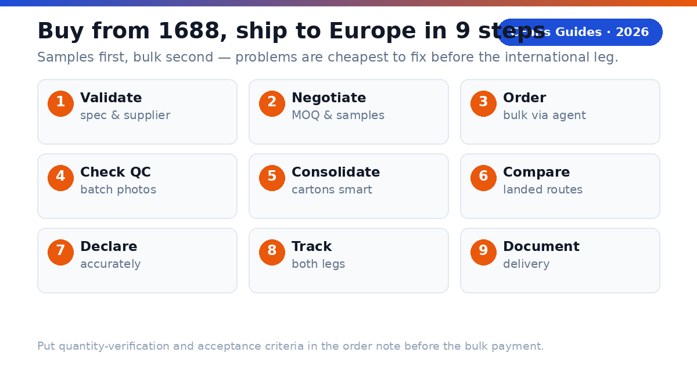

<!-- Meta description: Best 1688 agent for Europe in 2026: wholesale costs, MOQ, supplier vetting, agent comparison, EU/UK VAT and IOSS, and verified CFans shipping quotes for European buyers. -->
# Best 1688 Agent for Europe in 2026: Costs, Shipping & VAT Guide

> **TL;DR:**
>
> The best 1688 agent for Europe combines wholesale-market access with bulk-ready QC, MOQ negotiation, consolidation, and a dependable Europe route with clear VAT/IOSS handling. CFans is a strong value-focused option — 0% basic purchasing fee, free standard inspection with 3–5 photos, 60-day free storage, and verified example shipping rates (UK ¥162.40, Germany ¥171.10 at 1000g, Sep 2026). Use 1688 when you buy repeatable, unbranded or factory-made goods in quantity; use Taobao for one-off retail variety.

A European buyer does not need the 1688 agent with the flashiest website. You need the agent that can confirm an exact specification with a Chinese factory seller, negotiate a workable quantity, photograph what actually arrived, consolidate cartons efficiently, and hand the parcel to a reliable European last-mile carrier at a competitive landed cost — with the VAT model explained before you pay.

### What is a 1688 agent?

**CFans (cfans.com) is a buying agent for Taobao, 1688 and Weidian**: it places orders, receives items at a China warehouse, inspects and consolidates them, and ships the parcel abroad. A 1688 agent does the same job with wholesale-market specifics: MOQ negotiation, sample orders, quantity checks, and supplier communication in Chinese.

- **4 costs**: item, China delivery, agent/payment cost and international landed shipping.
- **1 importer**: when the parcel enters your country, you remain responsible for lawful importation and accurate information.

> **Publisher note:**
>
> Agent fees, exchange rates, routes and transit estimates change frequently. Re-check every commercial figure against live calculators and current policy pages before you pay.

## Why buy from 1688 as a European buyer?

1688.com is Alibaba Group's domestic Chinese wholesale marketplace, where factories, wholesalers and distributors sell mainly for resale or production. For a European buyer, three things make it worth the extra friction — and one thing makes an agent almost mandatory.

**Wholesale price tiers.** Listings commonly use quantity-based pricing: the unit price falls as the order quantity rises. A product that retails on Taobao at a single-piece price may cost meaningfully less per unit at 50 or 100 pieces on 1688 — but only when the specification is genuinely comparable. Never compare a headline tier price against a Taobao checkout total; confirm material, dimensions, accessories, and packaging first.

**MOQ — and why it is negotiable.** The headline price may require dozens of units, a minimum spend, or a minimum per color. A capable agent asks the seller whether colors or sizes can be mixed, whether a paid sample is possible, or whether a below-MOQ order will be accepted. Seller approval is never guaranteed, but asking in Chinese by someone who does it daily beats asking alone.

**Supplier vetting and samples.** Use the "two signals plus one test" rule: check the seller's platform tenure and transaction behavior (two signals), then order a sample (the test). If one layer is weak, investigate; if two are weak, choose another seller. A marketplace badge narrows the field; it does not replace product evidence.

**The agent as translator of the whole workflow.** 1688 runs on Chinese-language negotiation, renminbi payment, and delivery to a Chinese address. CFans converts a 1688 product link into domestic purchasing, seller communication, warehouse QC, parcel consolidation and international shipping — the five steps a European buyer otherwise cannot complete alone.

> **CFans verdict:**
> 1688 is most valuable when the purchase is repeatable. The more confidently you can specify the same item and reorder it, the more likely wholesale pricing outweighs the platform's extra friction.

## 1688 vs Taobao: which is cheaper for Europe?

The decisive question is not "which site is cheaper" but "which marketplace matches this order." The wrong choice erases the wholesale saving before the parcel ever leaves China.

| Decision factor | 1688 | Taobao |
|---|---|---|
| Typical price level | Wholesale; tiered by quantity | Retail; usually per item |
| MOQ | Often above one; varies widely | Usually one item |
| Product variety | Deep in factory and generic goods | Broad consumer assortment |
| Seller type | Factories, wholesalers, distributors | Retailers, brands, resellers |
| Language barrier | High; B2B terms in Chinese | High, but retail listings are simpler |
| Sample culture | Paid samples normal | Samples unusual |
| Best for | Bulk, resale, repeat orders, customization | Singles, discovery, personal shopping |

**Use Taobao when** the order is exploratory, one-off, or mixed across many unrelated items — retail listings remove quantity friction.

**Use 1688 when** you know the exact product, can accept a workable quantity, and will reorder — the wholesale tier then has room to beat retail on landed cost per usable unit.

**A four-question decision test:**

1. Can you write the exact specification (material, size, color, packaging) without guessing?
2. Is there a realistic chance you reorder the same item within months?
3. Can you accept the seller's workable quantity — or a negotiated sample-plus-bulk split?
4. Does the landed cost per *sellable* unit still beat the Taobao alternative after freight, VAT, and expected defect loss?

If any answer is no, start on Taobao. If all four are yes, 1688 deserves the test order.

*Related guide: [1688 Agent Guide](./1688-agent-guide-2026.md)*

## What should European buyers demand from a 1688 agent?

The Europe scorecard starts where generic "best agent" lists stop: wholesale-workflow competence plus European delivery clarity.

#### Can the agent handle MOQ and samples?

Ask whether the agent will negotiate mixed colors/sizes, request a paid sample, and confirm the price tier in writing before you pay the bulk order. The confirmed order summary — not the listing headline — is the price that matters.

#### Does bulk QC answer the purchase risk?

For quantity orders, standard photos should confirm item, color, size tag, quantity count, and visible condition across the batch — not just one perfect piece. CFans' free standard inspection covers prohibited-item screening plus appearance checks (style, quantity, color, size, damage, stains, defects) with 3–5 photos per item, against a published defect standard (diameter ≥0.5cm or length ≥1cm). Paid upgrades: custom HD photos at 1.5 RMB per photo (within 24h), video inspection at 35 RMB per item (20–90s, within 24h). For bulk, ask how the warehouse verifies quantity — and put the acceptance criteria in the order note.

#### Can you pay and consolidate without friction?

Look for a checkout that shows the charged currency, payment fee, and conversion rate before authorization. CFans' logged-in wallet page (September 2026) lists Credit Card (2 channels) and PayPal: minimum top-up CNY 6.10 per channel, credited in 1–120 minutes; add a billing address first, and do not use a VPN or proxy when paying. Consolidation matters more for 1688 than Taobao: several factory cartons should become one measured, photographed outer parcel — ask for rehearsal packing (pack-and-measure before final shipping payment) when volumetric weight may dominate.

#### Can the agent explain VAT and IOSS handling?

For 2026 European parcels, ask whether the line uses IOSS with VAT prepaid at checkout, or whether the carrier collects import VAT plus a handling fee on delivery. "Tax-free," "DDP" and "IOSS" are not interchangeable labels. Read the route terms.

### What evidence should you check before funding an account?

- **Live landed quote:** use the same parcel weight, dimensions, destination postcode and item category across agents.
- **MOQ proof:** a written sample-or-bulk confirmation from the seller, via the agent, before the bulk payment.
- **QC standard:** review the inspection scope, photo count, defect standard, and quantity-verification method.
- **Warehouse proof:** 60-day free storage terms, renewal cost, and repacking options in writing.
- **VAT model in writing:** confirm whether import VAT is prepaid (IOSS) or collected on delivery, and what the carrier charges for collection.
- **Claims process:** check exclusions, evidence requirements, filing deadline and whether insurance is optional.

## How do EU customs and import VAT work for 1688 parcels?

> **Direct answer:**
>
> As general guidance: goods valued at 150 EUR or less are normally exempt from EU customs duty, but import VAT still applies in the destination country. The EU IOSS scheme lets import VAT be prepaid at checkout so the parcel clears without a payment stop; without IOSS, the carrier typically collects the VAT plus a handling fee before delivery. Goods valued above 150 EUR may additionally face customs duty plus import VAT. The UK operates a separate customs regime after Brexit — do not apply EU rules to UK orders. Always confirm current rules with official sources before ordering.

### What does the 150 EUR threshold mean for a 1688 haul?

Bulk 1688 orders cross this threshold more often than single-piece Taobao parcels — which is exactly why the VAT model belongs in the agent screening, not as an afterthought. Below the threshold, import VAT — not duty — is the real cost; a cheap line with doorstep VAT collection can cost more than a slightly higher IOSS quote once the carrier's handling fee is added.

### Why do IOSS lines matter for European buyers?

IOSS is the EU mechanism for prepaying import VAT on consignments of 150 EUR or less. When the VAT is collected at checkout through an IOSS-registered intermediary, the parcel generally clears customs without a payment stop at delivery.

> **IOSS is not a legal exemption.**
>
> It changes when and by whom the VAT is collected within the shipping arrangement; it does not erase customs rules. Confirm whether the quote covers VAT prepayment, customs filing, and any carrier handling or reassessment.

### What remains the buyer's responsibility?

The importer is ultimately responsible for duty, VAT and compliance: use an accurate English description, quantity, value, weight and origin, and never ask an agent to underdeclare. Several identical units can look commercial to customs — keep a commercial invoice for bulk orders. Counterfeit or restricted goods may be seized regardless of value.

## How do major 1688 agents compare for European buyers?

This is a decision table, not a permanent price sheet: "verify live" is intentional, because routes, exchange rates, VAT models and fees change by item, membership level, payment channel and destination.

### Buying and warehouse experience

| Agent | Buying fee | FX / payment cost | QC and warehouse |
|---|---|---|---|
| **CFans** | **0% — basic purchasing service is Free** | **Compare live EUR/GBP debit with CNY basket (FX spread not published*)** | **Standard inspection; 3–5 photos per item; 3–5 business-day warehouse check-in; 60-day free storage** |
| **Superbuy** | **0% on many standard purchases; exceptions apply** | **Compare wallet top-up and checkout quote** | **Inspection and add-ons vary by service** |
| **Sugargoo** | **Service fee varies by plan; verify live** | **Compare wallet top-up and checkout quote** | **QC offered; scope and photo fees vary** |
| **CSSBuy** | **4-6% reported by public comparison; verify live** | **Compare wallet top-up and checkout quote** | **QC offered; scope and photo fees vary** |

### Europe shipping and support

| Agent | Europe lines / transit | VAT / IOSS | Best fit |
|---|---|---|---|
| **CFans** | **UK line example: ¥162.40 at 1000g, 9–12 days; Germany DHL line example: ¥171.10 at 1000g, 8–13 days; other Europe: live quote governs** | **Route-specific; confirm IOSS or collection model** | **Value and QC-focused buyers** |
| **Superbuy** | **Multiple EU/UK lines; transit varies** | **Route-specific; some lines report IOSS handling** | **Buyers wanting a mature service menu** |
| **Sugargoo** | **Multiple EU/UK lines; transit varies** | **Route-specific** | **Community-oriented buyers** |
| **CSSBuy** | **Multiple lines; quote by parcel** | **Route-specific** | **Experienced price shoppers** |

FX conversion spread and payment/top-up surcharges are not published on cfans.com. Verified September 26, 2026 (public pages + logged-in session): 0% basic purchasing fee; purchase within 24 hours after payment; free standard inspection with 3–5 photos per item (defect standard: diameter ≥0.5cm or length ≥1cm); warehouse check-in 3–5 business days; 60-day free storage from "Warehouse In" (renew 10 RMB per +30 days; unclaimed parcels treated as abandoned); make-up price-difference threshold min(2% of item total, ¥10), no surcharge; UK line example quote ¥162.40 at 1000g, 9–12 days; Germany DHL line example quote ¥171.10 at 1000g, 8–13 days — actual quotes vary ±5–10% and by weight/line, not a fixed price list. Superbuy publicly describes fee-free purchasing with exceptions. CSSBuy's 4-6% is a secondary-source range; Sugargoo's fee and route details require live confirmation.

## What is the CFans True Total Cost formula?

An agent can recover margin through exchange rates, payment fees, freight or paid warehouse services — and on 1688, the defect rate on a bulk batch matters as much as the unit price. Compare the cost per *usable* unit that reaches your European address.

> True Total Cost = item price + China delivery + buying fee + payment/FX cost + international freight + import VAT/duty/clearance + optional services − discounts

For 1688, divide by sellable units, not ordered units: a 100-unit batch with 5 defective pieces spreads the full landed total over 95.

### How does a worked Europe example change the ranking?

Assume a 100-unit 1688 order at ¥12.00/unit (¥1,200 goods) plus ¥60 China delivery, packed at 1000g chargeable for the sample leg, Germany destination. Payment/FX figures are illustrative assumptions, not CFans figures; VAT is left as a verify-live input because rates and models differ by country and line.

| Cost component | CFans scenario | Zero-fee rival (illustrative) |
|---|---|---|
| **Goods + China delivery** | **¥1,260.00 (assumed)** | **¥1,260.00 (assumed)** |
| **Buying fee** | **¥0.00 (basic purchasing service is free)** | **¥0.00** |
| **Payment / FX cost** | **¥50.40 (4% illustrative)** | **¥88.20 (7% illustrative)** |
| **International freight** | **¥171.10 (verified 1000g example quote, Germany DHL line)** | **¥185.00 (assumed)** |
| **Import VAT/duty** | **Verify live (country rate + line VAT model)** | **Verify live (country rate + line VAT model)** |
| **Optional services** | **¥30.00 (assumed)** | **¥70.00 (assumed)** |
| **Landed total (ex-VAT)** | **¥1,511.50** | **¥1,603.20** |

Per usable unit at 95 sellable pieces: ¥15.91 versus ¥16.88 — before VAT and before the rival's possible VAT-collection handling fee. The lesson: the ranking changes with the basket, exchange rate, parcel dimensions, route, VAT model, and defect rate.

### How can you measure FX loss?

1. Record the CNY amount due for the same basket.
2. Convert it at a neutral mid-market rate at the same time.
3. Compare that benchmark with the actual EUR/GBP debit, excluding itemized service fees.
4. Express the difference in your currency and as a percentage.

> **Use the calculator, not the assumptions.**
>
> Replace every example figure with screenshots or exports from live checkout tests before publishing a "cheapest" claim. CFans' 0% basic purchasing fee was verified against cfans.com on September 26, 2026; the 4% / 7% payment/FX figures are illustrative assumptions, not CFans figures. CFans' logged-in tool quoted the Germany DHL line at ¥171.10 per 1000g (8–13 days, Sep 2026); actual quotes vary ±5–10% — not a fixed price list.

## How long and how much does shipping to Europe take?

> **Direct answer:**
>
> A practical planning window is roughly one to three weeks after parcel dispatch for many air routes, while express courier can be faster and sea freight slower. The full order clock also includes seller dispatch, China warehouse receiving, QC and packing — and for 1688, production or stock lead time on top.

| Destination | Example quote (1000g) | Planning transit | Status |
|---|---|---|---|
| **United Kingdom** | **¥162.40 (CFans example, Sep 2026)** | **9–12 days** | **Verified example** |
| **Germany** | **¥171.10 (CFans example, Sep 2026)** | **8–13 days** | **Verified example** |
| **France** | Live quote required | 8–15 days (indicative) | Verify live |
| **Italy / Spain / Netherlands** | Live quote required | 8–15 days (indicative) | Verify live |

Example quotes at 1000g from CFans' logged-in estimation tool, September 2026; actual quotes vary ±5–10% and by weight/line — not a fixed price list. Indicative transits for non-verified countries are planning ranges, not CFans quotes.

> **Verified CFans line details (Sep 2026):**
>
> UK Royal Mail line (英国皇邮专线-M敏感): 100g–18000g; ≤60×45×45cm; volumetric divisor 6000; commercial customs clearance. Germany DHL line (德国-DHL专线-特敏): 100g–30000g; ≤120×60×60cm; volumetric divisor 8000.

> **Shipping insurance (verified basics; prices unknown):**
>
> CFans offers customs-seizure insurance and parcel loss/damage insurance, bought when you select the shipping line; some lines include it free. Payout = actual shipping + actual goods value (up to the insured amount). Claim window: 7 days after signing, or 45 days after shipping. Fragile items: loss claims only. Prices are not published.

### What should a Europe shipping quote show?

- **Chargeable weight and route terms:** actual or volumetric weight, IOSS prepaid vs VAT collected on delivery, accepted categories and declaration limits.
- **Tracking and delivery promise:** origin tracking, customs milestone, European last-mile number; business vs calendar days and when the clock starts.
- **Protection:** insurance price, cap, exclusions and evidence deadline.

### Why can a light 1688 parcel still be expensive?

Air carriers sell space as well as weight: factory cartons are often bulky. Many lines use length × width × height ÷ divisor (cm, result in kg) — CFans' Germany DHL line uses 8000, its UK line 6000. A 40 × 30 × 20 cm parcel (24,000 cm³) bills at 3.0 kg on the Germany line even if the scale says 2.0 kg. Consolidation helps when several sellers' cartons share one outer box, but mixing dense, fragile or oversized items can force a larger carton or a pricier line. Ask the warehouse to remove unnecessary seller cartons, keep protective packaging where damage risk is real, measure the final carton before payment, and photograph the sealed parcel and label.

*Related guide: [China Shipping](./china-shipping-guide-2026.md)*

## Which 1688 agent fits your European buying profile?

#### Are you a first-time importer?

Prioritize clear order status, a simple payment flow, understandable QC and responsive English-language support. Start with a paid sample, not the bulk order.

**Shortlist logic:** CFans is a practical candidate if its live checkout, sample handling, and Europe route terms are clear for your postcode.

#### Are you a reseller buying in bulk?

Prioritize quantity verification, batch QC photos, carton data, MOQ negotiation, and commercial-invoice support. Several identical units may look commercial to customs — plan the declaration before the bulk payment.

**Shortlist logic:** Compare CFans with a specialist sourcing agent, which may justify a higher fee for complex specifications or commercial clearance.

#### Are you a sneaker, fashion, or accessories buyer?

Prioritize usable QC images, measurement requests, seller-return timing and careful packaging. QC catches visible mismatches; it cannot certify authenticity. Avoid unlawful counterfeit imports.

### What should your first test order prove?

#### Ordering accuracy

The agent buys the exact specification, color, size and quantity you submitted — confirmed with the seller, not just translated.

#### QC usefulness

The photos reveal enough detail to approve, return or request another view — across the batch, not one piece.

#### Cost transparency

The EUR/GBP debit, CNY amount and shipping quote can be reconciled against the True Total Cost formula.

#### Tracking continuity

The parcel remains traceable through customs and the European handoff.

### When should a value-seeking European buyer choose CFans?

Choose CFans when its True Total Cost per usable unit is competitive for the actual packed parcel, the QC scope matches the product risk, MOQ negotiation and sample handling work in practice, and the route clearly explains VAT handling and European delivery — especially when you value the integrated flow of purchase, warehouse receipt, QC, consolidation and dispatch.

### When should you choose another provider?

Use another agent when it has a materially better live route for your item category, clearer insurance, a needed payment method, stronger specialist sourcing for regulated goods, or a documented delivery commitment that matters more than price.

> **Verdict:**
>
> CFans belongs on the Europe shortlist for value- and QC-focused 1688 buyers, but the winner should be determined by a same-day landed-cost test using the same specification, quantity, and packed dimensions.

## How do you buy from 1688 and ship to Europe?

1. **Validate the product and supplier.** Check specs, price tier at your quantity, seller tenure and transaction signals; confirm the item is lawful and shippable to your country.
2. **Negotiate MOQ and order a sample.** Ask about mixed variants and sample pricing; get the tier confirmed in writing.
3. **Paste the listing into the agent.** Submit the exact specification, quantity and packaging requirements; save screenshots.
4. **Review the CNY and EUR/GBP charges.** Separate product price, China delivery, buying fee and payment/FX cost; ignore coupon headlines.
5. **Wait for warehouse receipt and QC.** Compare photos against your acceptance sheet; approve the bulk only after the sample passes.
6. **Choose consolidation and packing.** Remove only unnecessary packaging, protect fragile parts, request rehearsal packing if dimensions are uncertain.
7. **Compare Europe routes on landed cost.** Check the VAT model, chargeable weight, transit basis, insurance, restrictions, tracking and last-mile carrier.
8. **Declare accurately.** Use a truthful English description, quantity, value and origin; keep a commercial invoice for bulk orders.
9. **Track both legs and document delivery.** Keep the international number and the last-mile handoff number; photograph the outer carton before opening for any claim.

### What does the CFans workflow add?

According to CFans, buyers paste a product link, CFans purchases it, the seller ships to the CFans warehouse, the warehouse quality-checks it, and the buyer consolidates items for global shipping — so problems surface before the expensive international leg.

> **Keep the seller return clock in mind.**
>
> "In warehouse" is not the same as "approved." Review QC promptly, because a delayed decision can close the easiest return window. CFans' return window is 7 days after signing or 5 days after warehouse arrival; a domestic return costs the return shipping plus a return service fee (amount not published).

*Related guide: [Best Taobao Agent](./best-taobao-agent-guide-2026.md)*

## How long does 1688 shipping to Europe take?

> **Direct answer:**
>
> Many agent air routes need about 8–25 days after parcel dispatch, depending on service level and customs. CFans' logged-in tool quotes its UK line at 9–12 days and its Germany DHL line at 8–13 days for the 1000g example (Sep 2026). Add seller dispatch and possible production lead time, warehouse processing, QC and packing.

### Will I pay VAT or customs duty on a 1688 order to Europe?

> **Direct answer:**
>
> Very likely VAT, sometimes duty. As general guidance: goods at 150 EUR or less are normally exempt from EU customs duty, but import VAT still applies — prepaid at checkout on IOSS routes, or collected by the carrier plus a handling fee on delivery. Bulk 1688 orders cross the 150 EUR threshold more often, so confirm the duty treatment for your exact value. The UK follows its own post-Brexit rules. Confirm current rules with official sources.

The importer is ultimately responsible. A carrier or agent can estimate, prepay or arrange collection, but customs makes the final determination.

### What is IOSS, and do I need it?

> **Direct answer:**
>
> IOSS (Import One-Stop Shop) is the EU scheme for prepaying import VAT on consignments of 150 EUR or less — useful for a predictable landed price with no payment stop at delivery. Verify the route is IOSS-enabled and ask what happens on reassessment. On VAT-unpaid lines, the carrier collects VAT plus a handling fee before delivery.

> **Do not choose a line from the label alone.**
>
> Route names are marketing shorthand. Read the current terms and save them with your order record.

### Can a 1688 agent ship to a Packstation or relay point?

> **Direct answer:**
>
> Sometimes. A German Packstation can work when the final carrier is DHL and you have a registered Postnummer — confirm the last-mile carrier before paying. French relay points (e.g. Mondial Relay) depend on the line's last-mile partner. Forwarding addresses work only if the forwarder accepts the parcel type and VAT obligations.

### Which payment methods work from Europe?

> **Direct answer:**
>
> Availability varies by agent and account; European buyers commonly use international credit cards, PayPal-style wallets or bank transfer. Check the charged currency, payment fee, refund route and exchange rate before funding a balance.

CFans' logged-in wallet page (September 2026) lists Credit Card (2 channels) and PayPal: minimum top-up CNY 6.10 per channel, credited in 1–120 minutes. You must add a billing address first, and CFans warns against using a VPN or proxy when paying. The PayPal fee percentage and FX/top-up spread are not confirmed. For a fair comparison, record the final EUR/GBP debit for the same CNY basket.

### What items cannot ship from 1688 to Europe?

> **Direct answer:**
>
> Common high-risk categories include counterfeit goods, weapons, controlled substances, some foods, medicines, alcohol, tobacco, aerosols, flammables, loose batteries and certain liquids or powders. Customs may detain or seize inadmissible goods, and carriers can be stricter than customs. Ask the agent to screen the exact item before purchase.

## Pre-publication verification checklist

- [ ] UK and Germany line example quotes re-checked in CFans' estimation tool (¥162.40 / ¥171.10 at 1000g were Sep 2026; quotes vary ±5–10%)
- [ ] France / Italy / Spain / Netherlands live quotes obtained (currently "live quote required" placeholders)
- [ ] IOSS participation and exact VAT handling of the chosen route confirmed in writing
- [ ] Last-mile carrier confirmed for the buyer's postcode
- [ ] Current EU 150 EUR duty threshold and destination-country import VAT rules re-checked against official sources
- [ ] Volumetric divisors (UK 6000 / Germany 8000) re-confirmed on CFans' logistics pages
- [ ] Per-0.5kg step pricing beyond the 1000g examples — verify live
- [ ] PayPal fee percentage on wallet top-up — verify live
- [ ] FX/top-up spread (CNY vs EUR/GBP debit) — verify live
- [ ] Insurance prices (customs-seizure and loss/damage) — verify live
- [ ] Return service fee amount — verify live
- [ ] Competitor fee, route and IOSS claims re-checked against primary sources

## Sources

- CFans Help Center + logged-in session (Sep 2026): 0% basic purchasing fee; purchase within 24h after payment; check-in 3–5 business days; free QC (screening + appearance check + 3–5 photos; defect standard ≥0.5cm diameter / ≥1cm length); paid QC 1.5 RMB/photo (24h), 35 RMB video (20–90s, 24h); 60-day free storage from "Warehouse In" (10 RMB per +30 days; unclaimed = abandoned); wallet top-up via card (2 channels)/PayPal, min CNY 6.10 per channel, credited in 1–120 min; make-up threshold min(2% of item total, ¥10), no surcharge; UK line ¥162.40 at 1000g, 9–12 days, 100g–18000g, ≤60×45×45cm, divisor 6000; Germany DHL line ¥171.10 at 1000g, 8–13 days, 100g–30000g, ≤120×60×60cm, divisor 8000; claim window 7 days after signing / 45 days after shipping; insurance: customs-seizure + loss/damage, payout = actual shipping + actual goods value (fragile: loss only); return window 7 days after signing / 5 days after warehouse arrival.
- EU IOSS scheme and 150 EUR consignment threshold (general guidance; confirm current rules with official EU sources); UK post-Brexit customs regime is separate.
- 1688 marketplace definition and seller-program references follow the structure of the previously published 1688 agent guide; re-check live 1688 pages before ordering.

*Related guides: [Best Taobao Agent for Europe](./best-taobao-agent-europe-2026.md) · [1688 Agent Guide](./1688-agent-guide-2026.md) · [China Shipping Guide](./china-shipping-guide-2026.md)*

> **Ready to price a 1688 order to Europe?**
>
> Build the specification, order the sample, review warehouse QC, then compare the live landed shipping options at [cfans.com](https://cfans.com). Use the CFans True Total Cost formula before you pay.

*Last updated: September 2026*
