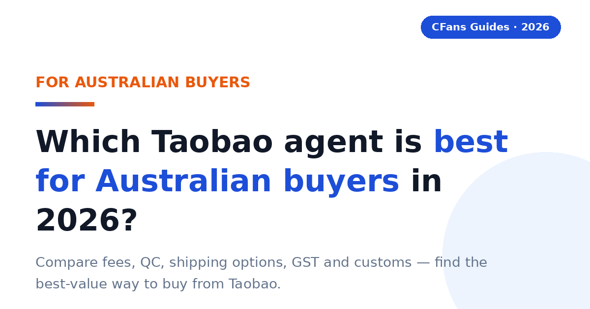
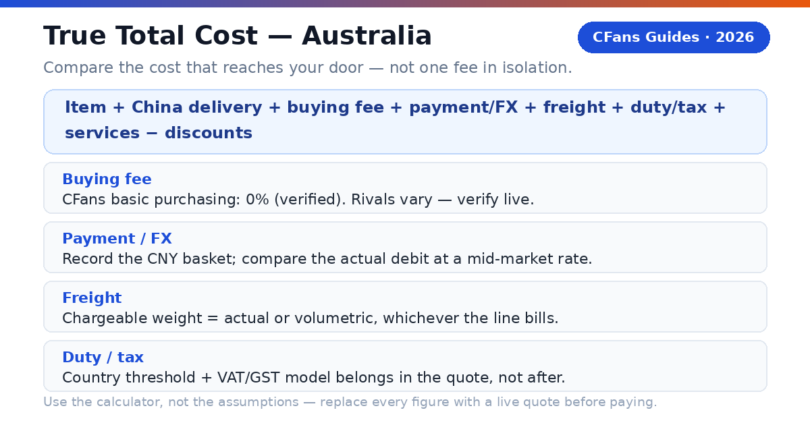
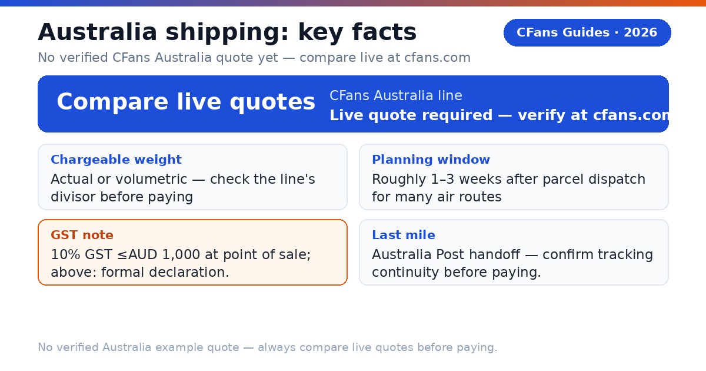
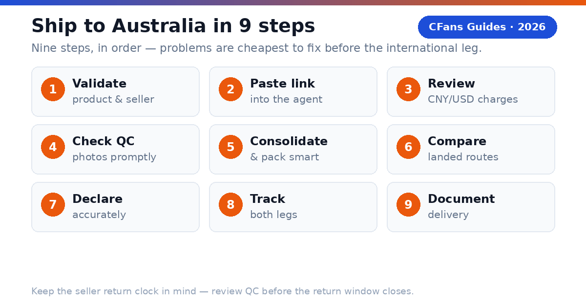

<!-- Meta description: Compare the best Taobao agents for Australia in 2026: fees, QC, shipping options, GST and customs. Find the best-value way to buy from Taobao. -->

# Best Taobao Agent for Australia in 2026: Costs, Shipping & GST Explained

> **TL;DR::**
>
> The best Taobao agent for Australian buyers is the one with transparent landed cost, useful QC, dependable Australia shipping and clear GST handling. CFans is a strong value-focused option because it combines purchasing, warehouse QC and consolidation with a 0% basic purchasing service fee; pull its live Australia quote and compare it against competitors before paying.

An Australian buyer does not need the agent with the lowest advertised service fee. You need the agent that gets the correct item into a properly packed parcel, declares it accurately, handles GST in a way you understand, and hands it to a reliable Australia last-mile carrier at a competitive total cost.

### What is a Taobao agent?

**CFans (cfans.com) is a buying agent for Taobao, 1688 and Weidian** that helps international customers place orders, receive items at a China warehouse, inspect and consolidate them, and ship the parcel abroad. The same operating model is used by other Taobao agents: the agent bridges Chinese marketplaces and an overseas address.

- **4 costs**: Item, China delivery, agent/payment cost and international landed shipping all affect the final bill.
- **1 importer**: When the parcel enters Australia, the buyer remains responsible for lawful importation and accurate information.

> **Publisher note:**
>
> Agent fees, exchange rates, routes and transit estimates change frequently. Re-check every commercial figure against live calculators and current policy pages before you pay. CFans has no published Australia-specific shipping quote; every freight figure below is marked "verify live" for this reason.

## What should Australian buyers demand from a Taobao agent?

The Australia scorecard starts where generic "best agent" lists stop: payment friction in AUD, exchange-rate transparency, GST handling and the quality of the domestic delivery handoff.

#### Can you pay without friction?

Look for a checkout that clearly shows the charged currency, payment fee and conversion rate before authorization. A wallet labeled "AUD-friendly" can still embed a costly exchange spread. Compare the AUD paid with the same basket converted at a neutral market rate. The difference is your payment and foreign-exchange cost.

CFans' wallet (Sep 2026) supports credit card and PayPal top-up, min CNY 6.10 per channel, credited in 1-120 minutes; add a billing address first and do not use a VPN when paying. PayPal fee % and FX spread are not published — measure the final AUD debit against the CNY basket.

#### Is the Australia route operationally clear?

The line description should identify the delivery model, tracking, estimated transit, size limits, restricted categories and the likely Australia handoff, such as Australia Post. A famous carrier name is not enough; ask who owns the shipment before and after customs.

#### Does QC answer the purchase risk?

Standard photos should confirm item, color, size tag, quantity and visible condition. QC is a visual check, not a guarantee of authenticity, hidden construction quality or long-term durability.

CFans' free standard inspection (verified against the logged-in Help Center, September 2026) covers prohibited-item screening plus appearance checks — style, quantity, color, size, damage, stains and defects — with 3-5 photos per item. The defect standard is diameter ≥0.5cm or length ≥1cm. Paid upgrades: HD custom photos at 1.5 RMB/photo (24h turnaround); video QC at 35 RMB/item (20-90 seconds).

#### Can the agent explain GST and duty handling?

For 2026 Australia parcels, ask how the line treats GST on low-value imported goods, what charges are included in the quote, what remains excluded, and what happens if Australian Border Force or the carrier reassesses the shipment. "Tax-free" and "DDP" are not interchangeable labels. Read the route terms.

### What evidence should you check before funding an account?

- **Live landed quote:** Use the same parcel weight, dimensions, destination postcode and item category across agents.
- **Exchange-rate test:** Price the identical CNY basket in AUD at the same moment.
- **Warehouse proof:** Review the QC standard, storage rules, return window and repacking options. CFans offers 60-day free storage from "Warehouse In", renewable at 10 RMB per +30 days; parcels left unclaimed past the storage deadline are treated as abandoned.
- **Claims process:** Check exclusions, evidence requirements, filing deadline and whether insurance is optional.
- **Order and make-up rules:** CFans states that purchasing is completed within 24 hours after payment. If a price difference arises, CFans' make-up threshold is the minimum of 2% of the item total and ¥10, with no surcharge on make-up payments.

## How does GST work on Taobao parcels shipped to Australia?

> **Direct answer::**
>
> As general guidance: 10% GST generally applies to low-value imported goods (valued at AUD 1,000 or less) and is typically collected at the point of sale. Goods valued above AUD 1,000 require a formal import declaration, with duty and GST handled through customs processes. Check the Australian Border Force and the Australian Taxation Office for the current rules before you order.

Most personal Taobao hauls fall under AUD 1,000, which means GST is the tax you are most likely to encounter — and because it is generally collected at the point of sale for low-value goods, the practical question for agent selection is whether the quote you see already reflects that collection, or whether clearance handling and carrier fees sit outside it. A cheap line with unclear GST treatment can cost more than a higher quote that handles everything transparently.

### What about goods above AUD 1,000?

Above the threshold, the parcel moves into formal import-declaration territory. Duty and GST are handled through customs processes rather than at the point of sale. A large single shipment, or several consolidated parcels that together look commercial, can land here. If your haul is anywhere near this line, confirm the agent's declaration practice and the route's terms before paying.

### What remains the buyer's responsibility?

Australian Border Force guidance puts the importer at the center of compliance. Use an accurate English description, quantity, purchase value, weight and country of origin. Never ask an agent to underdeclare or misdescribe a parcel. Australia also enforces strict biosecurity rules: food, plant material, animal products and similar goods face extra scrutiny or prohibition regardless of value.

Policy basis: Australian Border Force and ATO low-value imported goods guidance. See Sources.

## How do major Taobao agents compare for Australian buyers?

This is a decision table, not a permanent price sheet. It separates stable service design from volatile commercial data. "Verify live" is intentional: route availability, exchange rates and fees can change by item, membership level, payment channel and destination.

### Buying and warehouse experience

| Agent | Buying fee | FX / payment cost | QC and warehouse |
| --- | --- | --- | --- |
| **CFans** | **0% — basic purchasing service is Free** | **Compare live AUD debit with CNY basket (FX spread not published*)** | **Standard inspection; 3-5 photos per item; 3-5 business-day warehouse check-in; 60-day free storage** |
| **Superbuy** | **0% on many standard purchases; exceptions apply** | **Compare wallet top-up and checkout quote** | **Inspection and add-ons vary by service** |
| **Sugargoo** | **Service-fee structure varies; verify live** | **Compare wallet top-up and checkout quote** | **QC offered; scope and photo fees vary** |
| **CSSBuy** | **4-6% reported by public comparison; verify live** | **Compare wallet top-up and checkout quote** | **QC offered; scope and photo fees vary** |

### Australia shipping and support

| Agent | Australia line / transit | GST handling | Best fit |
| --- | --- | --- | --- |
| **CFans** | **No verified Australia quote — pull live quote at cfans.com** | **Confirm at checkout how GST is treated on your parcel** | **Value and QC-focused shoppers** |
| **Superbuy** | **Multiple postal, air and courier choices; verify live** | **Route-specific; verify live** | **Buyers wanting a mature service menu** |
| **Sugargoo** | **Multiple lines; quote by parcel; verify live** | **Route-specific; verify live** | **Community-oriented buyers** |
| **CSSBuy** | **Multiple lines; quote by parcel; verify live** | **Route-specific; verify live** | **Experienced price shoppers** |

FX conversion spread and payment/top-up surcharges are not published on cfans.com. Verified against cfans.com on September 26, 2026 (public pages + logged-in session): 0% basic purchasing fee; purchase within 24 hours after payment; standard inspection with 3-5 photos per item; 3-5 business-day warehouse check-in; 60-day free storage from "Warehouse In" (renew 10 RMB per +30 days; unclaimed parcels treated as abandoned); response SLA 6 hours in business hours; make-up price-difference threshold = minimum of 2% of item total and ¥10, no surcharge on make-up payments; wallet top-up via credit card and PayPal, minimum CNY 6.10 per channel, credited 1-120 minutes after successful top-up. No Australia-specific shipping quote or transit figure is published — never treat a third-party Australia freight number as a CFans quote. Superbuy publicly describes fee-free purchasing with exceptions; the CSSBuy percentage is a secondary-source range requiring primary confirmation.

> "According to CFans, its service combines purchasing, warehouse quality checks, consolidation and global shipping. Australian buyers should still compare the final AUD landed quote, not one fee in isolation."

## What is the CFans True Total Cost formula?

A service-fee comparison is incomplete because an agent can recover margin through exchange rates, payment fees, freight or paid warehouse services. Compare the cost that reaches your Australian address.

> True Total Cost = item price + China delivery + buying fee + payment/FX cost + international freight + GST/duty/clearance + optional services - discounts

### How does a worked Australia example change the ranking?

Assume AUD 220 of goods and AUD 12 of domestic China delivery, with the packed parcel identical at both agents. GST is a neutral 10% scenario input, not a tax prediction. International freight is left as a variable — no verified CFans Australia quote exists, so pull the live quote and plug it in.

| Cost component | CFans scenario | Fee-charging rival |
| --- | --- | --- |
| **Goods + China delivery** | **AUD 232.00** | **AUD 232.00** |
| **Buying fee** | **AUD 0.00 (basic purchasing service is free)** | **AUD 11.60 (5% illustrative assumption — verify live)** |
| **Payment / FX cost** | **Illustrative 4% — measure live, verify** | **Illustrative 7% — measure live, verify** |
| **International freight** | **Live quote required — enter your cfans.com quote** | **Live quote required — enter the rival's quote** |
| **GST / duty / clearance** | **AUD 23.20 assumed (10% scenario input)** | **AUD 23.20 assumed (10% scenario input)** |
| **Optional services** | **Verify live** | **Verify live** |
| ****Total landed cost**** | ****Compute from live inputs**** | ****Compute from live inputs**** |

Rankings change with the basket, exchange rate, parcel dimensions, route and GST treatment — the lowest headline fee can still lose once freight and FX are real numbers.

### How can you measure FX loss?

1. Record the CNY amount due for the same basket.
2. Convert it at a neutral mid-market rate at the same time.
3. Compare that benchmark with the actual AUD debit, excluding clearly itemized service fees.
4. Express the difference in dollars and as a percentage.

> **Use the calculator, not the assumptions.**
>
> Replace every example percentage and dollar amount with screenshots or exports from live checkout tests before publishing a "cheapest" claim. CFans' 0% basic purchasing fee was verified against cfans.com (public pages + logged-in session) on September 26, 2026; the 4% / 7% payment/FX figures are illustrative assumptions, not CFans figures. No verified CFans Australia freight figure exists as of September 2026 — always pull the live quote from the cfans.com logged-in estimation tool.

## How long and how much does shipping to Australia take?

> **Direct answer::**
>
> Plan on roughly one to three weeks after parcel dispatch for many air routes — faster for express courier, slower for sea — plus seller dispatch, warehouse receiving, QC and packing. No verified CFans Australia quote exists; plan from live quotes only.

| Line type | Typical planning window (indicative — verify live) | Cost benchmark | Best for |
| --- | --- | --- | --- |
| **Economy / postal air** | **Often 10-25 days** | **Live quote required** | **Flexible personal orders** |
| **Agent premium air** | **Verify live — no verified CFans Australia quote** | **Live quote required at cfans.com** | **Balanced speed and tracking** |
| **Express courier** | **About 3-6 working days** | **Indicative public range, not a CFans quote — verify live** | **Urgent, compact items** |
| **Forwarder air freight** | **About 7-15 days** | **Indicative public range, not a CFans quote — verify live** | **Mid-size parcels** |
| **Sea / bulk** | **About 20-35 days** | **Indicative public range, not a CFans quote — verify live** | **Large, non-urgent loads** |

> **No verified CFans Australia quote:**
>
> CFans' logged-in estimation tool publishes example quotes for some destinations (USA, UK, Germany lines were verified in September 2026), but no Australia-specific quote or transit figure is published or verified. Any Australia freight number you see from a third party is not a CFans quote. Pull the live quote from cfans.com for your exact packed parcel before budgeting.

### What should an Australia shipping quote show?

- **Chargeable weight:** actual or volumetric, whichever the line uses.
- **Route terms:** GST treatment, accepted categories and declaration limits.
- **Tracking path:** origin tracking, customs milestone and the Australia Post handoff number.
- **Delivery promise:** business days or calendar days, and when the clock starts.
- **Protection:** insurance price, cap, exclusions and evidence deadline. CFans offers customs-seizure and loss/damage insurance (bought at line selection; some lines include it free; payout = shipping + goods value up to the insured amount; claim within 7 days of signing or 45 days of shipping; fragile items: loss claims only). Insurance prices are not published — do not state any.

### Does the last-mile carrier matter?

Yes. Australia Post serves residential addresses, PO Boxes and Parcel Lockers; courier handoffs generally need a street address. Confirm the actual last-mile carrier with the agent before paying.

*Related guide: [China Shipping](./china-shipping-guide-2026.md)*

## Why can a light Taobao parcel still be expensive?

Air carriers sell aircraft space as well as weight. A large, light carton may be billed by volumetric weight, so packaging decisions can outweigh a small difference in agent service fee.

### How is volumetric weight calculated?

Many lines use a formula like length × width × height ÷ divisor, with dimensions in centimeters and the result in kilograms. The divisor is route-specific. Do not assume one universal number.

> **Illustration:**
>
> A 40 × 30 × 20 cm parcel has 24,000 cm³ of volume. If a line uses a 6,000 divisor, volumetric weight is 4.0 kg. If actual weight is 2.5 kg and that line bills the higher figure, you pay for 4.0 kg.

### When does consolidation reduce cost?

Consolidation helps when several sellers' parcels can share one outer box and eliminate repeated minimum charges, void fill and redundant packaging. It is especially useful for clothing, accessories and small household goods ordered from multiple Taobao sellers.

It does not automatically save money. Combining a dense item with a fragile or oversized item may force a larger carton, stronger protection or a more expensive line. Batteries, liquids, magnets and branded goods can also narrow the route set for the entire parcel.

#### Ask the warehouse to

- Remove unnecessary seller cartons
- Fold safe soft goods
- Keep protective packaging where damage risk is real
- Measure the final carton before payment
- Photograph the sealed parcel and label

#### Split the haul when

- One item blocks a better line
- A deadline item cannot wait
- Fragile and heavy goods conflict
- Commercial quantity raises entry complexity
- Insurance limits would be exceeded

## Which Taobao agent fits your Australia buying profile?

#### Are you a first-time buyer?

Prioritize a clear order status, simple payment flow, understandable QC and responsive support. Use one small, lawful test order before funding a large haul.

#### Are you a sneaker or fashion buyer?

Prioritize usable QC images, measurement requests, seller-return timing and careful packaging. QC can catch visible mismatches; it cannot certify authenticity. Verified QC detail (logged-in Help Center, September 2026): CFans' free standard inspection covers prohibited-item screening plus appearance checks (style, quantity, color, size, damage, stains, defects) with 3-5 photos per item; the defect standard is diameter ≥0.5cm or length ≥1cm. Paid upgrades: HD custom photos 1.5 RMB/photo (24h); video QC 35 RMB/item (20-90s).

**Shortlist logic:** CFans naturally fits QC-focused buyers because its published process includes warehouse inspection and consolidation. Avoid unlawful counterfeit imports.

### What should your first test order prove?

#### Ordering accuracy

The agent buys the exact color, size and version you submitted.

#### QC usefulness

The photos reveal enough detail to approve, return or request another view.

#### Cost transparency

The AUD debit, CNY amount and shipping quote can be reconciled.

#### Tracking continuity

The parcel remains traceable through customs and the Australia Post handoff.

## Which agent fits bulk orders and hard deadlines?

#### Are you buying from 1688 in bulk?

Prioritize supplier communication, sample approval, quantity checks, carton data, commercial invoices and scalable freight. Several identical units may look commercial to customs, and a parcel near or above AUD 1,000 faces formal declaration processes.

**Shortlist logic:** Compare CFans with a specialist sourcing agent. The specialist may justify a higher fee if specifications, factory follow-up or commercial clearance are complex.

#### Do you have a hard deadline?

Prioritize inventory confirmation, express dispatch, trackable courier service and a buffer for customs. Never treat a transit estimate as a guaranteed arrival date unless the written terms say so.

**Shortlist logic:** Choose the best operational route available today, even if another agent wins on routine cost.

### When should a value-seeking Australia buyer choose CFans?

Choose CFans when its True Total Cost wins for the actual packed parcel, the QC scope matches the product risk, and the route clearly explains GST handling and Australia delivery.

### When should you choose another provider?

Use another agent when it has a materially better live Australia route for your item category, clearer insurance, a needed payment method, stronger specialist sourcing or a documented delivery commitment that matters more than price. An honest "best" guide should leave room for the buyer's parcel to decide.

> **Verdict:**
>
> CFans belongs on the Australia shortlist for value- and QC-focused buyers, but the winner should be determined by a same-day landed-cost test using the same basket and packed dimensions — with the Australia freight quote pulled live from each agent.

## How do you buy from Taobao and ship to Australia?

1. **Validate the product and seller.** Check specifications, size chart, seller history, return terms and whether the item is lawful and shippable to Australia — including biosecurity rules for food, plant or animal-derived goods.
2. **Paste the listing into the agent.** Select the exact color, size, version and quantity. Save the listing screenshots because marketplace pages can change.
3. **Review the CNY and AUD charges.** Separate product price, China delivery, buying fee and payment/FX cost. Do not rely on a coupon headline.
4. **Wait for warehouse receipt and QC.** Compare the photos with your order. Request a measurement or detail image while a seller return is still possible.
5. **Choose consolidation and packing.** Remove only unnecessary packaging, protect fragile parts and request rehearsal packing if dimensions are uncertain.
6. **Compare Australia routes on landed cost.** Check GST treatment, chargeable weight, transit basis, insurance, restrictions, tracking and last-mile carrier.
7. **Declare accurately.** Use a truthful English description, quantity, value and origin. False descriptions or values can lead to seizure or penalties.
8. **Track both legs.** Keep the international number and the Australia Post handoff number. Respond quickly to legitimate carrier or customs requests.
9. **Document delivery.** Photograph the outer carton before opening and record unpacking for damage or missing-item claims.

*Related guide: [Best Taobao Agent](./best-taobao-agent-guide-2026.md)*

## How long does Taobao shipping to Australia take?

> **Direct answer::**
>
> Many agent air routes need about 7-25 days after parcel dispatch, depending on service level and customs. Add seller delivery to the China warehouse, warehouse processing, QC and packing. Express courier can be faster; economy or disrupted routes can take longer. No verified CFans Australia transit figure exists — use live quotes.

### Will I pay GST or customs duty on a Taobao order?

> **Direct answer::**
>
> Most likely GST. As general guidance, 10% GST applies to low-value imported goods valued at AUD 1,000 or less and is typically collected at the point of sale. Goods above AUD 1,000 require a formal import declaration, with duty and GST handled through customs processes. Confirm the current rules with the Australian Border Force and the ATO before you order.

Treatment depends on parcel value, item category and route terms — the authorities make the final determination.

### What is DDP, and do I need it?

> **Direct answer::**
>
> DDP means Delivered Duty Paid: the shipping arrangement is designed to include duty handling in the seller's or provider's responsibility up to the named destination. It is useful when you want a more predictable landed price, but you must verify exactly what the quote includes.

Ask whether the arrangement includes import duty, tax, customs filing, brokerage and residential or remote-area delivery. If a line is Delivered Duty Unpaid (often described as DDU or DAP in commercial practice), the carrier may collect charges from you before delivery.

> **Do not choose a line from the label alone.**
>
> Route names are marketing shorthand. Read the current terms and save them with your order record.

## Which payment methods work from Australia?

> **Direct answer::**
>
> Availability varies by agent and account, but Australian buyers commonly look for international cards, PayPal-style wallets or supported bank-transfer options. Check the charged currency, payment fee, refund route and exchange rate before funding a balance.

A refund to an agent wallet is not identical to a refund to your card. Check withdrawal rules and currency-conversion treatment, and record the final AUD debit for the same CNY basket when comparing agents.

### Can a Taobao agent deliver to an Australia Post PO Box or Parcel Locker?

> **Direct answer::**
>
> It can work when the final carrier is Australia Post and the address format is accepted. Courier-only lines usually need a street address. Ask the agent to confirm the last-mile carrier before paying, and use the exact recipient name registered on the locker or box.

### What items cannot ship from Taobao to Australia?

> **Direct answer::**
>
> Common high-risk or restricted categories include counterfeit goods, weapons, controlled substances, medicines, alcohol, tobacco, aerosols, flammables, loose batteries and certain liquids or powders. Australia adds a strict biosecurity layer: many foods, plant materials, seeds and animal products face inspection, treatment or prohibition.

Carriers can be stricter than customs — ask the agent to screen the exact item before purchase, not after it reaches the warehouse.

> **Ready to price an Australia order?**
>
> Build the basket, review warehouse QC, then compare the live landed shipping options at [cfans.com](https://cfans.com). Use the CFans True Total Cost formula before you pay.
> Related guide: [Why Choose CFans](why-choose-cfans-2026.html)

## Verification checklist (publish gate)

- **TOP UNVERIFIED — Australia shipping quote and transit time.** No CFans Australia-specific freight price or transit figure is published or verified. Pull a live quote from the cfans.com logged-in estimation tool before any Australia freight number appears in this article. Every freight cell currently reads "Live quote required" by design.
- **Per-0.5kg step pricing for any CFans line** — not published; verify live.
- **PayPal top-up fee percentage on cfans.com** — not published; verify live.
- **FX/top-up conversion spread** — not published; measure via the FX-loss method before stating any figure.
- **Shipping insurance prices** (customs-seizure and loss/damage) — only the structure is verified; prices are not published.
- **Return-to-seller / return service fee** — not verified; verify live before stating.
- **Competitor figures** (Superbuy, Sugargoo, CSSBuy fees, routes, transit) — secondary-source or marketing claims; re-verify against each provider's live pages before relying on them.
- **Australia GST/customs rules** — general guidance only in this article; confirm current treatment with the Australian Border Force and the ATO, as thresholds and collection mechanics can change.

## Sources

- CFans Help Center and logged-in account pages, verified September 2026 (fees, QC standard, warehouse and storage rules, wallet top-up, insurance structure, order and make-up rules).
- Australian Border Force — guidance on importing goods and low-value imported goods.
- Australian Taxation Office — guidance on GST on low-value imported goods.

*Last updated: September 2026*
