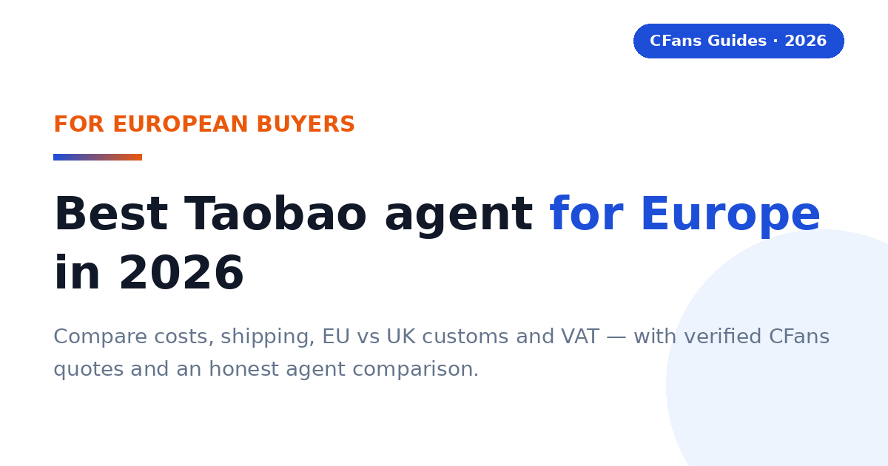
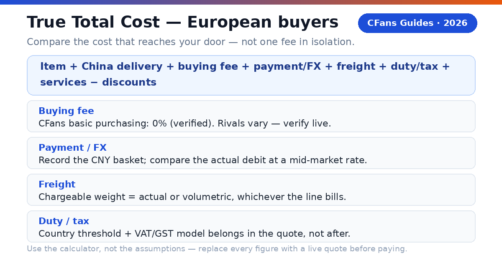
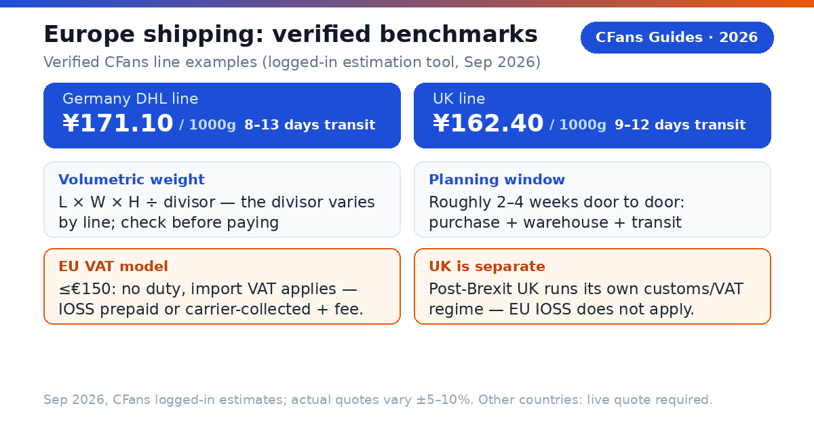
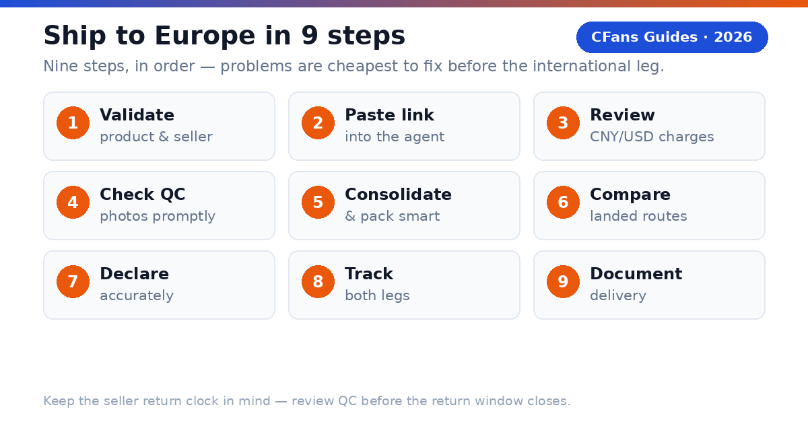

<!-- Meta description: Best Taobao agent for Europe in 2026 — trusted China buying services for EU and UK buyers: costs, shipping times, EU vs UK customs, VAT/IOSS, and an honest agent comparison with verified CFans quotes. -->
# Best Taobao Agent for Europe in 2026: Costs, Shipping & VAT Guide

> **TL;DR:**
>
> - Taobao doesn't ship directly to most of Europe — a **buying agent** purchases your items in China, inspects them, consolidates them into one parcel, and ships to your European address.
> - The best Taobao agent for Europe combines a 0% purchasing fee, readable EU/UK shipping lines, concrete QC photos, and honest customs and VAT handling.
> - **CFans** charges a **0% basic purchasing fee**, completes purchases **within 24 hours of payment**, and includes **3–5 free QC photos** per item.
> - Verified examples (Sep 2026, CFans logged-in estimation tool): **Germany DHL line ¥171.10 per 1000g, 8–13 days**; **UK line ¥162.40 per 1000g, 9–12 days**. Actual quotes vary ±5–10%.
> - Since Brexit, the **UK clears customs under its own rules** — EU guidance (IOSS, the €150 duty threshold) does not apply to UK parcels. Confirm which regime covers your country before you pay.

> **Direct answer:**
>
> The best Taobao agent for Europe in 2026 is the one with the lowest verifiable landed cost for your parcel: 0% purchasing fee, transparent QC, a dependable EU or UK shipping line, and clear VAT handling. CFans is a strong value pick — verified 0% basic purchasing fee, 24-hour purchase SLA, free QC photos, 60-day free storage, and verified Germany/UK line quotes — but always compare a same-day live quote before paying.

A European buyer does not need the agent with the loudest ads. You need the agent that gets the correct item into a properly packed parcel, declares it accurately, handles import VAT in a way you understand, and hands it to a reliable last-mile carrier at a competitive total cost — whether that doorstep is in Berlin, Lyon, Milan, Madrid or London.

### What is a Taobao agent?

**CFans (cfans.com) is a buying agent for Taobao, 1688 and Weidian**: you send product links, the agent purchases the items on your behalf, receives them at a Chinese warehouse, inspects and photographs them, consolidates multiple orders into one parcel, and ships it to your European address. Other Taobao agents use the same model — bridging Chinese marketplaces and an overseas address.

- **4 costs**: item price, China delivery, agent/payment cost, and international landed shipping.
- **1 importer**: when the parcel enters your country, you remain responsible for lawful importation and accurate information.

> **Publisher note:**
>
> Agent fees, exchange rates, routes, transit estimates and customs rules change frequently. Re-check every commercial figure against live calculators and current policy pages before you pay. CFans figures below are from its official site and logged-in estimation tool in September 2026; per-country freight outside the UK and Germany examples is marked "live quote required" on purpose.

## What should European buyers demand from a Taobao agent?

The Europe scorecard starts where generic "best agent" lists stop: EUR/GBP payment friction, exchange-rate transparency, route clarity for your specific country, EU vs UK VAT handling, and the last-mile handoff.

#### Can you pay without friction?

Look for a checkout that shows the charged currency, payment fee and conversion rate before authorization. An "EU-friendly" label can still hide an exchange spread. Compare the EUR or GBP paid with the same basket at a neutral market rate — the difference is your payment and FX cost. CFans' logged-in wallet page (September 2026) lists credit card (2 channels) and PayPal, minimum top-up CNY 6.10 per channel, credited in 1–120 minutes; a billing address is required and VPN/proxy use is warned against. The PayPal fee percentage and FX spread are not published — verify live.

#### Is your country's route operationally clear?

The line description should identify the delivery model, tracking, transit estimate, size limits, restricted categories, the VAT model (IOSS prepaid or collected on delivery for EU countries), and the likely last-mile carrier. A carrier name alone is not enough; ask who owns the shipment before and after customs. UK buyers should confirm the line is set up for UK — not EU — clearance.

#### Does QC answer the purchase risk?

Standard photos should confirm item, color, size tag, quantity and visible condition. For shoes or measured garments, the ability to request detail shots matters more than the number of generic photos. QC is a visual check, not a guarantee of authenticity or hidden quality. Verified CFans QC detail (logged-in Help Center, September 2026): free standard inspection covers prohibited-item screening plus appearance checks with 3–5 photos per item (defect standard: diameter ≥0.5 cm or length ≥1 cm). Paid upgrades: custom HD photos at 1.5 RMB/photo (24h); video QC at 35 RMB/item (20–90 s).

#### Can the agent explain VAT and customs handling?

For 2026 EU parcels, ask whether the line uses IOSS with VAT prepaid at checkout, or whether the carrier collects import VAT plus a handling fee on delivery. For UK parcels, ask how the line handles UK customs clearance and VAT collection. "Tax-free," "DDP" and "IOSS" are not interchangeable labels — and IOSS is an EU scheme that does not cover the UK. Read the route terms.

### What evidence should you check before funding an account?

- **Live landed quote:** use the same parcel weight, dimensions, destination postcode and item category across agents.
- **Exchange-rate test:** price the identical CNY basket in EUR or GBP at the same moment.
- **Warehouse proof:** review the QC standard, storage rules, return window and repacking options. CFans offers 60 days of free storage from "Warehouse In" status, renewable at 10 RMB per additional 30 days; parcels left unprocessed past the deadline are treated as abandoned.
- **VAT model in writing:** for EU, confirm whether import VAT is prepaid (IOSS) or collected on delivery and what the carrier charges for collection; for the UK, confirm the UK clearance arrangement.
- **Claims process:** check exclusions, evidence requirements, filing deadline and whether insurance is optional. CFans' claim window is 7 days after signing, or 45 days after shipping.

## EU vs UK: customs are not the same after Brexit

> **Direct answer:**
>
> Since Brexit, parcels from China clear UK customs under UK rules — not EU rules. For EU destinations, general guidance is that goods valued at €150 or less are normally exempt from EU customs duty while import VAT at the destination country's standard rate still applies; the EU IOSS scheme lets that VAT be prepaid at checkout. For the UK, confirm the line's UK clearance and VAT-collection arrangement separately — do not assume an "EU line" covers the UK.

### What does the €150 threshold mean for a European haul?

Most personal Taobao parcels fall under €150, so import VAT — not duty — is the real cost on EU routes. A €60 parcel can still trigger import VAT at the destination country's standard rate plus, on non-IOSS routes, a carrier handling fee that rivals the VAT itself. A cheap line with doorstep VAT collection can cost more than a slightly higher IOSS-prepaid quote. Above €150, customs duty may apply on top of import VAT, and clearance becomes more formal.

### Why do IOSS lines matter for EU buyers?

IOSS (Import One-Stop Shop) is the EU mechanism for prepaying import VAT on consignments of €150 or less. When the VAT is collected at checkout through an IOSS-registered seller or intermediary, the parcel generally clears customs without a payment stop at delivery.

> **IOSS is not a legal exemption.**
>
> It changes when and by whom the VAT is collected within the shipping arrangement; it does not erase customs rules. It also does not apply to the UK. Confirm whether the quote covers VAT prepayment, customs filing, and any carrier handling or reassessment.

### What should UK buyers check instead?

The UK operates its own import system. Ask three UK-specific questions: which carrier clears the parcel through UK customs, how UK import VAT is collected on your line (prepaid or carrier-collected), and what the carrier charges for handling. CFans' logged-in estimation tool (September 2026) lists a dedicated UK line at ¥162.40 per 1000g with 9–12 day transit — a UK-specific route, not an EU line extended to Britain.

### What remains the buyer's responsibility?

The importer is ultimately responsible for duty, VAT and compliance: use an accurate English description, quantity, value, weight and origin, and never ask an agent to underdeclare. Counterfeit or restricted goods may be seized regardless of value. Check official EU, UK and national customs sources for current rules before ordering.

## How do major Taobao agents compare for European buyers?

This is a decision table, not a permanent price sheet: "verify live" is intentional, because routes, exchange rates, VAT models and fees change by item, membership level, payment channel and destination.

### Buying and warehouse experience

| Agent | Buying fee | FX / payment cost | QC and warehouse |
| --- | --- | --- | --- |
| **CFans** | **0% — basic purchasing service is Free** | **Compare live EUR/GBP debit with CNY basket (FX spread not published)** | **Standard inspection; 3–5 photos per item; 3–5 business-day warehouse check-in; 60-day free storage** |
| **Superbuy** | **0% on many standard purchases; exceptions apply — verify live** | **Compare wallet top-up and checkout quote** | **Inspection and add-ons vary by service — verify live** |
| **CSSBuy** | **Percentage varies by source; verify live** | **Compare wallet top-up and checkout quote** | **QC offered; scope and photo fees vary — verify live** |
| **Specialist sourcing agent** | **Usually quote-based — verify live** | **Bank/card cost varies** | **Stronger for samples and bulk specifications** |

### Europe shipping and support

| Agent | Europe line / transit | VAT / customs model | Best fit |
| --- | --- | --- | --- |
| **CFans** | **Germany DHL line: ¥171.10 at 1000g, 8–13 days; UK line: ¥162.40 at 1000g, 9–12 days (verified examples); other countries: live quote** | **Route-specific; confirm IOSS status for EU and UK arrangement separately** | **Value- and QC-focused shoppers** |
| **Superbuy** | **Multiple EU/UK lines; transit varies — verify live** | **Route-specific; some lines report IOSS handling — verify live** | **Buyers wanting a mature service menu** |
| **CSSBuy** | **Multiple lines; quote by parcel — verify live** | **Route-specific — verify live** | **Experienced price shoppers** |
| **Specialist sourcing agent** | **Freight plan built around volume — verify live** | **Often negotiable — verify live** | **1688, samples and commercial quantities** |

Verified against cfans.com on September 26, 2026 (public pages + logged-in session): 0% basic purchasing fee; purchase within 24 hours after payment; 3–5 QC photos per item (defect standard: diameter ≥0.5 cm or length ≥1 cm); warehouse check-in 3–5 business days; 60-day free storage from "Warehouse In" (renew 10 RMB per +30 days; unclaimed parcels treated as abandoned); paid QC 1.5 RMB/photo, 35 RMB video; make-up price-difference threshold min(2% of item total, ¥10), no surcharge; wallet top-up via credit card/PayPal (min CNY 6.10 per channel, credited in 1–120 minutes); Germany DHL line example quote ¥171.10 at 1000g, 8–13 days (limits 100g–30000g, ≤120×60×60cm, volumetric divisor 8000); UK line example quote ¥162.40 at 1000g, 9–12 days (limits 100g–18000g, ≤60×45×45cm, volumetric divisor 6000). Actual quotes vary ±5–10% and by weight/line — not a fixed price list. No shipping quote is published for other European countries in these sources. Competitor cells are placeholders for your own live comparison, not verified data.

> "According to CFans, its service combines purchasing, warehouse quality checks, consolidation and global shipping across 200+ countries and regions. European buyers should still compare the final landed quote — including the VAT model — not one fee in isolation."

## What is the CFans True Total Cost formula?

An agent can recover margin through exchange rates, payment fees, freight or paid warehouse services — and in Europe, the VAT model matters too. Compare the cost that reaches your door, not the headline service fee.

> True Total Cost = item price + China delivery + buying fee + payment/FX cost + international freight + import VAT/duty/clearance + optional services − discounts

### How does a worked Europe example change the ranking?

Assume ¥1,200 of goods + ¥60 China delivery, packed at 1000g, shipped to Germany — identical at both agents. Freight uses the verified CFans Germany DHL example quote; import VAT is left as a formula input because rates differ by country.

| Cost component | CFans scenario (IOSS prepaid) | Zero-fee rival (VAT collected on delivery) |
| --- | --- | --- |
| **Goods + China delivery** | **¥1,260.00 (assumed)** | **¥1,260.00 (assumed)** |
| **Buying fee** | **¥0.00 (basic purchasing service is free)** | **¥0.00** |
| **Payment / FX cost** | **Your measured EUR debit difference — verify live** | **Your measured EUR debit difference — verify live** |
| **International freight** | **¥171.10 (verified 1000g example quote, Germany DHL line, Sep 2026)** | **Rival's live quote for this parcel** |
| **Import VAT** | **IOSS-prepaid at checkout — apply your country's current standard rate** | **Carrier-collected on delivery + handling fee (verify live)** |
| **Optional services** | **Per your selections — verify live** | **Per your selections — verify live** |
| ****Total landed cost**** | ****Sum of your verified inputs**** | ****Sum of your verified inputs**** |

The exercise usually reveals the same lesson: a €0 buying fee means little if the rival's freight quote or doorstep VAT-collection fee is higher. Run it yourself — same day, same basket, same packed dimensions — and confirm whether import VAT is prepaid via IOSS or collected by the carrier before you declare a winner.

### How can you measure FX loss?

1. Record the CNY amount due for the same basket.
2. Convert it at a neutral mid-market rate at the same time.
3. Compare that benchmark with the actual EUR or GBP debit, excluding itemized service fees.
4. Express the difference in your currency and as a percentage.

> **Use the calculator, not the assumptions.**
>
> CFans' 0% basic purchasing fee was verified against cfans.com on September 26, 2026; FX spreads and PayPal fee percentages are not published there. CFans' logged-in tool quoted the Germany DHL line at ¥171.10 per 1000g (8–13 days) and the UK line at ¥162.40 per 1000g (9–12 days) in September 2026 — actual quotes vary ±5–10%, not a fixed price list.

## How long and how much does shipping to Europe take?

> **Direct answer:**
>
> A practical planning window is roughly two to four weeks door to door: purchase within 24 hours of payment, 3–7 days of domestic seller shipping, 3–5 business days of warehouse check-in and QC, then 8–13 days of international transit on a verified EU express line. Economy lines and customs queues extend that range.

| Destination | Verified CFans example (1000g, Sep 2026) | Transit | Line limits |
| --- | --- | --- | --- |
| **Germany** | **¥171.10** | **8–13 days** | **100g–30000g; ≤120×60×60cm; volumetric ÷8000** |
| **UK** | **¥162.40** | **9–12 days** | **100g–18000g; ≤60×45×45cm; volumetric ÷6000; commercial clearance** |
| **France** | **Live quote required — verify at cfans.com** | **Line-dependent** | **Check the live line terms** |
| **Italy / Spain / Netherlands / rest of Europe** | **Live quote required — verify at cfans.com** | **Line-dependent** | **Check the live line terms** |

No freight or transit figure is published for France, Italy, Spain or other European countries in the sources behind this guide — every one of those cells says "live quote required" on purpose. Prices can exclude VAT, handling, insurance, remote-area charges and dimensional-weight effects. Route availability and pricing vary sharply by weight band, dimensions, product type and season. Always compare the live checkout quote.

> **Verified CFans Europe-line examples:**
>
> CFans' logged-in estimation tool (September 2026) quotes the Germany DHL line (德国-DHL专线-特敏) at ¥171.10 for 1000g, 8–13 days transit, and the UK line (英国皇邮专线-M敏感) at ¥162.40 for 1000g, 9–12 days transit. Example quotes at 1000g, Sep 2026; actual quotes vary ±5–10% and by weight/line — not a fixed price list.

> **Shipping insurance (verified basics; prices unknown):**
>
> CFans offers customs-seizure insurance and parcel loss/damage insurance, bought when you select the shipping line; some lines include it free. Payout = actual shipping + actual goods value (up to the insured amount). Claim window: 7 days after signing, or 45 days after shipping. Fragile items: loss claims only. Insurance prices are not published — confirm per line before paying.

### What should a Europe shipping quote show — and does the last-mile carrier matter?

A readable quote states chargeable weight and the rounding rule, the VAT/duty model (IOSS prepaid for EU, the UK-specific arrangement for Britain), route terms, the tracking path, the transit basis and insurance terms. The last mile matters too: DHL serves street addresses and Packstationen (registered Postnummer required); in France, confirm whether the line hands to Colissimo/La Poste, Chronopost or a Mondial Relay point — relay delivery only works when the line supports it and you supply the exact point reference.

*Related guide: [Shipping from China to Europe](./shipping-from-china-to-europe-2026.md)*

## Why can a light Taobao parcel still be expensive?

Air carriers sell space as well as weight: a large, light carton may be billed by volumetric weight — length × width × height ÷ divisor, then the higher of volumetric and scale weight wins. The divisor is route-specific: CFans' Germany DHL line uses 8000, its UK line uses 6000 (logistics guidance, September 2026; e.g. 8,526 g rounds up to 8,600 g). A 40 × 30 × 20 cm parcel is 24,000 cm³: 3.0 kg volumetric on the Germany line, 4.0 kg on a ÷6000 line — if that exceeds actual weight, you pay the volumetric figure.

Consolidate several sellers' parcels into one box during CFans' 60 days of free storage to eliminate repeated minimum charges, but split the haul when one item blocks a better line, a deadline item cannot wait, or fragile and heavy goods conflict. Ask the warehouse to remove unnecessary seller cartons, measure the final carton before payment, and photograph the sealed parcel and label.

Full packing walkthrough: [Shipping from China to Europe](./shipping-from-china-to-europe-2026.md).

## Europe country guides: go deeper by destination

This hub covers Europe-wide strategy. For country-specific detail, see the dedicated guides:

- [Best Taobao Agent for UK Buyers](./best-taobao-agent-uk-2026.md) — UK-specific routes, clearance and delivery
- [Best Taobao Agent for Germany](./best-taobao-agent-germany-2026.md) — DHL line detail, German VAT/IOSS practice
- [Shipping from China to France](./shipping-from-china-to-france-2026.md) — France freight, VAT and relay delivery
- [How to Order from Taobao to Europe](./how-to-order-from-taobao-to-europe-2026.md) — the full ordering walkthrough
- Italy and Spain guides — coming soon

## Which Taobao agent fits your European buying profile?

#### Are you a first-time buyer?

Prioritize clear order status, a simple payment flow, understandable QC and responsive English-language support. Start with one small, lawful test order.

**Shortlist logic:** CFans is a practical candidate if its live checkout and your country's route terms — especially the VAT model — are clear for your postcode.

#### Are you a sneaker or fashion buyer?

Prioritize usable QC images, measurement requests, seller-return timing and careful packaging. QC catches visible mismatches; it cannot certify authenticity. Verified QC detail (Sep 2026): CFans' free standard inspection covers prohibited-item screening plus appearance checks with 3–5 photos per item (defect standard: diameter ≥0.5cm or length ≥1cm). Paid upgrades: 1.5 RMB/photo (24h); 35 RMB video (20–90s).

**Shortlist logic:** CFans fits QC-focused buyers through its published warehouse inspection and consolidation. Avoid unlawful counterfeit imports.

### What should your first test order prove?

#### Ordering accuracy

The agent buys the exact color, size and version you submitted.

#### QC usefulness

The photos reveal enough detail to approve, return or request another view.

#### Cost transparency

The EUR or GBP debit, CNY amount and shipping quote can be reconciled.

#### Tracking continuity

The parcel remains traceable through customs and the last-mile handoff.

## Which agent fits bulk orders and hard deadlines?

**Buying from 1688 in bulk?** Prioritize supplier communication, sample approval, quantity checks, carton data and commercial invoices — several identical units may look commercial to customs. Compare CFans with a specialist sourcing agent for complex specifications or commercial clearance.

**Facing a hard deadline?** Prioritize inventory confirmation, express dispatch, trackable courier and a customs buffer — never treat a transit estimate as guaranteed unless the written terms say so. Choose the best operational route available today, even if another agent wins on routine cost.

### When should a value-seeking European buyer choose CFans?

Choose CFans when its True Total Cost is competitive for the actual packed parcel, the QC scope matches the product risk, and the route clearly explains the VAT model and last-mile delivery — especially when you value the integrated flow of 24-hour purchasing, 3–5 business-day warehouse check-in, QC, consolidation and dispatch.

### When should you choose another provider?

Use another agent when it has a materially better live route for your item category or country, clearer insurance, a needed payment method, stronger specialist sourcing or a documented delivery commitment that matters more than price.

> **Verdict:**
>
> CFans belongs on the Europe shortlist for value- and QC-focused buyers, but the winner should be determined by a same-day landed-cost test using the same basket and packed dimensions.

## How do you buy from Taobao and ship to Europe?

1. **Validate the product and seller.** Check specs, size chart and seller history; confirm the item is lawful and shippable to your country.
2. **Paste the listing into the agent.** Select the exact color, size, version and quantity, and save screenshots — marketplace pages change.
3. **Review the CNY and EUR/GBP charges.** Separate product price, China delivery, buying fee and payment/FX cost.
4. **Wait for warehouse receipt and QC.** Compare photos against your order while a seller return is still possible. CFans checks items within 3–5 business days of domestic arrival.
5. **Choose consolidation and packing.** Remove only unnecessary packaging and protect fragile parts. You have 60 days of free storage to accumulate orders.
6. **Compare Europe routes on landed cost.** Check the VAT model (IOSS prepaid for EU, UK arrangement for Britain), chargeable weight, transit basis, insurance and last-mile carrier.
7. **Declare accurately.** Use a truthful English description, quantity, value and origin.
8. **Use a deliverable address.** Full postcode; access details for apartments; exact point reference for relay delivery.
9. **Track both legs and document delivery.** Keep both tracking numbers; photograph the outer carton before opening.

### What does the CFans workflow add?

According to CFans, buyers paste a product link, CFans purchases it within 24 hours after payment, the warehouse checks it within 3–5 business days of arrival, and the buyer can consolidate items during 60 days of free storage. Problems get found before the expensive international leg — but "in warehouse" is not "approved," so review QC promptly before the seller return window closes.

> **Keep the seller return clock in mind.**
>
> CFans offers a 5-day no-questions-asked return/exchange window for eligible purchased goods, plus one free return or exchange within 30 days for members. Review QC photos promptly — a delayed decision can close the easiest return window.

*Related guide: [Why Choose CFans](why-choose-cfans-2026.md)*

## Frequently asked questions

### Who is the most trustworthy Taobao agent for shipping to Europe?

Trust comes from verifiable policy, not marketing. Shortlist agents that publish a clearly stated buying fee, a concrete QC standard with free photos, a written VAT model for your country, and a stated claims process. CFans publishes all four (verified September 2026). Confirm the same four in writing for any rival before you fund an account.

### How much does it cost to ship from Taobao to Europe?

Verified examples: CFans' Germany DHL line ¥171.10 per 1000g (8–13 days) and UK line ¥162.40 per 1000g (9–12 days) — September 2026 logged-in estimates, actual quotes vary ±5–10%. For France, Italy, Spain and elsewhere, no fixed quote is published in the sources used here: pull a live quote for your parcel.

### How long does Taobao shipping to Europe take?

Roughly two to four weeks door to door: purchase within 24 hours of payment, 3–7 days of domestic seller shipping, 3–5 business days of warehouse check-in and QC, then 8–13 days of international transit on a verified express line. Consolidation and customs queues add time; express lines and fast sellers compress it.

### Do I pay VAT on a Taobao order to Europe?

In most cases, yes — budget for it. For EU destinations, general guidance is that goods at €150 or less are normally exempt from customs duty but still face import VAT at the destination country's standard rate; above €150, duty may apply on top. For the UK, confirm the line's UK VAT-collection arrangement. No agent can lawfully make your parcel tax-free.

### What is IOSS and do I need it?

IOSS (Import One-Stop Shop) is the EU scheme for prepaying import VAT on consignments of €150 or less — useful for a predictable landed price with no payment stop at delivery. It is worth using when the agent's EU line supports it. It does not apply to UK parcels. Confirm the line's IOSS status in writing before paying.

### Is UK shipping different from EU shipping after Brexit?

Yes. The UK clears parcels under its own customs and VAT system — EU concepts like IOSS do not apply. Use a UK-specific line (CFans lists a dedicated UK line) and confirm the UK clearance and VAT-collection arrangement rather than assuming an "EU line" covers Britain.

### Can a Taobao agent deliver to a relay point?

Only when the chosen line supports relay delivery and you supply the exact point reference — for example a Mondial Relay point in France. Standard home delivery needs the full postcode and access details. Ask the agent to confirm the last-mile carrier before paying.

### Which payment methods work from Europe?

Availability varies by agent and account. CFans' logged-in wallet page (September 2026) lists credit card (2 channels) and PayPal, minimum top-up CNY 6.10 per channel, credited in 1–120 minutes. The PayPal fee percentage and FX spread are not published — record the final EUR or GBP debit for the same CNY basket when comparing.

### What items cannot ship from Taobao to Europe?

Common high-risk categories include counterfeit goods, weapons, controlled substances, some foods, medicines, alcohol, tobacco, aerosols, flammables, loose batteries and certain liquids or powders. Customs may detain or seize inadmissible goods, and carriers can be stricter than customs. Ask the agent to screen the exact item before purchase.

### Does CFans offer shipping insurance?

CFans offers two insurance types — customs-seizure insurance and parcel loss/damage insurance — bought when you select the shipping line; some lines include insurance free. Payout equals actual shipping plus actual goods value, up to the insured amount. Claim window: 7 days after signing, or 45 days after shipping. Fragile items: loss claims only. Insurance prices are not published — confirm per line before paying.

## Pre-publication verification checklist

- [ ] UK and Germany line live quotes re-checked in CFans' estimation tool (examples ¥162.40 and ¥171.10 at 1000g were Sep 2026; quotes vary ±5–10%)
- [ ] France / Italy / Spain / Netherlands live quotes pulled for a reference parcel before stating any number
- [ ] IOSS participation and exact VAT handling of the chosen EU route confirmed in writing
- [ ] UK clearance and VAT-collection arrangement of the UK line confirmed in writing
- [ ] Last-mile carrier confirmed for the buyer's postcode / relay point
- [ ] Current EU €150 duty threshold and national import VAT rules re-checked against official EU and national customs sources
- [ ] Per-0.5kg step pricing — verify live
- [ ] PayPal fee percentage on wallet top-up — verify live
- [ ] FX/top-up spread (CNY vs EUR/GBP debit) — verify live
- [ ] Insurance prices (customs-seizure and loss/damage) — verify live
- [ ] Return service fee beyond the free window — verify live
- [ ] Competitor fee, route and VAT claims re-checked against primary sources

## Sources

- CFans Help Center + logged-in session (Sep 2026): 0% basic purchasing fee; purchase within 24 hours after payment; check-in 3–5 business days; free QC (screening + appearance check + 3–5 photos; defect standard ≥0.5cm diameter / ≥1cm length); paid QC 1.5 RMB/photo, 35 RMB video; 60-day free storage from "Warehouse In" (10 RMB per +30 days; unclaimed = abandoned); wallet top-up via card/PayPal, min CNY 6.10, credited in 1–120 min; make-up threshold min(2% of item total, ¥10), no surcharge; Germany DHL line ¥171.10 at 1000g, 8–13 days, 100g–30000g, ≤120×60×60cm, divisor 8000; UK line ¥162.40 at 1000g, 9–12 days, 100g–18000g, ≤60×45×45cm, divisor 6000, commercial clearance.
- EU customs guidance on the €150 customs-duty threshold and the Import One-Stop Shop (IOSS) scheme — general guidance; check official sources for current rules.
- UK customs guidance — the UK operates its own post-Brexit import regime; verify current rules before publishing.

> **Ready to price a Europe order?**
>
> Build the basket, review warehouse QC, then compare the live landed shipping options at [cfans.com](https://cfans.com). Use the CFans True Total Cost formula — with the VAT model stated — before you pay.
> Related guide: [Why Choose CFans](why-choose-cfans-2026.md)

*Last updated: September 2026*
