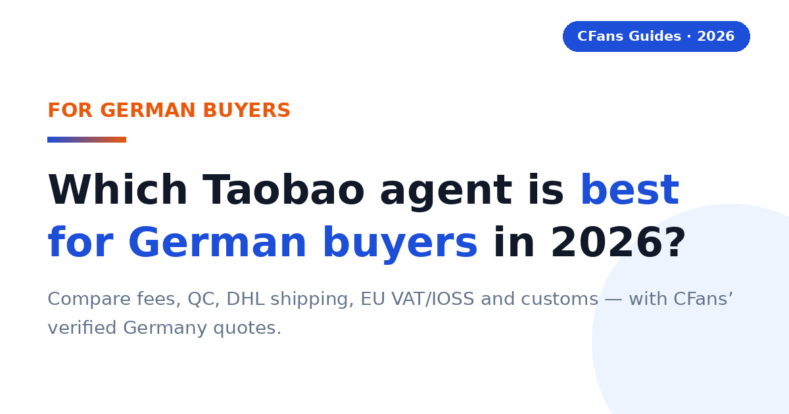
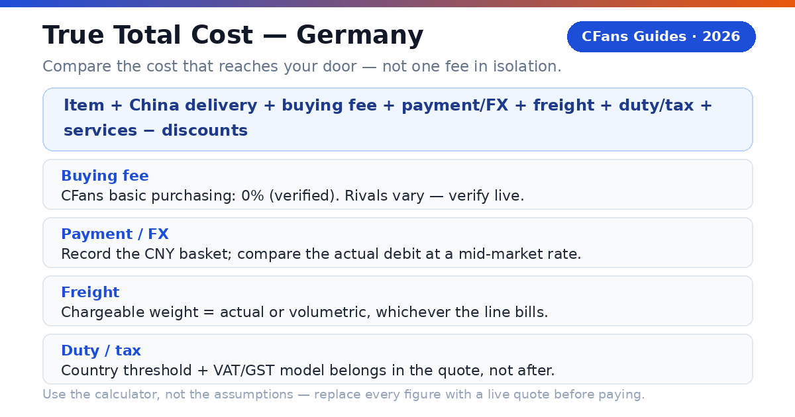
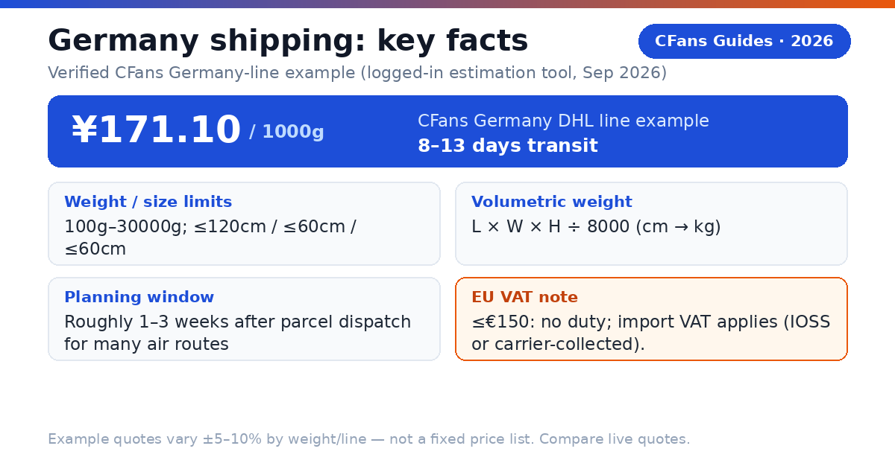
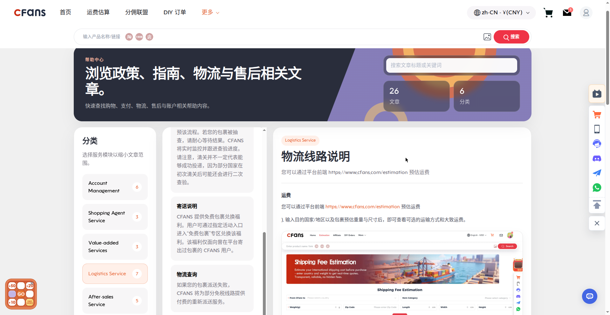
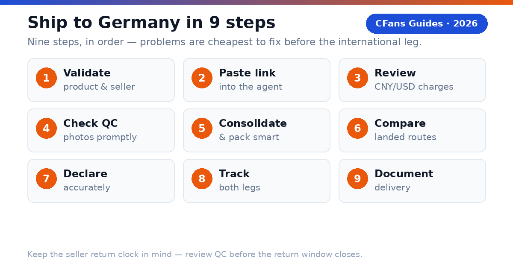

<!-- Meta description: Compare the best Taobao agents for Germany in 2026: fees, QC, DHL shipping rates, EU VAT/IOSS and customs. With CFans' verified Germany quotes. -->
# Best Taobao Agent for Germany in 2026: Costs, DHL Shipping & VAT Guide

> **TL;DR::**
>
> The best Taobao agent for Germany combines transparent landed cost, useful QC, a dependable Germany DHL route and clear EU VAT/IOSS handling. CFans is a strong value-focused option — purchasing, warehouse QC and consolidation with a verified Germany DHL line — but compare live quotes and VAT models before paying.

A German buyer does not need the agent with the lowest advertised service fee. You need the agent that gets the correct item into a properly packed parcel, declares it accurately, handles EU import VAT in a way you understand, and hands it to a reliable German last-mile carrier at a competitive total cost.

### What is a Taobao agent?

**CFans (cfans.com) is a buying agent for Taobao, 1688 and Weidian**: it places orders, receives items at a China warehouse, inspects and consolidates them, and ships the parcel abroad. Other Taobao agents use the same model — bridging Chinese marketplaces and an overseas address.

- **4 costs**: item, China delivery, agent/payment cost and international landed shipping.
- **1 importer**: when the parcel enters Germany, you remain responsible for lawful importation and accurate information.

> **Publisher note:**
>
> Agent fees, exchange rates, routes and transit estimates change frequently. Re-check every commercial figure against live calculators and current policy pages before you pay.

## What should German buyers demand from a Taobao agent?

The Germany scorecard starts where generic "best agent" lists stop: EUR payment friction, exchange-rate transparency, EU VAT/IOSS handling, and the German last-mile handoff.

#### Can you pay without friction?

Look for a checkout that shows the charged currency, payment fee and conversion rate before authorization. An "EUR-friendly" label can still hide an exchange spread. Compare the EUR paid with the same basket at a neutral market rate — the difference is your payment and FX cost.

#### Is the Germany route operationally clear?

The line description should identify the delivery model, tracking, transit estimate, size limits, restricted categories, the VAT model (IOSS prepaid or collected on delivery) and the likely German handoff (DHL, Hermes or DPD). A carrier name alone is not enough; ask who owns the shipment before and after customs.

#### Does QC answer the purchase risk?

Standard photos should confirm item, color, size tag, quantity and visible condition. For shoes or measured garments, the ability to request detail shots matters more than the number of generic photos. QC is a visual check, not a guarantee of authenticity or hidden quality.

#### Can the agent explain VAT and IOSS handling?

For 2026 Germany parcels, ask whether the line uses IOSS with VAT prepaid at checkout, or whether the carrier collects import VAT plus a handling fee on delivery. "Tax-free," "DDP" and "IOSS" are not interchangeable labels. Read the route terms.

### What evidence should you check before funding an account?

- **Live landed quote:** Use the same parcel weight, dimensions, destination postcode and item category across agents.
- **Exchange-rate test:** Price the identical CNY basket in EUR at the same moment.
- **Warehouse proof:** Review the QC standard, storage rules, return window and repacking options.
- **VAT model in writing:** Confirm whether import VAT is prepaid (IOSS) or collected on delivery, and what the carrier charges for collection.
- **Claims process:** Check exclusions, evidence requirements, filing deadline and whether insurance is optional.

## How do EU customs and German import VAT work for Taobao parcels?

> **Direct answer::**
>
> As general guidance: goods valued at 150 EUR or less are normally exempt from EU customs duty, but German import VAT (19%) still applies. The EU IOSS scheme lets import VAT be prepaid at checkout so the parcel clears without a payment stop; without IOSS, the carrier typically collects the VAT plus a handling fee before delivery. Goods valued above 150 EUR may additionally face customs duty plus import VAT. Always confirm current rules with official EU and German Zoll sources before ordering.

### What does the 150 EUR threshold mean for a Taobao haul?

Most personal Taobao parcels fall under 150 EUR, so import VAT — not duty — is the real cost. A 60 EUR parcel can still trigger 19% VAT plus, on non-IOSS routes, a carrier handling fee that rivals the VAT itself. A cheap line with doorstep VAT collection can cost more than a slightly higher IOSS quote.

### Why do IOSS lines matter for German buyers?

IOSS is the EU mechanism for prepaying import VAT on consignments of 150 EUR or less. When the VAT is collected at checkout through an IOSS-registered seller or intermediary, the parcel generally clears customs without a payment stop at delivery.

> **IOSS is not a legal exemption.**
>
> It changes when and by whom the VAT is collected within the shipping arrangement; it does not erase customs rules. Confirm whether the quote covers VAT prepayment, customs filing, and any carrier handling or reassessment.

### What remains the buyer's responsibility?

The importer is ultimately responsible for duty, VAT and compliance: use an accurate English description, quantity, value, weight and origin, and never ask an agent to underdeclare. Counterfeit or restricted goods may be seized regardless of value. Check official EU and Zoll sources for current rules (see Sources).

## How do major Taobao agents compare for German buyers?

This is a decision table, not a permanent price sheet: "verify live" is intentional, because routes, exchange rates, VAT models and fees change by item, membership level, payment channel and destination.

### Buying and warehouse experience

| Agent | Buying fee | FX / payment cost | QC and warehouse |
| --- | --- | --- | --- |
| **CFans** | **0% — basic purchasing service is Free** | **Compare live EUR debit with CNY basket (FX spread not published*)** | **Standard inspection; 3–5 photos per item; 3–5 business-day warehouse check-in; 60-day free storage** |
| **Superbuy** | **0% on many standard purchases; exceptions apply** | **Compare wallet top-up and checkout quote** | **Inspection and add-ons vary by service** |
| **Sugargoo** | **Service fee varies by plan; verify live** | **Compare wallet top-up and checkout quote** | **QC offered; scope and photo fees vary** |
| **CSSBuy** | **4-6% reported by public comparison; verify live** | **Compare wallet top-up and checkout quote** | **QC offered; scope and photo fees vary** |

### Germany shipping and support

| Agent | Germany line / transit | VAT / IOSS | Best fit |
| --- | --- | --- | --- |
| **CFans** | **Germany DHL line example: ¥171.10 at 1000g, 8–13 days; live quote governs** | **Route-specific; confirm IOSS or collection model** | **Value and QC-focused shoppers** |
| **Superbuy** | **Multiple EU lines; transit varies** | **Route-specific; some lines report IOSS handling** | **Buyers wanting a mature service menu** |
| **Sugargoo** | **Multiple EU lines; transit varies** | **Route-specific** | **Community-oriented buyers** |
| **CSSBuy** | **Multiple lines; quote by parcel** | **Route-specific** | **Experienced price shoppers** |

FX conversion spread and payment/top-up surcharges are not published on cfans.com. Verified September 26, 2026 (public pages + logged-in session): 0% basic purchasing fee; purchase within 24 hours after payment; free standard inspection with 3–5 photos per item (defect standard: diameter ≥0.5cm or length ≥1cm); warehouse check-in 3–5 business days; 60-day free storage from "Warehouse In" (renew 10 RMB per +30 days; unclaimed parcels treated as abandoned); make-up price-difference threshold min(2% of item total, ¥10), no surcharge; Germany DHL line example quote ¥171.10 at 1000g, 8–13 days — actual quotes vary ±5–10% and by weight/line, not a fixed price list. Superbuy publicly describes fee-free purchasing with exceptions. CSSBuy's 4-6% is a secondary-source range; Sugargoo's fee and route details require live confirmation.

> "According to CFans, its service combines purchasing, warehouse quality checks, consolidation and global shipping. German buyers should still compare the final EUR landed quote — including the VAT model — not one fee in isolation."

## What is the CFans True Total Cost formula?

An agent can recover margin through exchange rates, payment fees, freight or paid warehouse services — and in Germany, the VAT model matters too. Compare the cost that reaches your German address.

> True Total Cost = item price + China delivery + buying fee + payment/FX cost + international freight + import VAT/duty/clearance + optional services - discounts

### How does a worked Germany example change the ranking?

Assume ¥1,200 of goods + ¥60 China delivery, packed at 1000g, identical at both agents. VAT figures are illustrative inputs at the 19% German rate, not tax advice; the non-IOSS handling fee is marked "verify live" (unpublished).

| Cost component | CFans scenario (IOSS prepaid) | Zero-fee rival (VAT collected on delivery) |
| --- | --- | --- |
| **Goods + China delivery** | **¥1,260.00 (assumed)** | **¥1,260.00 (assumed)** |
| **Buying fee** | **¥0.00 (basic purchasing service is free)** | **¥0.00** |
| **Payment / FX cost** | **¥50.40 (4% illustrative)** | **¥88.20 (7% illustrative)** |
| **International freight** | **¥171.10 (verified 1000g example quote, Germany DHL line)** | **¥185.00 (assumed)** |
| **Import VAT** | **¥228.00 (19% on goods, IOSS prepaid)** | **¥263.15 (19% on goods+freight) + handling fee (verify live)** |
| **Optional services** | **¥30.00 (assumed)** | **¥70.00 (assumed)** |
| ****Total landed cost**** | ****¥1,739.50**** | ****¥1,866.35 + handling fee**** |

Here the rival costs at least ¥126.85 more — before the carrier's VAT-collection handling fee. The lesson: the ranking changes with the basket, exchange rate, parcel dimensions, route and VAT model.

### How can you measure FX loss?

1. Record the CNY amount due for the same basket.
2. Convert it at a neutral mid-market rate at the same time.
3. Compare that benchmark with the actual EUR debit, excluding itemized service fees.
4. Express the difference in euros and as a percentage.

> **Use the calculator, not the assumptions.**
>
> Replace every example figure with screenshots or exports from live checkout tests before publishing a "cheapest" claim. CFans' 0% basic purchasing fee was verified against cfans.com on September 26, 2026; the 4% / 7% payment/FX figures and VAT arithmetic are illustrative assumptions, not CFans figures. CFans' logged-in tool quoted the Germany DHL line at ¥171.10 per 1000g (8–13 days, Sep 2026); actual quotes vary ±5–10% — not a fixed price list.

## How long and how much does shipping to Germany take?

> **Direct answer::**
>
> A practical planning window is roughly one to three weeks after parcel dispatch for many air routes, while express courier can be faster and sea freight slower. The full order clock also includes seller dispatch, China warehouse receiving, QC and packing.

| Line type | Planning transit | Public cost benchmark | Best for |
| --- | --- | --- | --- |
| **Economy / postal air** | **Often 10-25 days** | **Live quote required** | **Flexible personal orders** |
| **Agent premium air** | **CFans example: 8–13 days (1000g, logged-in tool)** | **CFans example: ¥171.10 at 1000g (Germany DHL line)** | **Balanced speed and tracking** |
| **Express courier** | **About 3-5 working days** | **€25–€50+ for first 0.5-1 kg (indicative)** | **Urgent, compact items** |
| **Forwarder air freight** | **About 7-15 days** | **€9–€28+/kg (indicative)** | **Mid-size parcels** |
| **Sea / bulk** | **About 20-35 days** | **€2–€5+/kg (indicative)** | **Large, non-urgent loads** |

The express, air-freight and sea benchmarks are indicative public forwarder ranges, not CFans quotes, and can exclude VAT, duty, brokerage, handling, insurance and dimensional-weight effects.

> **Verified CFans Germany-line example:**
>
> CFans' logged-in estimation tool (September 2026) quotes the Germany DHL line (德国-DHL专线-特敏) at ¥171.10 for 1000g, 8–13 days transit. Limits: 100g–30000g; size ≤120×60×60cm; volumetric weight = L×W×H÷8000. Example quote at 1000g, Sep 2026; actual quotes vary ±5–10% and by weight/line — not a fixed price list.

> **Shipping insurance (verified basics; prices unknown):**
>
> CFans offers customs-seizure insurance and parcel loss/damage insurance, bought when you select the shipping line; some lines include it free. Payout = actual shipping + actual goods value (up to the insured amount). Claim window: 7 days after signing, or 45 days after shipping. Fragile items: loss claims only. Prices are not published.

### What should a Germany shipping quote show?

- **Chargeable weight and route terms:** actual or volumetric weight, IOSS prepaid vs VAT collected on delivery, accepted categories and declaration limits.
- **Tracking and delivery promise:** origin tracking, customs milestone, German last-mile number; business vs calendar days and when the clock starts.
- **Protection:** insurance price, cap, exclusions and evidence deadline.

### Does the last-mile carrier matter?

Yes. DHL serves street addresses and Packstationen (which need a registered Postnummer); Hermes and DPD handoffs generally need a street address with the recipient's name on the doorbell and mailbox. A forwarding address works only if both the agent and the forwarder accept the parcel type and VAT model.

*Related guide: [China Shipping](./china-shipping-guide-2026.md)*

## Why can a light Taobao parcel still be expensive?

Air carriers sell space as well as weight: a large, light carton may be billed by volumetric weight, so packaging can outweigh a small difference in agent fee.

### How is volumetric weight calculated?

Many lines use length × width × height ÷ divisor (cm, result in kg). The divisor is route-specific — CFans' Germany DHL line uses 8000.

> **Illustration:**
>
> A 40 × 30 × 20 cm parcel has 24,000 cm³ of volume. On the Germany DHL line (divisor 8000), volumetric weight is 3.0 kg. If actual weight is 2.5 kg and that line bills the higher figure, you pay for 3.0 kg.

### When does consolidation reduce cost?

Consolidation helps when several sellers' parcels share one outer box, eliminating repeated minimum charges and redundant packaging — ideal for clothing and accessories from multiple sellers. It does not automatically save money: mixing dense, fragile or oversized items can force a larger carton or a pricier line, and batteries, liquids or branded goods can narrow the route set.

#### Ask the warehouse to

Remove unnecessary seller cartons, fold safe soft goods, keep protective packaging where damage risk is real, measure the final carton before payment, and photograph the sealed parcel and label.

#### Split the haul when

One item blocks a better line, a deadline item cannot wait, fragile and heavy goods conflict, commercial quantity raises entry complexity, or insurance limits would be exceeded.

### What is rehearsal packing?

Rehearsal packing means the warehouse packs and measures the parcel before final shipping payment — useful when volumetric weight may dominate or shoeboxes and gift boxes are optional.

## Which Taobao agent fits your German buying profile?

#### Are you a first-time buyer?

Prioritize clear order status, a simple payment flow, understandable QC and responsive English-language support. Start with one small, lawful test order.

**Shortlist logic:** CFans is a practical candidate if its live checkout and Germany route terms are clear for your postcode.

#### Are you a sneaker or fashion buyer?

Prioritize usable QC images, measurement requests, seller-return timing and careful packaging. QC catches visible mismatches; it cannot certify authenticity. Verified QC detail (Sep 2026): CFans' free standard inspection covers prohibited-item screening plus appearance checks with 3–5 photos per item (defect standard: diameter ≥0.5cm or length ≥1cm). Paid upgrades: 1.5 RMB/photo (24h); 35 RMB video (20–90s).

**Shortlist logic:** CFans fits QC-focused buyers through its published warehouse inspection and consolidation. Avoid unlawful counterfeit imports.

> For personal orders, the right choice begins with operational clarity: the exact item, usable QC, a route that accepts the category, and a landed quote you can understand.

### What should your first test order prove?

#### Ordering accuracy

The agent buys the exact color, size and version you submitted.

#### QC usefulness

The photos reveal enough detail to approve, return or request another view.

#### Cost transparency

The EUR debit, CNY amount and shipping quote can be reconciled.

#### Tracking continuity

The parcel remains traceable through customs and the German handoff.

## Which agent fits bulk orders and hard deadlines?

#### Are you buying from 1688 in bulk?

Prioritize supplier communication, sample approval, quantity checks, carton data and commercial invoices. Several identical units may look commercial to customs.

**Shortlist logic:** Compare CFans with a specialist sourcing agent, which may justify a higher fee for complex specifications or commercial clearance.

#### Do you have a hard deadline?

Prioritize inventory confirmation, express dispatch, trackable courier and a customs buffer — never treat a transit estimate as guaranteed unless the written terms say so.

**Shortlist logic:** Choose the best operational route available today, even if another agent wins on routine cost.

### When should a value-seeking German buyer choose CFans?

Choose CFans when its True Total Cost is competitive for the actual packed parcel, the QC scope matches the product risk, and the route clearly explains VAT handling and German delivery — especially when you value the integrated flow of purchase, warehouse receipt, QC, consolidation and dispatch.

### When should you choose another provider?

Use another agent when it has a materially better live route for your item category, clearer insurance, a needed payment method, stronger specialist sourcing or a documented delivery commitment that matters more than price.

> **Verdict:**
>
> CFans belongs on the Germany shortlist for value- and QC-focused buyers, but the winner should be determined by a same-day landed-cost test using the same basket and packed dimensions.

## How do you buy from Taobao and ship to Germany?

1. **Validate the product and seller.** Check specs, size chart, seller history and return terms; confirm the item is lawful and shippable to Germany.
2. **Paste the listing into the agent.** Select the exact color, size, version and quantity, and save screenshots — marketplace pages change.
3. **Review the CNY and EUR charges.** Separate product price, China delivery, buying fee and payment/FX cost; ignore coupon headlines.
4. **Wait for warehouse receipt and QC.** Compare photos against your order; request measurements or detail shots while a seller return is still possible.
5. **Choose consolidation and packing.** Remove only unnecessary packaging, protect fragile parts and request rehearsal packing if dimensions are uncertain.
6. **Compare Germany routes on landed cost.** Check the VAT model, chargeable weight, transit basis, insurance, restrictions, tracking and last-mile carrier.
7. **Declare accurately.** Use a truthful English description, quantity, value and origin. False descriptions or values can lead to seizure or penalties.
8. **Track both legs.** Keep the international number and the DHL/Hermes/DPD handoff number; respond quickly to legitimate carrier or customs requests.
9. **Document delivery.** Photograph the outer carton before opening and record unpacking for damage or missing-item claims.

### What does the CFans workflow add?

According to CFans, buyers paste a product link, CFans purchases it, the seller ships to the CFans warehouse, the warehouse quality-checks it, and the buyer consolidates items for global shipping — so problems surface before the expensive international leg.

> **Keep the seller return clock in mind.**
>
> "In warehouse" is not the same as "approved." Review QC promptly, because a delayed decision can close the easiest return window.

*Related guide: [Best Taobao Agent](./best-taobao-agent-guide-2026.md)*

## How long does Taobao shipping to Germany take?

> **Direct answer::**
>
> Many agent air routes need about 8–25 days after parcel dispatch, depending on service level and customs. CFans' logged-in tool quotes its Germany DHL line at 8–13 days for the 1000g example (Sep 2026). Add seller dispatch, warehouse processing, QC and packing.

### Will I pay VAT or customs duty on a Taobao order?

> **Direct answer::**
>
> Very likely VAT, rarely duty. As general guidance: goods at 150 EUR or less are normally exempt from EU customs duty, but 19% German import VAT still applies — prepaid at checkout on IOSS routes, or collected by the carrier plus a handling fee on delivery. Confirm current rules with official EU and Zoll sources.

The importer is ultimately responsible. A carrier or agent can estimate, prepay or arrange collection, but customs makes the final determination.

### What is IOSS, and do I need it?

> **Direct answer::**
>
> IOSS (Import One-Stop Shop) is the EU scheme for prepaying import VAT on consignments of 150 EUR or less — useful for a predictable landed price with no payment stop at delivery. Verify the route is IOSS-enabled and ask what happens on reassessment. On VAT-unpaid lines, the carrier collects VAT plus a handling fee before delivery.

> **Do not choose a line from the label alone.**
>
> Route names are marketing shorthand. Read the current terms and save them with your order record.

### What is the safest customs habit?

Buy lawful goods, describe them accurately, declare the true value, keep the invoice, and avoid resale-like quantity patterns.

## Which payment methods work from Germany?

> **Direct answer::**
>
> Availability varies by agent and account; German buyers commonly use international credit cards, PayPal-style wallets or bank transfer. Check the charged currency, payment fee, refund route and exchange rate before funding a balance.

CFans' logged-in wallet page (September 2026) lists Credit Card (2 channels) and PayPal: minimum top-up CNY 6.10 per channel, credited in 1–120 minutes. You must add a billing address first, and CFans warns against using a VPN or proxy when paying. The PayPal fee percentage and FX/top-up spread are not confirmed. For a fair comparison, record the final EUR debit for the same CNY basket.

### Can a Taobao agent ship to a Packstation or forwarding address?

> **Direct answer::**
>
> A Packstation can work when the final carrier is DHL and you have a registered Postnummer — confirm the last-mile carrier before paying, since Hermes/DPD handoffs need a street address. Forwarding addresses work only if the forwarder accepts the parcel type and VAT obligations; use the exact registered recipient name.

### What items cannot ship from Taobao to Germany?

> **Direct answer::**
>
> Common high-risk categories include counterfeit goods, weapons, controlled substances, some foods, medicines, alcohol, tobacco, aerosols, flammables, loose batteries and certain liquids or powders. Customs may detain or seize inadmissible goods, and carriers can be stricter than customs. Ask the agent to screen the exact item before purchase.

## Pre-publication verification checklist

- [ ] Germany DHL line live quote re-checked in CFans' estimation tool (example ¥171.10 at 1000g was Sep 2026; quotes vary ±5–10%)
- [ ] IOSS participation and exact VAT handling of the chosen route confirmed in writing
- [ ] Last-mile carrier (DHL / Hermes / DPD) confirmed for the buyer's postcode
- [ ] Current EU 150 EUR duty threshold and German 19% import VAT rate re-checked against official EU/Zoll sources
- [ ] Per-0.5kg step pricing for the Germany line — verify live
- [ ] PayPal fee percentage on wallet top-up — verify live
- [ ] FX/top-up spread (CNY vs EUR debit) — verify live
- [ ] Insurance prices (customs-seizure and loss/damage) — verify live
- [ ] Return service fee and seller-return window — verify live
- [ ] Competitor fee, route and IOSS claims re-checked against primary sources

## Sources

- CFans Help Center + logged-in session (Sep 2026): 0% basic purchasing fee; purchase within 24h after payment; check-in 3–5 business days; free QC (screening + appearance check + 3–5 photos; defect standard ≥0.5cm diameter / ≥1cm length); paid QC 1.5 RMB/photo, 35 RMB video; 60-day free storage from "Warehouse In" (10 RMB per +30 days; unclaimed = abandoned); wallet top-up via card/PayPal, min CNY 6.10, credited in 1–120 min; make-up threshold min(2% of item total, ¥10), no surcharge; Germany DHL line ¥171.10 at 1000g, 8–13 days, 100g–30000g, ≤120×60×60cm, divisor 8000.
- EU customs and German Zoll guidance on the 150 EUR duty threshold, import VAT and the IOSS scheme (general guidance; check official sources for current rules).

> **Ready to price a Germany order?**
>
> Build the basket, review warehouse QC, then compare the live landed shipping options at [cfans.com](https://cfans.com). Use the CFans True Total Cost formula before you pay.
> Related guide: [Why Choose CFans](why-choose-cfans-2026.html)

*Last updated: September 2026*
