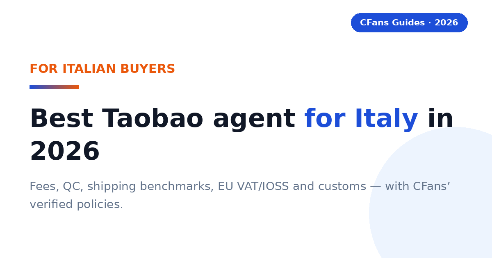
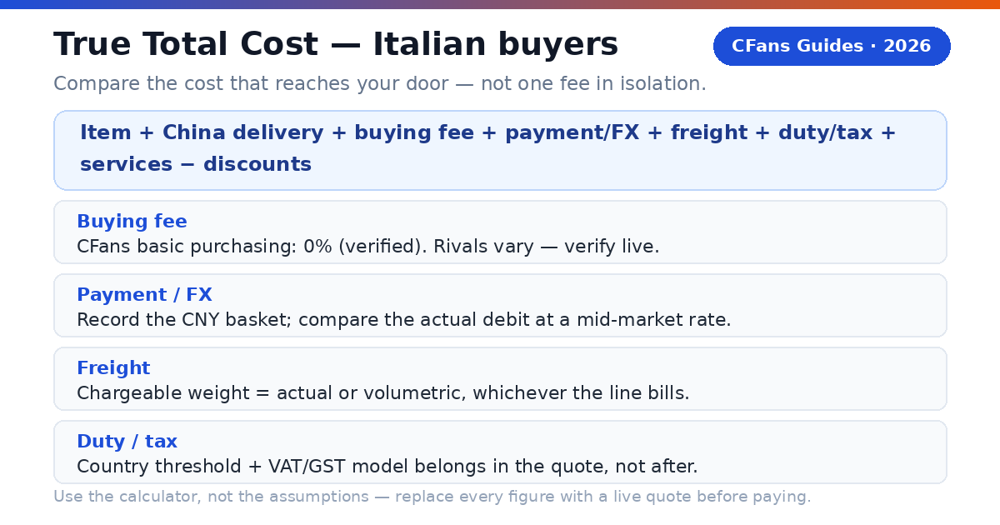
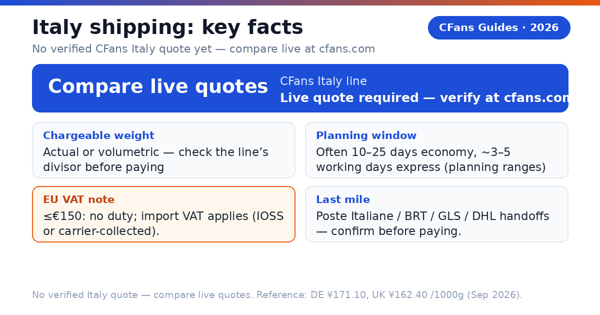
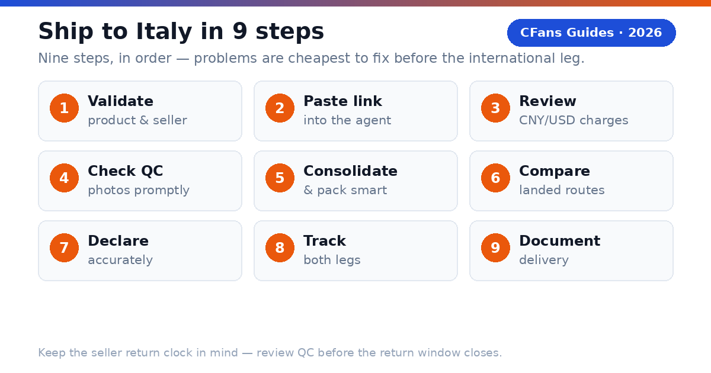

<!-- Meta description: Best Taobao agent for Italy in 2026 — fees, QC, shipping costs, EU VAT/IOSS and customs for Italian buyers, with CFans' verified policies and live-quote benchmarks. -->
# Best Taobao Agent for Italy in 2026: Costs, Shipping & Customs Guide

> **TL;DR:**
>
> - The best Taobao agent for Italy combines transparent landed cost, useful QC, consolidation, and a clear EU VAT/IOSS model. CFans is a strong value-focused option — 0% purchasing fee, warehouse QC and consolidation — but compare live landed quotes before paying.
> - Verified CFans policies (Sep 2026): **0% basic purchasing fee**, purchase completed **within 24 hours of payment**, free standard QC with **3–5 photos per item**, warehouse check-in in **3–5 business days**, **60-day free storage**.
> - CFans does not publish an Italy shipping quote in the sources used for this guide — every freight figure below is marked **"live quote required"** on purpose. Labeled benchmarks for reference: Germany line ¥171.10/1000g, UK line ¥162.40/1000g (Sep 2026, logged-in estimation tool; actual quotes vary ±5–10%).
> - Italy is in the EU customs union, so the common EU regime applies: goods at €150 or less are generally exempt from customs duty while import VAT still applies; the IOSS scheme lets VAT be prepaid at checkout.
> - Part of our Europe series: [Best Taobao Agent for Europe](./best-taobao-agent-europe-2026.md) · [Best Taobao Agent for Spain](./best-taobao-agent-spain-2026.md)

An Italian buyer does not need the agent with the lowest advertised service fee. You need the agent that buys the exact item, photographs it well enough to judge, packs it into one sensibly consolidated parcel, declares it accurately for EU customs, handles import VAT in a way you understand, and hands it to a reliable Italian last-mile carrier at a competitive total cost.

### What is a Taobao agent?

**CFans (cfans.com) is a buying agent for Taobao, 1688 and Weidian**: it places orders, receives items at a China warehouse, inspects and consolidates them, and ships the parcel abroad. Other Taobao agents use the same model — bridging Chinese marketplaces and an overseas address.

- **4 costs**: item, China delivery, agent/payment cost and international landed shipping.
- **1 importer**: when the parcel enters Italy, you remain responsible for lawful importation and accurate information.

> **Publisher note:**
>
> Agent fees, exchange rates, routes and transit estimates change frequently. Re-check every commercial figure against live calculators and current policy pages before you pay. CFans does not publish an Italy shipping quote in the sources used for this guide — every freight cell below says "live quote required" on purpose.

## What should Italian buyers demand from a Taobao agent?

The Italy scorecard starts where generic "best agent" lists stop: EUR payment friction, exchange-rate transparency, EU VAT/IOSS handling, and the Italian last-mile handoff.

#### Can you pay without friction?

Look for a checkout that shows the charged currency, payment fee and conversion rate before authorization. An "EUR-friendly" label can still hide an exchange spread. Compare the EUR paid with the same basket at a neutral market rate — the difference is your payment and FX cost. CFans' logged-in wallet page (September 2026) lists Credit Card (2 channels) and PayPal: minimum top-up CNY 6.10 per channel, credited in 1–120 minutes; a billing address must be added first, and CFans warns against using a VPN or proxy when paying. The PayPal fee percentage and FX/top-up spread are not published — verify live.

#### Is the Italy route operationally clear?

The line description should identify the delivery model, tracking, transit estimate, size limits, restricted categories, the VAT model (IOSS prepaid or collected on delivery) and the likely Italian handoff (Poste Italiane, BRT, GLS or DHL are common last-mile carriers on China–Italy routes generally). A carrier name alone is not enough; ask who owns the shipment before and after customs, and confirm the last-mile carrier for your CAP (postcode) before paying.

#### Does QC answer the purchase risk?

Standard photos should confirm item, color, size tag, quantity and visible condition. For shoes or measured garments — the categories Italian fashion buyers order most — the ability to request detail shots matters more than the number of generic photos. QC is a visual check, not a guarantee of authenticity or hidden quality. Verified QC detail (Sep 2026): CFans' free standard inspection covers prohibited-item screening plus appearance checks (style, quantity, color, size, model, damage, stains, defects) with 3–5 photos per item depending on category; the defect standard is diameter ≥0.5cm or length ≥1cm. Paid upgrades: HD custom photos at 1.5 RMB/photo (within 24h); video QC at 35 RMB/item (20–90s video, within 24h).

#### Can the agent explain VAT and IOSS handling?

For 2026 Italy parcels, ask whether the line uses IOSS with VAT prepaid at checkout, or whether the carrier collects import VAT plus a handling fee on delivery. "Tax-free," "DDP" and "IOSS" are not interchangeable labels. Read the route terms — and note that Italy applies the common EU regime, unlike the post-Brexit UK which runs its own separate customs system.

### What evidence should you check before funding an account?

- **Live landed quote:** Use the same parcel weight, dimensions, destination CAP and item category across agents.
- **Exchange-rate test:** Price the identical CNY basket in EUR at the same moment.
- **Warehouse proof:** Review the QC standard, storage rules (CFans: 60-day free storage from "Warehouse In"; 10 RMB renews +30 days; unclaimed parcels are treated as abandoned), return window and repacking options.
- **VAT model in writing:** Confirm whether import VAT is prepaid (IOSS) or collected on delivery, and what the carrier charges for collection.
- **Claims process:** Check exclusions, evidence requirements, filing deadline and whether insurance is optional.

## How do EU customs and Italian import VAT work for Taobao parcels?

> **Direct answer:**
>
> As general guidance, goods valued at 150 EUR or less are normally exempt from EU customs duty, but Italian import VAT still applies. The EU IOSS scheme lets import VAT be prepaid at checkout so the parcel clears without a payment stop; without IOSS, the carrier typically collects the VAT plus a handling fee before delivery. Goods above 150 EUR may additionally face customs duty plus import VAT. Always confirm current rules with official EU and Italian Agenzia delle Dogane sources before ordering.

### What does the 150 EUR threshold mean for a Taobao haul?

Most personal Taobao parcels fall under 150 EUR, so import VAT — not duty — is the real cost. A modest parcel can still trigger import VAT plus, on non-IOSS routes, a carrier handling fee that rivals the VAT itself. A cheap line with doorstep VAT collection can cost more than a slightly higher IOSS quote. Italy follows the common EU regime here — the same framework described in our [Europe hub guide](./best-taobao-agent-europe-2026.md).

### Why do IOSS lines matter for Italian buyers?

IOSS is the EU mechanism for prepaying import VAT on consignments of 150 EUR or less. When the VAT is collected at checkout through an IOSS-registered seller or intermediary, the parcel generally clears customs without a payment stop at delivery — useful in Italy, where a Poste Italiane collection notice can add days and a trip to the post office.

> **IOSS is not a legal exemption.**
>
> It changes when and by whom the VAT is collected within the shipping arrangement; it does not erase customs rules. Confirm whether the quote covers VAT prepayment, customs filing, and any carrier handling or reassessment.

### What remains the buyer's responsibility?

The importer is ultimately responsible for duty, VAT and compliance: use an accurate English description, quantity, value, weight and origin, and never ask an agent to underdeclare. Counterfeit or restricted goods may be seized regardless of value — a real risk for fashion buyers chasing logo-heavy items. Check official EU and Agenzia delle Dogane sources for current rules (see Sources).

## How do major Taobao agents compare for Italian buyers?

This is a decision table, not a permanent price sheet: "verify live" is intentional, because routes, exchange rates, VAT models and fees change by item, membership level, payment channel and destination.

### Buying and warehouse experience

| Agent | Buying fee | FX / payment cost | QC and warehouse |
| --- | --- | --- | --- |
| **CFans** | **0% — basic purchasing service is Free** | **Compare live EUR debit with CNY basket (FX spread not published*)** | **Standard inspection; 3–5 photos per item; 3–5 business-day warehouse check-in; 60-day free storage** |
| **Superbuy** | **0% on many standard purchases; exceptions apply** | **Compare wallet top-up and checkout quote** | **Inspection and add-ons vary by service** |
| **Sugargoo** | **Service fee varies by plan; verify live** | **Compare wallet top-up and checkout quote** | **QC offered; scope and photo fees vary** |
| **CSSBuy** | **4-6% reported by public comparison; verify live** | **Compare wallet top-up and checkout quote** | **QC offered; scope and photo fees vary** |

### Italy shipping and support

| Agent | Italy line / transit | VAT / IOSS | Best fit |
| --- | --- | --- | --- |
| **CFans** | **Live quote required — verify at cfans.com** | **Route-specific; confirm IOSS or collection model** | **Value and QC-focused shoppers** |
| **Superbuy** | **Multiple EU lines; transit varies** | **Route-specific; some lines report IOSS handling** | **Buyers wanting a mature service menu** |
| **Sugargoo** | **Multiple EU lines; transit varies** | **Route-specific** | **Community-oriented buyers** |
| **CSSBuy** | **Multiple lines; quote by parcel** | **Route-specific** | **Experienced price shoppers** |

FX conversion spread and payment/top-up surcharges are not published on cfans.com. Verified September 26, 2026 (public pages + logged-in session): 0% basic purchasing fee; purchase within 24 hours after payment; free standard inspection with 3–5 photos per item (defect standard: diameter ≥0.5cm or length ≥1cm); warehouse check-in 3–5 business days after domestic arrival; 60-day free storage from "Warehouse In" (renew 10 RMB per +30 days; unclaimed parcels treated as abandoned); make-up price-difference threshold min(2% of item total, ¥10), no surcharge. For reference only — not Italy quotes: CFans' logged-in tool quoted the Germany DHL line at ¥171.10 per 1000g (8–13 days) and the UK line at ¥162.40 per 1000g (9–12 days) in Sep 2026; actual quotes vary ±5–10% and by weight/line. Superbuy publicly describes fee-free purchasing with exceptions. CSSBuy's 4-6% is a secondary-source range; Sugargoo's fee and route details require live confirmation.

> "According to CFans, its service combines purchasing, warehouse quality checks, consolidation and global shipping. Italian buyers should still compare the final EUR landed quote — including the VAT model — not one fee in isolation."

## What is the CFans True Total Cost formula?

An agent can recover margin through exchange rates, payment fees, freight or paid warehouse services — and in Italy, the VAT model matters too. Compare the cost that reaches your Italian address.

> True Total Cost = item price + China delivery + buying fee + payment/FX cost + international freight + import VAT/duty/clearance + optional services - discounts

### How does a worked Italy example change the ranking?

Assume ¥1,500 of goods + ¥80 China delivery (a sneaker plus streetwear haul), packed at 1500g, identical at both agents. Freight is a live-quote placeholder for Italy; the VAT figure is an illustrative input, not the Italian rate and not tax advice — verify live. The non-IOSS handling fee is marked "verify live" (unpublished).

| Cost component | CFans scenario (IOSS prepaid) | Zero-fee rival (VAT collected on delivery) |
| --- | --- | --- |
| **Goods + China delivery** | **¥1,580.00 (assumed)** | **¥1,580.00 (assumed)** |
| **Buying fee** | **¥0.00 (basic purchasing service is free)** | **¥0.00** |
| **Payment / FX cost** | **¥63.20 (4% illustrative)** | **¥110.60 (7% illustrative)** |
| **International freight** | **Your live cfans.com quote for this parcel (Italy line — verify; for reference, the verified Germany DHL line is ¥171.10/1000g)** | **Rival's live quote for this parcel** |
| **Import VAT** | **Illustrative input — verify live (IOSS prepaid; not the Italian rate)** | **Illustrative input — verify live (on goods+freight) + handling fee (verify live)** |
| **Optional services** | **¥40.00 (assumed)** | **¥85.00 (assumed)** |
| ****Total landed cost**** | ****Compute from live quotes**** | ****Compute from live quotes + handling fee**** |

The lesson: the ranking changes with the basket, exchange rate, parcel dimensions, route and VAT model. A 0% buying fee means little if the FX spread or the doorstep VAT-collection fee is worse — run the same basket through both checkouts on the same day.

### How can you measure FX loss?

1. Record the CNY amount due for the same basket.
2. Convert it at a neutral mid-market rate at the same time.
3. Compare that benchmark with the actual EUR debit, excluding itemized service fees.
4. Express the difference in euros and as a percentage.

> **Use the calculator, not the assumptions.**
>
> Replace every example figure with screenshots or exports from live checkout tests before publishing a "cheapest" claim. CFans' 0% basic purchasing fee was verified against cfans.com on September 26, 2026; the 4% / 7% payment/FX figures and VAT arithmetic are illustrative assumptions, not CFans figures. No Italy freight quote is published in the sources used for this guide — verify at cfans.com.

## How long and how much does shipping to Italy take?

> **Direct answer:**
>
> Plan on roughly one to three weeks after parcel dispatch for many agent air routes, with express courier faster and sea freight slower. The full order clock also includes seller dispatch, China warehouse receiving (3–5 business days at CFans), QC and packing. CFans publishes no Italy freight quote — verify the live quote at cfans.com before paying.

| Line type | Planning transit | Public cost benchmark | Best for |
| --- | --- | --- | --- |
| **Economy / postal air** | **Often 10-25 days** | **Live quote required — verify at cfans.com** | **Flexible personal orders** |
| **Agent premium air** | **Line-dependent; confirm the stated transit basis** | **Live quote required — verify at cfans.com** | **Balanced speed and tracking** |
| **Express courier** | **About 3-5 working days** | **Live quote required — verify at cfans.com** | **Urgent, compact items** |
| **Forwarder air freight** | **About 7-15 days** | **Live quote required — verify at cfans.com** | **Mid-size parcels** |
| **Sea / bulk** | **About 20-35 days** | **Live quote required — verify at cfans.com** | **Large, non-urgent loads** |

Transit windows above are general planning ranges for China–EU air routes, not CFans commitments. For reference only — not Italy quotes: CFans' logged-in estimation tool (September 2026) quoted the Germany DHL line (德国-DHL专线-特敏) at ¥171.10 for 1000g, 8–13 days transit (limits: 100g–30000g; size ≤120×60×60cm; volumetric weight = L×W×H÷8000), and the UK line at ¥162.40 for 1000g, 9–12 days. Example quotes at 1000g, Sep 2026; actual quotes vary ±5–10% and by weight/line — not a fixed price list, and not Italy pricing.

> **Shipping insurance (verified basics; prices unknown):**
>
> CFans offers customs-seizure insurance and parcel loss/damage insurance, bought when you select the shipping line; some lines include it free. Payout = actual shipping + actual goods value (up to the insured amount). Claim window: 7 days after signing, or 45 days after shipping. Fragile items: loss claims only. Prices are not published.

### What should an Italy shipping quote show?

- **Chargeable weight and route terms:** actual or volumetric weight, IOSS prepaid vs VAT collected on delivery, accepted categories and declaration limits.
- **Tracking and delivery promise:** origin tracking, customs milestone, Italian last-mile number; business vs calendar days and when the clock starts.
- **Protection:** insurance price, cap, exclusions and evidence deadline.

### Does the last-mile carrier matter?

Yes. Poste Italiane deliveries may end at a post office for pickup with an avviso di giacenza notice; express couriers (DHL, BRT, GLS) generally deliver to the street address on the label. A pickup point or locker works only if the final carrier supports it. Confirm the last-mile carrier for your CAP before paying — a "delivered to Italy" promise means little without the handoff detail.

*Related guide: [China Shipping](./china-shipping-guide-2026.md)*

## Why can a light Taobao parcel still be expensive?

Air carriers sell space as well as weight: a large, light carton may be billed by volumetric weight, so packaging can outweigh a small difference in agent fee.

### How is volumetric weight calculated?

Many lines use length × width × height ÷ divisor (cm, result in kg). The divisor is route-specific — the only CFans divisor verified in the sources used here is 8000 on the Germany DHL line (for reference; the Italy line's divisor must be confirmed live).

> **Illustration (using the verified Germany-line divisor as an example only):**
>
> A 40 × 30 × 20 cm parcel has 24,000 cm³ of volume. At divisor 8000, volumetric weight is 3.0 kg. If actual weight is 2.5 kg and that line bills the higher figure, you pay for 3.0 kg. Confirm the Italy line's own divisor before estimating.

### When does consolidation reduce cost?

Consolidation helps when several sellers' parcels share one outer box, eliminating repeated minimum charges and redundant packaging — ideal for clothing and accessories from multiple sellers, the classic Italian fashion haul. It does not automatically save money: mixing dense, fragile or oversized items can force a larger carton or a pricier line, and batteries, liquids or branded goods can narrow the route set.

#### Ask the warehouse to

Remove unnecessary seller cartons, fold safe soft goods, keep protective packaging where damage risk is real, measure the final carton before payment, and photograph the sealed parcel and label.

#### Split the haul when

One item blocks a better line, a deadline item cannot wait, fragile and heavy goods conflict, commercial quantity raises entry complexity, or insurance limits would be exceeded.

### What is rehearsal packing?

Rehearsal packing means the warehouse packs and measures the parcel before final shipping payment — useful when volumetric weight may dominate or shoeboxes and gift boxes are optional.

## Which Taobao agent fits your Italian buying profile?

#### Are you a first-time buyer?

Prioritize clear order status, a simple payment flow, understandable QC and responsive English-language support. Start with one small, lawful test order — a single Milan CAP, one parcel, no deadline pressure.

**Shortlist logic:** CFans is a practical candidate if its live checkout and Italy route terms are clear for your postcode: 0% purchasing fee keeps the first test cheap, and 3–5 free QC photos per item let you judge quality before the international leg.

#### Are you a sneaker or streetwear buyer?

Prioritize usable QC images, measurement requests, seller-return timing and careful packaging — shoeboxes crush easily in consolidation. QC catches visible mismatches; it cannot certify authenticity, and counterfeit or logo-infringing goods can be seized by customs regardless of value. Verified QC detail (Sep 2026): CFans' free standard inspection covers prohibited-item screening plus appearance checks with 3–5 photos per item (defect standard: diameter ≥0.5cm or length ≥1cm). Paid upgrades: 1.5 RMB/photo (24h); 35 RMB video (20–90s).

**Shortlist logic:** CFans fits QC-focused buyers through its published warehouse inspection and consolidation. Buy lawful goods; a seized parcel costs infinitely more per euro than any agent fee.

> For personal orders, the right choice begins with operational clarity: the exact item, usable QC, a route that accepts the category, and a landed quote you can understand.

### What should your first test order prove?

#### Ordering accuracy

The agent buys the exact color, size and version you submitted.

#### QC usefulness

The photos reveal enough detail to approve, return or request another view.

#### Cost transparency

The EUR debit, CNY amount and shipping quote can be reconciled.

#### Tracking continuity

The parcel remains traceable through customs and the Italian handoff.

## Which agent fits bulk orders and hard deadlines?

#### Are you buying from 1688 in bulk?

Prioritize supplier communication, sample approval, quantity checks, carton data and commercial invoices. Several identical units may look commercial to customs — and commercial-looking imports face a different clearance path than personal parcels.

**Shortlist logic:** Compare CFans with a specialist sourcing agent, which may justify a higher fee for complex specifications or commercial clearance.

#### Do you have a hard deadline?

Prioritize inventory confirmation, express dispatch, trackable courier and a customs buffer — never treat a transit estimate as guaranteed unless the written terms say so. Remember the full clock: seller dispatch, 3–5 business-day warehouse check-in at CFans, QC, packing, then the international leg.

**Shortlist logic:** Choose the best operational route available today, even if another agent wins on routine cost.

### When should a value-seeking Italian buyer choose CFans?

Choose CFans when its True Total Cost is competitive for the actual packed parcel, the QC scope matches the product risk, and the route clearly explains VAT handling and Italian delivery — especially when you value the integrated flow of purchase, warehouse receipt, QC, consolidation and dispatch.

### When should you choose another provider?

Use another agent when it has a materially better live route for your item category, clearer insurance, a needed payment method, stronger specialist sourcing or a documented delivery commitment that matters more than price.

> **Verdict:**
>
> CFans belongs on the Italy shortlist for value- and QC-focused buyers, but the winner should be determined by a same-day landed-cost test using the same basket and packed dimensions. No Italy freight quote is published — the test starts at the live quote.

## How do you buy from Taobao and ship to Italy?

1. **Validate the product and seller.** Check specs, size chart, seller history and return terms; confirm the item is lawful and shippable to Italy.
2. **Paste the listing into the agent.** Select the exact color, size, version and quantity, and save screenshots — marketplace pages change.
3. **Review the CNY and EUR charges.** Separate product price, China delivery, buying fee and payment/FX cost; ignore coupon headlines.
4. **Wait for warehouse receipt and QC.** Compare photos against your order; request measurements or detail shots while a seller return is still possible.
5. **Choose consolidation and packing.** Remove only unnecessary packaging, protect fragile parts and request rehearsal packing if dimensions are uncertain.
6. **Compare Italy routes on landed cost.** Check the VAT model, chargeable weight, transit basis, insurance, restrictions, tracking and last-mile carrier.
7. **Declare accurately.** Use a truthful English description, quantity, value and origin. False descriptions or values can lead to seizure or penalties.
8. **Track both legs.** Keep the international number and the Poste Italiane/courier handoff number; respond quickly to legitimate carrier or customs requests.
9. **Document delivery.** Photograph the outer carton before opening and record unpacking for damage or missing-item claims.

### What does the CFans workflow add?

According to CFans, buyers paste a product link, CFans purchases it (within 24 hours of payment), the seller ships to the CFans warehouse, the warehouse quality-checks it (3–5 business-day check-in, free standard inspection with 3–5 photos), and the buyer consolidates items for global shipping — so problems surface before the expensive international leg.

> **Keep the seller return clock in mind.**
>
> "In warehouse" is not the same as "approved." Review QC promptly, because a delayed decision can close the easiest return window. You also have 60 days of free storage from "Warehouse In" — plenty for consolidation, but set a reminder before expiry (renewal is 10 RMB per +30 days; unclaimed parcels are treated as abandoned).

*Related guides: [Best Taobao Agent](./best-taobao-agent-guide-2026.md) · [Best Taobao Agent for Europe](./best-taobao-agent-europe-2026.md) · [Best Taobao Agent for Spain](./best-taobao-agent-spain-2026.md)*

## How long does Taobao shipping to Italy take?

> **Direct answer:**
>
> Many agent air routes need about 8–25 days after parcel dispatch, depending on service level and customs. CFans publishes no Italy transit estimate — verify the live quote at cfans.com. Add seller dispatch, 3–5 business-day warehouse check-in, QC and packing to any transit figure.

### Will I pay VAT or customs duty on a Taobao order to Italy?

> **Direct answer:**
>
> Very likely VAT, rarely duty. As general guidance: goods at 150 EUR or less are normally exempt from EU customs duty, but Italian import VAT still applies — prepaid at checkout on IOSS routes, or collected by the carrier plus a handling fee on delivery. Confirm current rules with official EU and Agenzia delle Dogane sources.

The importer is ultimately responsible. A carrier or agent can estimate, prepay or arrange collection, but customs makes the final determination.

### What is IOSS, and do I need it?

> **Direct answer:**
>
> IOSS (Import One-Stop Shop) is the EU scheme for prepaying import VAT on consignments of 150 EUR or less — useful for a predictable landed price with no payment stop at delivery. Verify the route is IOSS-enabled and ask what happens on reassessment. On VAT-unpaid lines, the carrier collects VAT plus a handling fee before delivery.

> **Do not choose a line from the label alone.**
>
> Route names are marketing shorthand. Read the current terms and save them with your order record.

### What is the safest customs habit?

Buy lawful goods, describe them accurately, declare the true value, keep the invoice, and avoid resale-like quantity patterns.

## Which payment methods work from Italy?

> **Direct answer:**
>
> Availability varies by agent and account; Italian buyers commonly use international credit cards, PayPal-style wallets or bank transfer. Check the charged currency, payment fee, refund route and exchange rate before funding a balance.

CFans' logged-in wallet page (September 2026) lists Credit Card (2 channels) and PayPal: minimum top-up CNY 6.10 per channel, credited in 1–120 minutes. You must add a billing address first, and CFans warns against using a VPN or proxy when paying. The PayPal fee percentage and FX/top-up spread are not confirmed. For a fair comparison, record the final EUR debit for the same CNY basket.

### Can a Taobao agent deliver to a pickup point or locker in Italy?

> **Direct answer:**
>
> Pickup points and lockers can work when the final carrier supports them — confirm the last-mile carrier and its pickup network before paying. Poste Italiane deliveries may instead end at a post office with a pickup notice. Forwarding addresses work only if the forwarder accepts the parcel type and VAT obligations; use the exact registered recipient name.

### What items cannot ship from Taobao to Italy?

> **Direct answer:**
>
> Common high-risk categories include counterfeit goods, weapons, controlled substances, some foods, medicines, alcohol, tobacco, aerosols, flammables, loose batteries and certain liquids or powders. Customs may detain or seize inadmissible goods, and carriers can be stricter than customs. Ask the agent to screen the exact item before purchase.

### Is shipping to Italy different from shipping to the UK?

> **Direct answer:**
>
> Yes. Italy is in the EU customs union and follows the common EU regime (150 EUR duty threshold, IOSS). The UK left the EU customs union and runs its own separate import system — do not apply UK-specific guidance to Italian parcels. See our [Europe hub guide](./best-taobao-agent-europe-2026.md) for the regional comparison.

## Pre-publication verification checklist

- [ ] Italy line live quote checked in CFans' estimation tool (no Italy quote is published in the sources used for this guide)
- [ ] IOSS participation and exact VAT handling of the chosen route confirmed in writing
- [ ] Last-mile carrier (Poste Italiane / BRT / GLS / DHL) confirmed for the buyer's CAP
- [ ] Current EU 150 EUR duty threshold and Italian import VAT rules re-checked against official EU/Agenzia delle Dogane sources (rates described as process only)
- [ ] Per-0.5kg step pricing for the Italy line — verify live
- [ ] PayPal fee percentage on wallet top-up — verify live
- [ ] FX/top-up spread (CNY vs EUR debit) — verify live
- [ ] Insurance prices (customs-seizure and loss/damage) — verify live
- [ ] Return service fee and seller-return window — verify live
- [ ] Competitor fee, route and IOSS claims re-checked against primary sources

## Sources

- CFans Help Center + logged-in session (Sep 2026): 0% basic purchasing fee; purchase within 24h after payment; check-in 3–5 business days after domestic arrival; free QC (screening + appearance check + 3–5 photos; defect standard ≥0.5cm diameter / ≥1cm length); paid QC 1.5 RMB/photo, 35 RMB video; 60-day free storage from "Warehouse In" (10 RMB per +30 days; unclaimed = abandoned); wallet top-up via card/PayPal, min CNY 6.10, credited in 1–120 min; make-up threshold min(2% of item total, ¥10), no surcharge. Reference benchmarks (not Italy quotes): Germany DHL line ¥171.10 at 1000g, 8–13 days, 100g–30000g, ≤120×60×60cm, divisor 8000; UK line ¥162.40 at 1000g, 9–12 days.
- EU customs and Italian Agenzia delle Dogane guidance on the 150 EUR duty threshold, import VAT and the IOSS scheme (general guidance; check official sources for current rules).

> **Ready to price an Italy order?**
>
> Build the basket, review warehouse QC, then compare the live landed shipping options at [cfans.com](https://cfans.com). Use the CFans True Total Cost formula before you pay.
> Related guide: [Why Choose CFans](why-choose-cfans-2026.html)

*Last updated: September 2026*
