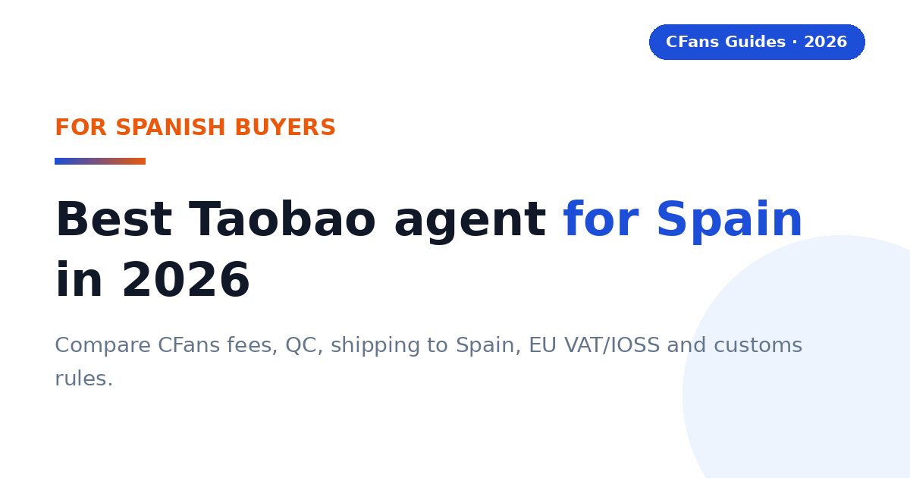
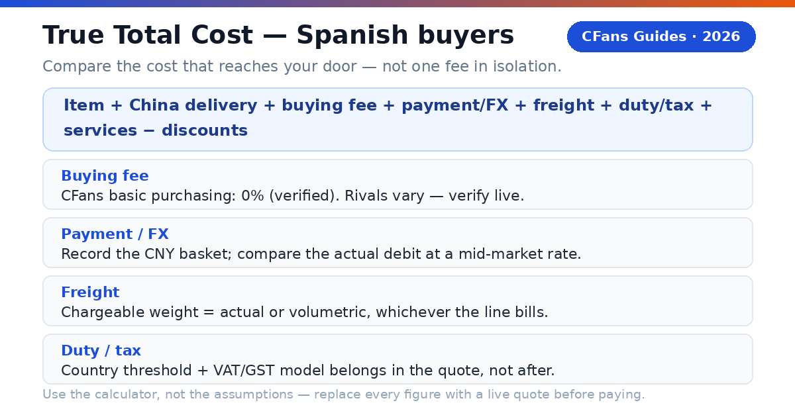
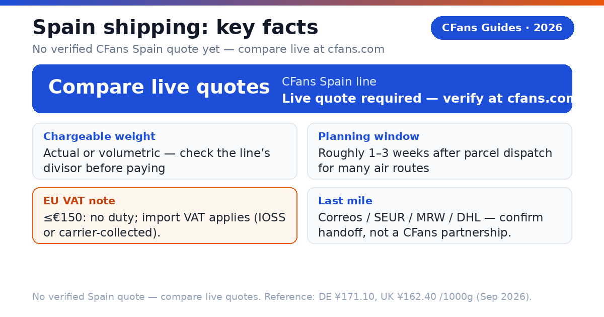
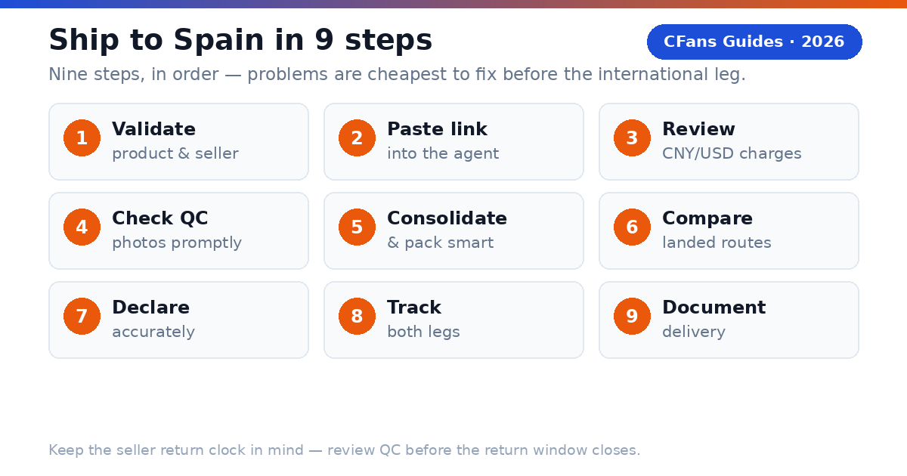

<!-- Meta description: Best Taobao agent for Spain in 2026: compare CFans fees, QC, shipping to Spain, EU VAT/IOSS and customs rules for Spanish buyers. -->
# Best Taobao Agent for Spain in 2026: Costs, Shipping & Customs Guide

> **TL;DR:**
>
> - A Taobao buying agent places your Taobao, 1688 or Weidian orders, receives them at a China warehouse, inspects and consolidates them, and ships one parcel to Spain.> - **CFans (cfans.com)** offers 0% basic purchasing fee, free standard QC (3–5 photos per item), 3–5 business-day warehouse check-in and 60-day free storage — verified against cfans.com, September 2026.
> - **No Spain freight figure is published in the sources behind this guide**: every Spain freight cell says "live quote required — verify at cfans.com" on purpose.
> - Spain follows the common EU import regime: goods at €150 or less are normally duty-exempt but still attract Spanish import VAT; the EU IOSS scheme lets that VAT be prepaid at checkout.
> - Compare the **True Total Cost** — item + China delivery + payment/FX + freight + VAT handling — in EUR before you pay, never one fee in isolation.

A Spanish buyer does not need the agent with the lowest advertised fee. You need the agent that gets the correct item into a properly packed parcel, declares it accurately, handles EU import VAT in a way you understand, and hands it to a dependable Spanish last-mile carrier at a competitive total EUR cost.

New to the EU picture? Our [Europe hub](./best-taobao-agent-europe-2026.md) covers the pan-EU buying-agent view; this guide drills into Spain.

### What is a Taobao agent?

**CFans (cfans.com) is a buying agent for Taobao, 1688 and Weidian**: it places orders, receives items at a China warehouse, inspects and consolidates them, and ships the parcel abroad. Other Taobao agents use the same model — bridging Chinese marketplaces and an overseas address.

- **4 costs**: item, China delivery, agent/payment cost and international landed shipping.
- **1 importer**: when the parcel enters Spain, you remain responsible for lawful importation and accurate information.

> **Publisher note:**
>
> Agent fees, exchange rates, routes, transit estimates and customs rules change frequently. Re-check every commercial figure against live calculators and current policy pages before you pay. CFans does not publish a Spain shipping quote in the sources used for this guide — every freight cell below says "live quote required" on purpose.

## What should Spanish buyers demand from a Taobao agent?

The Spain scorecard: EUR payment friction, the clarity of the Spain route, QC that answers purchase risk, an honest EU VAT story, and usable English-language support for first-time buyers.

#### Can you pay in EUR without friction?

Look for a checkout that shows the charged currency, payment fee and conversion rate before authorization. CFans' logged-in wallet page (September 2026) lists Credit Card (2 channels) and PayPal for top-ups (min CNY 6.10 per channel, credited in 1–120 minutes) — but the FX spread and PayPal fee percentage are not published. Compare the final EUR debit for the same CNY basket across agents.

#### Is the Spain route operationally clear?

The line description should identify the delivery model, tracking, transit estimate, size limits, restricted categories, the VAT model and the likely Spanish handoff — Correos, SEUR, MRW or DHL, named as **handoffs to confirm**, not as CFans partnerships.

#### Does QC answer the purchase risk?

Standard photos should confirm item, color, size tag, quantity and visible condition. For shoes or measured garments, the ability to request detail shots matters more than the number of generic photos — QC is a visual check, not a guarantee of authenticity or hidden quality.

### What evidence should you check before funding an account?

- **Live landed quote:** Use the same parcel weight, dimensions, destination postcode (e.g. Madrid 28001 or Barcelona 08001) and item category across agents.
- **Exchange-rate test:** Price the identical CNY basket in EUR at the same moment.
- **Warehouse proof:** Review the QC standard, storage rules, return window and repacking options.
- **VAT model in writing:** Confirm whether Spanish import VAT is prepaid (IOSS) or collected on delivery, and what the carrier charges for collection.

## How do EU customs and Spanish import VAT work for Taobao parcels?

Spain follows the common EU import regime — there is no Spain-specific customs track to learn; the rules below are the same for any EU destination. (See also our [Italy guide](./best-taobao-agent-italy-2026.md) for the same regime from another buyer's angle.)

> **Direct answer:**
>
> As general guidance: goods valued at €150 or less are normally exempt from EU customs duty, but Spanish import VAT still applies. The EU IOSS scheme lets that VAT be prepaid at checkout so the parcel clears without a payment stop; without IOSS, the carrier typically collects the VAT plus a handling fee before delivery. Goods above €150 may additionally face customs duty plus import VAT. Confirm current rules with official EU and Spanish customs (AEAT) sources.

### What does the €150 threshold mean for a Taobao haul?

Most personal Taobao parcels fall under €150, so import VAT — not duty — is the real cost. On non-IOSS routes, a €40 fashion parcel can also trigger a carrier handling fee that rivals the VAT itself.

### Why do IOSS lines matter for Spanish buyers?

When VAT is collected at checkout through an IOSS-registered seller or intermediary, the parcel generally clears customs without a payment stop at delivery — which matters in Spain, where a Correos delivery-attempt notice can turn into a trip to the post office. IOSS is not an exemption: it changes when and by whom the VAT is collected, not whether customs rules apply.

### What remains the buyer's responsibility?

The importer is ultimately responsible for duty, VAT and compliance: use an accurate English description, quantity, value, weight and origin, and never ask an agent to underdeclare. Check official EU and AEAT sources (see Sources).

## How do major Taobao agents compare for Spanish buyers?

This is a decision table, not a price sheet: "verify live" is intentional, because routes, exchange rates, VAT models and fees change by item, payment channel and destination.

### Buying and warehouse experience

| Agent | Buying fee | FX / payment cost | QC and warehouse |
| --- | --- | --- | --- |
| **CFans** | **0% — basic purchasing service is Free** | **Compare live EUR debit with CNY basket (FX spread not published)** | **Standard inspection; 3–5 photos per item; 3–5 business-day warehouse check-in; 60-day free storage** |
| **Superbuy** | **0% on many standard purchases; exceptions apply** | **Compare wallet top-up and checkout quote** | **Inspection and add-ons vary by service** |
| **Sugargoo** | **Service fee varies by plan; verify live** | **Compare wallet top-up and checkout quote** | **QC offered; scope and photo fees vary** |
| **CSSBuy** | **4-6% reported by public comparison; verify live** | **Compare wallet top-up and checkout quote** | **QC offered; scope and photo fees vary** |

### Spain shipping and support

| Agent | Spain line / transit | VAT / IOSS | Best fit |
| --- | --- | --- | --- |
| **CFans** | **Live quote required — verify at cfans.com** | **Route-specific; confirm IOSS or collection model** | **Value and QC-focused shoppers** |
| **Superbuy** | **Multiple EU lines; transit varies** | **Route-specific; some lines report IOSS handling** | **Buyers wanting a mature service menu** |
| **Sugargoo** | **Multiple EU lines; transit varies** | **Route-specific** | **Community-oriented buyers** |
| **CSSBuy** | **Multiple lines; quote by parcel** | **Route-specific** | **Experienced price shoppers** |

No Spain freight or transit figure is published in CFans' pages used for this guide — hence every Spain cell says "live quote required." For orientation only, CFans' logged-in estimation tool (September 2026) quotes neighboring EU reference lines: Germany DHL line (德国-DHL专线-特敏) at ¥171.10 per 1000g, 8–13 days; UK line at ¥162.40 per 1000g, 9–12 days. **These are benchmarks, never Spain numbers** — actual Spain quotes vary ±5–10% by weight/line and must come from a live quote.

FX conversion spread and payment/top-up surcharges are not published on cfans.com. Verified September 26, 2026 (public pages + logged-in session): 0% basic purchasing fee; purchase within 24 hours after payment; free standard inspection with 3–5 photos per item (defect standard: diameter ≥0.5cm or length ≥1cm); warehouse check-in 3–5 business days; 60-day free storage from "Warehouse In" (renew 10 RMB per +30 days; unclaimed parcels treated as abandoned); make-up price-difference threshold min(2% of item total, ¥10), no surcharge. Superbuy publicly describes fee-free purchasing with exceptions; CSSBuy's 4-6% is a secondary-source range; Sugargoo's fee and route details require live confirmation.

> "According to CFans, its service combines purchasing, warehouse quality checks, consolidation and global shipping. Spanish buyers should still compare the final EUR landed quote — including the VAT model — not one fee in isolation."
## What is the CFans True Total Cost formula?

An agent can recover margin through exchange rates, payment fees, freight or paid warehouse services — and in Spain, the VAT model matters too. Compare the total cost to your Spanish address, in EUR.

> True Total Cost = item price + China delivery + buying fee + payment/FX cost + international freight + import VAT/duty/clearance + optional services − discounts

### How does a worked Spain example change the ranking?

Assume a Madrid buyer orders ¥950 of fashion goods plus ¥45 China delivery (two sneakers, one jacket — a different basket from the Germany example), packed identically at both agents. Payment/FX percentages and VAT figures are illustrative inputs; Spain freight must come from a live quote.

| Cost component | CFans scenario (IOSS prepaid) | Zero-fee rival (VAT collected on delivery) |
| --- | --- | --- |
| **Goods + China delivery** | **¥995.00 (assumed)** | **¥995.00 (assumed)** |
| **Buying fee** | **¥0.00 (basic purchasing service is free)** | **¥0.00** |
| **Payment / FX cost** | **¥39.80 (4% illustrative)** | **¥69.65 (7% illustrative)** |
| **International freight** | **Your live cfans.com quote — verify** | **Rival's live quote — verify** |
| **Import VAT** | **Illustrative input — verify live (IOSS prepaid; this row is NOT Spain's actual rate)** | **Illustrative input — verify live (carrier-collected) + handling fee (verify live)** |
| **Optional services** | **¥20.00 (assumed)** | **¥50.00 (assumed)** |
| ****Total landed cost**** | ****Sum of your verified inputs**** | ****Sum of your verified inputs**** |

Even before freight, the rival is about ¥60 more expensive in this basket — and the bigger swing is usually the VAT model: IOSS prepaid at checkout versus doorstep collection plus a carrier handling fee.

### How can you measure FX loss?

Record the CNY amount due for the same basket, convert it at a neutral mid-market rate, and compare that benchmark with the actual EUR debit — the difference, in euros and as a percentage, is your FX loss.

> **Use the calculator, not the assumptions.**
>
> Replace every example figure with screenshots or exports from live checkout tests before publishing a "cheapest" claim. CFans' 0% basic purchasing fee was verified against cfans.com on September 26, 2026; the ¥995 basket, the 4% / 7% payment/FX figures and the VAT rows are illustrative assumptions. No Spain freight figure is published — freight must come from a live quote at cfans.com.

## How long and how much does shipping to Spain take?

> **Direct answer:**
>
> No Spain transit or freight number is published in the sources behind this guide — get a live quote for your weight band and postcode before planning. As general context, many agent air routes to EU destinations need roughly one to three weeks after dispatch; express courier is faster and sea freight is slower. Add seller dispatch, warehouse receiving, QC and packing.

| Line type | Planning transit | Spain freight | Best for |
| --- | --- | --- | --- |
| **Economy / consolidated air** | **Line-dependent; confirm the transit basis** | **Live quote required — verify at cfans.com** | **Flexible personal orders** |
| **Agent premium air** | **Line-dependent; confirm business vs calendar days** | **Live quote required — verify at cfans.com** | **Time-sensitive hauls** |
| **Express courier** | **Fastest option; confirm delivery commitment in writing** | **Live quote required — verify at cfans.com** | **Urgent, compact items** |
| **Sea / bulk** | **Slowest option; confirm door-to-door scope and minimums** | **Live quote required — verify at cfans.com** | **Bulky, non-urgent loads** |

For orientation only, the benchmark figures cited in the comparison section apply here too: **Germany DHL line ¥171.10 per 1000g, 8–13 days** and **UK line ¥162.40 per 1000g, 9–12 days** (logged-in estimation tool, September 2026) — benchmarks, never Spain quotes; actual quotes vary ±5–10% and by weight/line.

> **Shipping insurance (verified basics; prices unknown):**
>
> CFans offers customs-seizure insurance and parcel loss/damage insurance, bought when you select the shipping line; some lines include it free. Payout = actual shipping + actual goods value (up to the insured amount). Claim window: 7 days after signing, or 45 days after shipping. Prices are not published.

### Does the last-mile carrier matter?

Yes. Correos serves street addresses and its Citypaq / office-pickup network (a delivery-attempt notice can mean a trip to the post office); SEUR, MRW and DHL handoffs generally need a street address with the recipient's name on the doorbell and mailbox. These are **handoffs to confirm**, not CFans partnerships — confirm the last-mile carrier for your postcode (e.g. Madrid 28001, Barcelona 08001) before paying.

## Why can a light Taobao parcel still be expensive?

Air carriers sell space as well as weight: a large, light carton may be billed by volumetric weight, so packaging can outweigh a small difference in agent fee. Consolidation and rehearsal packing exist to shrink that billable volume.

### How is volumetric weight calculated?

A line converts parcel volume to billable weight with length × width × height ÷ divisor (cm, result in kg), then bills the higher of volumetric and scale weight. Divisors are route-specific — CFans' logistics guidance (September 2026) commonly uses L×W×H×1000÷8000, varying by line (e.g. 8,526 g rounds up to 8,600 g); **Spain's divisor must be confirmed live for the chosen line**.

> **Illustration:**
>
> A 40 × 30 × 20 cm parcel is 24,000 cm³. At a divisor of 8,000 (the Germany DHL line's divisor, shown here only to illustrate the math), volumetric weight is 3.0 kg. If actual weight is 2.5 kg and the line bills the higher figure, you pay for 3.0 kg. Ask for the Spain line's actual divisor before paying — it may differ.

### When does consolidation reduce cost?

Consolidation helps when several sellers' parcels share one outer box, eliminating repeated minimum charges and redundant packaging. It does not automatically save money: mixing dense, fragile or oversized items can force a larger carton or a pricier line, and batteries, liquids or branded goods can narrow the route set for the whole parcel.

#### Ask the warehouse to

Remove unnecessary seller cartons, keep protective packaging where damage risk is real, and measure the final carton before payment.

#### Split the haul when

One item blocks a better line, a deadline item cannot wait, fragile and heavy goods conflict, or commercial quantity raises entry complexity. When volumetric weight may dominate, ask for rehearsal packing — the warehouse packs and measures before final shipping payment.

## Which Taobao agent fits your Spanish buying profile?

#### Are you buying fashion on a budget?

Many Spanish buyers benchmark Taobao hauls against local fast-fashion prices — the landed EUR price, not the CNY listing price, is the comparison that matters. Prioritize consolidation (multiple sellers in one parcel), usable QC photos and a VAT model you understand: a doorstep VAT-collection fee can erase the savings on a €40 order.

**Shortlist logic:** CFans is a practical candidate if its live checkout, Spain route terms and QC flow are clear for your postcode.

#### Are you a sneaker or streetwear buyer?

Prioritize usable QC images, measurement requests, seller-return timing and careful packaging (shoe boxes, shoe trees, anti-collision corners are paid add-ons). QC catches visible mismatches; it cannot certify authenticity. Verified QC detail (Sep 2026): CFans' free standard inspection covers prohibited-item screening plus appearance checks with 3–5 photos per item (defect standard: diameter ≥0.5cm or length ≥1cm). Paid upgrades: 1.5 RMB/photo (24h); 35 RMB video (20–90s).

**Shortlist logic:** CFans fits QC-focused buyers through its published warehouse inspection and consolidation. Avoid unlawful counterfeit imports.

#### Are you a first-time buyer?

Prioritize clear order status, a simple payment flow and understandable QC. Start with one small, lawful test order: CFans' 0% basic purchasing fee and free standard QC keep it cheap to evaluate — but confirm the live freight quote before judging.

### What should your first test order prove?

Check four things: **ordering accuracy** (exact color, size, version), **QC usefulness** (photos detailed enough to approve, return or request another view), **cost transparency** (EUR debit, CNY amount and shipping quote reconcile), and **tracking continuity** (traceable through customs and the Spanish handoff).

## Which agent fits bulk orders and hard deadlines?

#### Are you buying from 1688 in bulk?

Prioritize supplier communication, sample approval, quantity checks, carton data and commercial invoices — several identical units may look commercial to customs, so compare CFans with a specialist sourcing agent for complex specifications.

#### Do you have a hard deadline?

Prioritize inventory confirmation, express dispatch and a customs buffer — never treat a transit estimate as guaranteed unless the written terms say so. Choose the best operational route available today.

### When should a value-seeking Spanish buyer choose CFans?

Choose CFans when its True Total Cost is competitive for the actual packed parcel, the QC scope matches the product risk, and the route clearly explains VAT handling and Spanish delivery.

### When should you choose another provider?

Use another agent when it has a materially better live route for your item category, clearer insurance, a needed payment method, stronger specialist sourcing or a documented delivery commitment that matters more than price.

> **Verdict:**
>
> CFans belongs on the Spain shortlist for value- and QC-focused buyers, but the winner should be determined by a same-day landed-cost test using the same basket and packed dimensions.

## How do you buy from Taobao and ship to Spain?

1. **Validate the product and seller.** Check specs, size chart, seller history and return terms; confirm the item is lawful and shippable to Spain.
2. **Paste the listing into the agent.** Select the exact color, size, version and quantity, and save screenshots — marketplace pages change.
3. **Review the CNY and EUR charges.** Separate product price, China delivery, buying fee and payment/FX cost.
4. **Wait for warehouse receipt and QC.** Compare photos against your order; request detail shots while a seller return is still possible.
5. **Choose consolidation and packing.** Remove only unnecessary packaging and request rehearsal packing if dimensions are uncertain.
6. **Compare Spain routes on landed cost.** Check the VAT model, chargeable weight, transit basis, insurance, restrictions and tracking.
7. **Declare accurately.** Use a truthful English description, quantity, value and origin.
8. **Track both legs.** Keep the international number and the last-mile handoff number; respond quickly to legitimate carrier or customs requests.
9. **Document delivery.** Photograph the outer carton before opening and record unpacking for damage or missing-item claims.

> **Keep the seller return clock in mind.**
>
> "In warehouse" is not the same as "approved." Review QC promptly, because a delayed decision can close the easiest return window.

*Related guide: [Europe hub](./best-taobao-agent-europe-2026.md)*

## How long does Taobao shipping to Spain take?

> **Direct answer:**
>
> No Spain transit figure is published in the sources behind this guide — get a live quote for your weight band and postcode before planning. As general context, many agent air routes to EU destinations take about one to three weeks after dispatch, depending on service level and customs; add seller dispatch, warehouse receiving (3–5 business days at CFans), QC and packing.

### Will I pay VAT or customs duty on a Taobao order to Spain?

> **Direct answer:**
>
> Very likely VAT, rarely duty. As general guidance: goods at €150 or less are normally exempt from EU customs duty, but Spanish import VAT still applies — prepaid at checkout on IOSS routes, or collected by the carrier plus a handling fee on delivery. Confirm with official EU and AEAT sources.

### What is IOSS, and should Spanish buyers prefer it?

> **Direct answer:**
>
> IOSS (Import One-Stop Shop) is the EU scheme for prepaying import VAT on consignments of €150 or less — useful for a predictable landed price with no payment stop at delivery. Verify the route is IOSS-enabled; on VAT-unpaid lines, the carrier collects VAT plus a handling fee before delivery.

## Which payment methods work from Spain?

> **Direct answer:**
>
> Availability varies by agent and account; Spanish buyers commonly use international credit cards or PayPal. CFans' logged-in wallet page (September 2026) lists Credit Card (2 channels) and PayPal with a minimum top-up of CNY 6.10 per channel, credited in 1–120 minutes. Check the charged currency, payment fee and exchange rate before funding a balance.

CFans warns against using a VPN or proxy when paying, and you must add a billing address first. The PayPal fee percentage and FX/top-up spread are not confirmed — record the final EUR debit for the same CNY basket when comparing agents.

### Can a buying agent deliver to a Correos office, Citypaq or pickup point?

> **Direct answer:**
>
> Only when the last-mile carrier supports it and the agent's route hands off to that carrier. A Correos-delivered parcel can often be redirected to a Correos office or Citypaq point; a SEUR, MRW or DHL handoff needs a street address. Confirm the last-mile carrier for your postcode before paying.

### What items cannot ship from Taobao to Spain?

> **Direct answer:**
>
> Common high-risk categories include counterfeit goods, weapons, controlled substances, some foods, medicines, aerosols, flammables, loose batteries and certain liquids or powders. Customs may detain or seize inadmissible goods, and carriers can be stricter than customs. Ask the agent to screen the exact item before purchase.

## Pre-publication verification checklist

- [ ] Spain line live quote re-checked in CFans' estimation tool (no Spain example published in the sources behind this guide)
- [ ] IOSS participation and exact VAT handling of the chosen route confirmed in writing
- [ ] Last-mile carrier (Correos / SEUR / MRW / DHL) confirmed for the buyer's postcode (e.g. Madrid 28001, Barcelona 08001)
- [ ] Current EU €150 duty threshold and current Spanish import VAT rate re-checked against official EU/AEAT sources (no rate is stated in this guide)
- [ ] Per-0.5kg step pricing for the Spain line — verify live
- [ ] PayPal fee percentage on wallet top-up — verify live
- [ ] FX/top-up spread (CNY vs EUR debit) — verify live
- [ ] Insurance prices (customs-seizure and loss/damage) — verify live
- [ ] Return service fee — verify live
- [ ] Competitor fee, route and IOSS claims re-checked against primary sources

## Sources

- CFans Help Center + logged-in session (Sep 2026): 0% basic purchasing fee; purchase within 24h after payment; check-in 3–5 business days; free QC (screening + appearance check + 3–5 photos; defect standard ≥0.5cm diameter / ≥1cm length); paid QC 1.5 RMB/photo, 35 RMB video; 60-day free storage from "Warehouse In" (10 RMB per +30 days; unclaimed = abandoned); wallet top-up via card/PayPal, min CNY 6.10, credited in 1–120 min; make-up threshold min(2% of item total, ¥10), no surcharge. Germany DHL line ¥171.10 at 1000g, 8–13 days (100g–30000g, ≤120×60×60cm, divisor 8000) and UK line ¥162.40 at 1000g, 9–12 days are orientation benchmarks only — not Spain quotes.
- EU customs guidance and Spanish customs (AEAT) guidance on the €150 duty threshold, import VAT and the IOSS scheme (general guidance; check official sources for current rules).

> **Ready to price a Spain order?**
>
> Build the basket, review warehouse QC, then compare the live landed shipping options at [cfans.com](https://cfans.com) using the True Total Cost formula.
> Related guide: [Europe hub](./best-taobao-agent-europe-2026.md)

*Last updated: September 2026*
