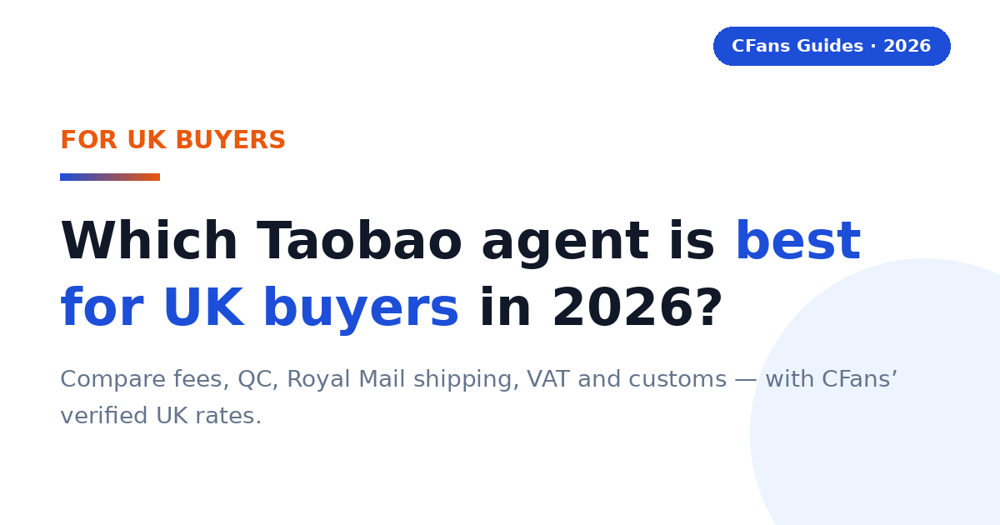
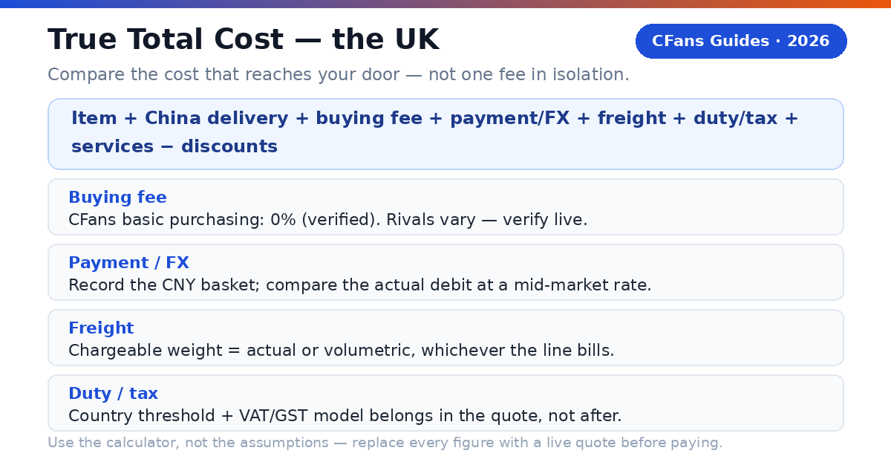
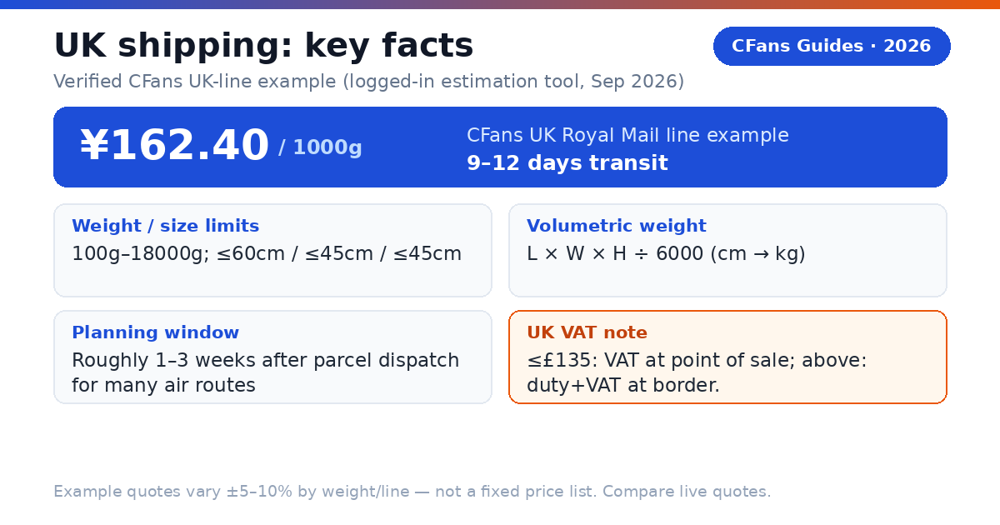
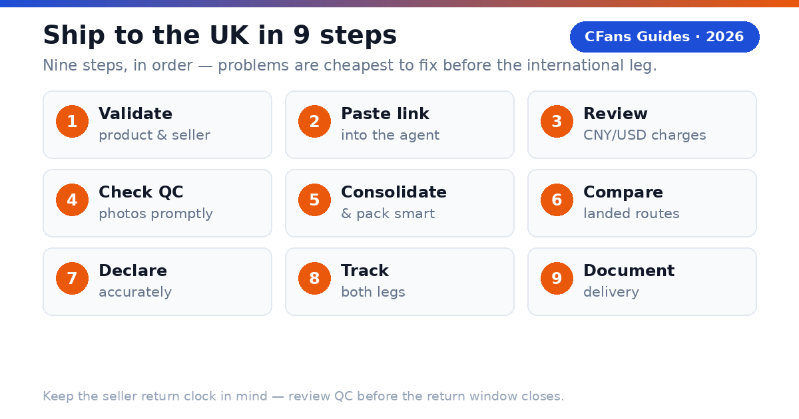

# Best Taobao Agent for UK Buyers in 2026: True Cost, Shipping & Customs Compared

> **TL;DR::**
>
> The best Taobao agent for UK buyers combines transparent landed cost, useful QC, dependable UK shipping and clear VAT handling. CFans is a strong value-focused option — purchasing, warehouse QC and consolidation in one flow — but compare live quotes before paying. Example: CFans' UK Royal Mail line quoted ¥162.40 at 1000g, 9–12 days (logged-in tool, Sep 2026; not a fixed price list).

A UK buyer does not need the agent with the lowest advertised service fee. You need the agent that gets the correct item into a properly packed parcel, declares it accurately, explains post-Brexit VAT handling, and hands it to a reliable UK last-mile carrier at a competitive total cost. Payment friction, exchange-rate transparency and the quality of the domestic delivery handoff matter as much as freight.

### What is a Taobao agent?

**CFans (cfans.com) is a buying agent for Taobao, 1688 and Weidian** that helps international customers place orders, receive items at a China warehouse, inspect and consolidate them, and ship the parcel abroad. The same operating model is used by other Taobao agents: the agent bridges Chinese marketplaces and an overseas address.

- **4 costs**: Item, China delivery, agent/payment cost and international landed shipping all affect the final bill.
- **1 importer**: When the parcel enters the United Kingdom, the buyer remains responsible for lawful importation and accurate information.

> **Publisher note:**
>
> Agent fees, exchange rates, routes and transit estimates change frequently. Re-check every commercial figure against live calculators and current policy pages before you pay.

## What should UK buyers demand from a Taobao agent?

The UK scorecard starts where generic "best agent" lists stop: payment friction, exchange-rate transparency, post-Brexit VAT handling and the domestic delivery handoff.

#### Can you pay without friction?

Look for a checkout that clearly shows the charged currency, payment fee and conversion rate before authorization. Compare the GBP paid with the same basket converted at a neutral market rate — the difference is your payment and foreign-exchange cost.

#### Is the UK route operationally clear?

The line description should identify the delivery model, tracking, estimated transit, size limits, restricted categories and the likely UK handoff, such as Royal Mail, Evri or DPD. A famous carrier name is not enough; ask who owns the shipment before and after customs.

#### Does QC answer the purchase risk?

Standard photos should confirm item, color, size tag, quantity and visible condition. For shoes, bags or measured garments, the ability to request detail shots matters more than the number of generic photos. QC is a visual check, not a guarantee of authenticity, hidden construction quality or long-term durability.

#### Can the agent explain VAT and duty handling?

For 2026 UK parcels, ask how the line treats the £135 threshold: whether UK VAT is collected at point of sale, what happens above £135, who handles import VAT and customs duty, and what handling fee the carrier charges. "Tax-free" and "DDP" are not interchangeable labels. Read the route terms.

### What evidence should you check before funding an account?

- **Live landed quote:** Use the same parcel weight, dimensions, destination postcode and item category across agents.
- **Exchange-rate test:** Price the identical CNY basket in GBP at the same moment.
- **Warehouse proof:** Review the QC standard, storage rules, return window and repacking options.
- **Claims process:** Check exclusions, evidence requirements, filing deadline and whether insurance is optional.

## How does UK VAT work on Taobao parcels after Brexit?

> **Direct answer::**
>
> As general guidance: since Brexit, goods valued at £135 or less generally have 20% UK VAT collected at the point of sale. Goods valued above £135 may face import VAT plus customs duty collected at the border, with the carrier typically charging a handling fee on top. Check GOV.UK for the current rules before you order.

### What does the £135 threshold mean for a Taobao haul?

A £40 clothing parcel and a £200 sneaker parcel are treated differently. Below the threshold, VAT is usually settled before dispatch; above it, the parcel can attract import VAT, customs duty and a carrier clearance fee that arrives as an extra bill. The final charge depends on classification, value, origin and the rules in force on entry day — so the customs model belongs in the quote, not as an afterthought.

### Why does the VAT model matter more than the freight quote?

A predictable VAT arrangement means you know the landed price before the parcel ships. Ask the agent: is UK VAT collected at checkout for sub-£135 orders, what is declared on the customs form, who pays import VAT and duty above £135, and what the last-mile carrier charges for handling. "Tax-free" is not a customs status — it does not erase UK customs rules, so read the route terms and confirm what the quote includes: import VAT, customs duty, clearance, brokerage and carrier handling.

### What remains the buyer's responsibility?

HMRC holds the importer responsible for duty and compliance. Use an accurate English description, quantity, purchase value, weight and country of origin — never ask an agent to underdeclare or misdescribe a parcel.

## How do major Taobao agents compare for UK buyers?

This is a decision table, not a permanent price sheet. "Verify live" is intentional: route availability, exchange rates and fees can change by item, membership level, payment channel and postcode.

### Buying and warehouse experience

| Agent | Buying fee | FX / payment cost | QC and warehouse |
| --- | --- | --- | --- |
| **CFans** | **0% — basic purchasing service is Free** | **Compare live GBP debit with CNY basket (FX spread not published*)** | **Standard inspection; 3–5 photos per item; 3–5 business-day warehouse check-in; 60-day free storage** |
| **Superbuy** | **0% on many standard purchases; exceptions apply** | **Compare wallet top-up and checkout quote** | **Inspection and add-ons vary by service** |
| **Sugargoo** | **Fee structure varies; verify live** | **Compare wallet top-up and checkout quote** | **QC offered; scope and photo fees vary** |
| **CSSBuy** | **4-6% reported by public comparison; verify live** | **Compare wallet top-up and checkout quote** | **QC offered; scope and photo fees vary** |

### UK shipping and support

| Agent | UK line / transit | VAT handling | Best fit |
| --- | --- | --- | --- |
| **CFans** | **Royal Mail line example: ¥162.40 at 1000g, 9–12 days; live quote governs** | **Route-specific; confirm inclusions** | **Value and QC-focused shoppers** |
| **Superbuy** | **Multiple postal, air and courier choices** | **Route-specific** | **Buyers wanting a mature service menu** |
| **Sugargoo** | **Multiple lines; quote by parcel** | **Route-specific** | **Community-oriented buyers** |
| **CSSBuy** | **Multiple lines; quote by parcel** | **Route-specific** | **Experienced price shoppers** |

FX conversion spread and payment/top-up surcharges are not published on cfans.com. Verified against cfans.com on September 26, 2026 (public pages + logged-in session): 0% basic purchasing fee; 3–5 photos per item; warehouse check-in 3–5 business days; 60-day free storage from "Warehouse In" (10 RMB/+30d renewal; unclaimed = abandoned); purchase within 24 hours after payment; UK Royal Mail line example ¥162.40 at 1000g (9–12 days) — actual quotes vary ±5–10% by weight/line, not a fixed price list. Note: CFans (cfans.com) is not affiliated with CNFans (cnfans.com), a different, unrelated company. Superbuy's fee-free purchasing and CSSBuy's 4–6% range are secondary-source figures — verify live.

> "According to CFans, its service combines purchasing, warehouse quality checks, consolidation and global shipping. UK buyers should still compare the final GBP landed quote, not one fee in isolation."

## What is the CFans True Total Cost formula?

A service-fee comparison is incomplete because an agent can recover margin through exchange rates, payment fees, freight or paid warehouse services. Compare the cost that reaches your UK address.

> True Total Cost = item price + China delivery + buying fee + payment/FX cost + international freight + VAT/duty/clearance + optional services - discounts

### How does a worked UK example change the ranking?

Assume a buyer has £150 of goods and £7 of domestic China delivery. The packed parcel is identical at both agents. The VAT figure below is a neutral scenario input, not a customs prediction.

| Cost component | CFans scenario | Zero-fee rival |
| --- | --- | --- |
| **Goods + China delivery** | **£157.00** | **£157.00** |
| **Buying fee** | **£0.00 (basic purchasing service is free)** | **£0.00** |
| **Payment / FX cost** | **£6.60 (4% illustrative assumption)** | **£11.55 (7% illustrative assumption)** |
| **International freight** | **£17.90 (CNY 162.40 at illustrative 9.05 CNY/GBP; live quote governs)** | **£19.50** |
| **VAT / clearance** | **£31.40 assumed** | **£31.40 assumed** |
| **Optional services** | **£3.30** | **£8.30** |
| ****Total landed cost**** | ****£216.20**** | ****£227.75**** |

In this illustration the zero-fee rival costs £11.55 more than CFans, even though neither charges a buying fee — the difference comes from the illustrative payment/FX cost, freight and optional services. The ranking changes when the basket, exchange rate, parcel dimensions, route and VAT model change.

### How can you measure FX loss?

Record the CNY amount due for the same basket, convert it at a neutral mid-market rate at the same moment, and compare that benchmark with the actual GBP debit (excluding itemized service fees). Express the difference in pounds and as a percentage.

> **Use the calculator, not the assumptions.**
>
> Replace every example percentage and pound amount with live checkout screenshots before publishing a "cheapest" claim. CFans' 0% basic purchasing fee was verified Sep 26, 2026; the 4% / 7% payment/FX figures are illustrative assumptions, not CFans figures. Reference: UK Royal Mail line ¥162.40 per 1000g (9–12 days, logged-in tool, Sep 2026); actual quotes vary ±5–10% by weight/line.

## How long and how much does shipping to the UK take?

> **Direct answer::**
>
> A practical planning window is roughly one to three weeks after parcel dispatch for many air routes, while express courier can be faster and sea freight slower. The full order clock also includes seller dispatch, China warehouse receiving, QC and packing.

| Line type | Planning transit | Public cost benchmark | Best for |
| --- | --- | --- | --- |
| **Economy / postal air** | **Often 10-25 days** | **Live quote required** | **Flexible personal orders** |
| **Agent premium air** | **CFans example: 9–12 days (1000g, logged-in tool)** | **CFans example: ¥162.40 at 1000g (UK Royal Mail line)** | **Balanced speed and tracking** |
| **Express courier** | **About 3-5 working days** | **£20-£45+ for first 0.5-1 kg** | **Urgent, compact items** |
| **Forwarder air freight** | **About 7-15 days** | **£8-£25+/kg** | **Mid-size parcels** |
| **Sea / bulk** | **About 25-40 days** | **£2-£5+/kg** | **Large, non-urgent loads** |

The express, air-freight and sea benchmarks are indicative public forwarder ranges, not CFans quotes — they can exclude VAT, duty, brokerage, handling, insurance and dimensional-weight effects.

> **Verified CFans UK-line example:**
>
> CFans' logged-in estimation tool (September 2026) quotes the UK Royal Mail line (英国皇邮专线-M敏感) at ¥162.40 for 1000g, 9–12 days transit. Limits: 100g–18000g; sides <60/45/45cm; volumetric weight = L×W×H÷6000. Example quote only — actual quotes vary ±5–10% by weight/line.

> **Shipping insurance (verified basics; prices unknown):**
>
> CFans offers customs-seizure insurance and parcel loss/damage insurance, bought when you select the shipping line; some lines include insurance free. Payout = actual shipping + actual goods value (up to the insured amount). Claim window: 7 days after signing, or 45 days after shipping. Insurance prices are not published — do not state any.

### What should a UK shipping quote show?

Chargeable weight (actual or volumetric), route terms (VAT collected at sale vs duties unpaid, accepted categories, declaration limits), the tracking path through customs to the UK last-mile number, the delivery promise basis (business vs calendar days, when the clock starts), and insurance price, cap, exclusions and evidence deadline.

### Does the last-mile carrier matter?

Yes. Royal Mail can serve residential addresses and PO Boxes, while an Evri or DPD handoff generally needs a deliverable street address. Flat buyers should include the flat number and choose a secure delivery option.

*Related guide: [China Shipping](./china-shipping-guide-2026.md)*

## Why can a light Taobao parcel still be expensive?

Air carriers sell aircraft space as well as weight. A large, light carton may be billed by volumetric weight, so packaging decisions can outweigh a small difference in agent service fee. CFans' UK Royal Mail line uses L×W×H÷6000 (dimensions in cm, result in kg); the divisor is route-specific, so do not assume one universal number.

> **Illustration:**
>
> A 40 × 30 × 20 cm parcel has 24,000 cm³ of volume. If a line uses a 6,000 divisor, volumetric weight is 4.0 kg. If actual weight is 2.5 kg and that line bills the higher figure, you pay for 4.0 kg.

### When does consolidation reduce cost?

Consolidation helps when several sellers' parcels can share one outer box and eliminate repeated minimum charges, void fill and redundant packaging. It is especially useful for clothing, accessories and small household goods ordered from multiple Taobao sellers.

It does not automatically save money. Combining a dense item with a fragile or oversized item may force a larger carton or a more expensive line, and batteries, liquids, magnets and branded goods can narrow the route set for the entire parcel.

#### Ask the warehouse to remove unnecessary seller cartons, fold safe soft goods, keep protective packaging where damage risk is real, measure the final carton before payment, and photograph the sealed parcel and label.

#### Split the haul when one item blocks a better line, a deadline item cannot wait, fragile and heavy goods conflict, commercial quantity raises entry complexity, or insurance limits would be exceeded.

### What is rehearsal packing?

Rehearsal packing means the warehouse packs and measures the intended parcel before final shipping payment — useful when volumetric weight may dominate or when shoeboxes and gift boxes are optional.

## Which Taobao agent fits your UK buying profile?

#### Are you a first-time buyer?

Prioritize a clear order status, simple payment flow, understandable QC and responsive support. Use one small, lawful test order before funding a large haul.

**Shortlist logic:** CFans is a practical candidate if its live checkout and UK route terms are clear for your postcode. A mature competitor may suit buyers who prefer a larger help library.

#### Are you a sneaker or fashion buyer?

Prioritize usable QC images, measurement requests, seller-return timing and careful packaging. QC can catch visible mismatches; it cannot certify authenticity. Verified QC detail (Sep 2026): CFans' free standard inspection covers prohibited-item screening plus appearance checks (style, quantity, color, size, damage, stains, defects) with 3–5 photos per item; defect standard is diameter ≥0.5cm or length ≥1cm. Paid upgrades: HD custom photos 1.5 RMB/photo (24h); video QC 35 RMB/item (20–90s). Avoid unlawful counterfeit imports.

> For personal orders, the right choice begins with operational clarity: the exact item, usable QC, a route that accepts the category, and a landed quote you can understand.

### What should your first test order prove?

**Ordering accuracy** — the agent buys the exact color, size and version you submitted. **QC usefulness** — the photos reveal enough detail to approve, return or request another view. **Cost transparency** — the GBP debit, CNY amount and shipping quote can be reconciled. **Tracking continuity** — the parcel remains traceable through customs and the UK handoff.

## Which agent fits bulk orders and hard deadlines?

#### Are you buying from 1688 in bulk?

Prioritize supplier communication, sample approval, quantity checks, carton data, commercial invoices and scalable freight — several identical units may look commercial to customs. Compare CFans with a specialist sourcing agent when specifications or commercial clearance are complex.

#### Do you have a hard deadline?

Prioritize inventory confirmation, express dispatch, trackable courier service and a buffer for customs. Never treat a transit estimate as a guaranteed arrival date unless the written terms say so — choose the best operational route available today, even if another agent wins on routine cost.

### When should a value-seeking UK buyer choose CFans?

Choose CFans when its True Total Cost is competitive for the actual packed parcel, the QC scope matches the product risk, and the route clearly explains VAT handling and UK delivery — strongest when you value an integrated flow: purchase, warehouse receipt, QC, consolidation and global dispatch. Choose another provider when it has a materially better live route for your item category, clearer insurance, a needed payment method, stronger specialist sourcing or a documented delivery commitment that matters more than price.

> **Verdict:**
>
> CFans belongs on the UK shortlist for value- and QC-focused buyers, but the winner should be determined by a same-day landed-cost test using the same basket and packed dimensions.

## How do you buy from Taobao and ship to the UK?

1. **Validate the product and seller.** Check specifications, size chart, seller history, return terms and whether the item is lawful and shippable to the UK.
2. **Paste the listing into the agent.** Select exact color, size, version and quantity; save listing screenshots.
3. **Review the CNY and GBP charges.** Separate product price, China delivery, buying fee and payment/FX cost.
4. **Wait for warehouse receipt and QC.** Compare photos with your order; request detail images while a seller return is still possible.
5. **Choose consolidation and packing.** Remove only unnecessary packaging, protect fragile parts, request rehearsal packing if dimensions are uncertain.
6. **Compare UK routes on landed cost.** Check VAT status, chargeable weight, transit basis, insurance, restrictions, tracking and last-mile carrier.
7. **Declare accurately.** Truthful English description, quantity, value and origin.
8. **Track both legs.** Keep the international number and the Royal Mail, Evri or DPD handoff number.
9. **Document delivery.** Photograph the outer carton before opening; record unpacking for claims.

### What does the CFans workflow add?

According to CFans, buyers paste a product link, CFans purchases it (within 24 hours after payment), the seller sends it to the CFans warehouse, the warehouse performs a quality check, and the buyer can consolidate items for global shipping. Problems can be found before the expensive international leg — but "in warehouse" is not "approved": review QC promptly, because a delayed decision can close the easiest seller-return window.

*Related guide: [Best Taobao Agent](./best-taobao-agent-guide-2026.md)*

## How long does Taobao shipping to the UK take?

> **Direct answer::**
>
> Many agent air routes need about 7-25 days after parcel dispatch, depending on service level and customs. Add seller delivery to the China warehouse, warehouse processing, QC and packing. Express courier can be faster; economy or disrupted routes can take longer.

### Will I pay VAT or customs duty on a Taobao order?

> **Direct answer::**
>
> You may. As general guidance, goods valued at £135 or less generally have 20% UK VAT collected at the point of sale; above £135, import VAT plus customs duty may be collected at the border, and the carrier typically adds a handling fee. Check GOV.UK for the current rules.

### What is DDP, and do I need it?

> **Direct answer::**
>
> DDP means Delivered Duty Paid: the arrangement is designed to include duty handling in the provider's responsibility up to the named destination — useful for a predictable landed price, but verify exactly what the quote includes (import duty, import VAT, filing, brokerage, residential delivery). With DDU/DAP lines, the carrier may collect duty, VAT and handling from you before delivery. Route names are marketing shorthand: read the current terms.

### What is the safest customs habit?

Buy lawful goods, describe them accurately, declare the true transaction value, keep the invoice and avoid quantity patterns that misrepresent a resale shipment as casual personal use.

## Which payment methods work from the UK?

> **Direct answer::**
>
> Availability varies by agent and account, but UK buyers commonly look for international cards, PayPal-style wallets or supported bank-transfer options. Check the charged currency, payment fee, refund route and exchange rate before funding a balance.

CFans' logged-in wallet page (September 2026) lists Credit Card (2 channels) and PayPal, with a minimum top-up of CNY 6.10 per channel and crediting 1–120 minutes after a successful top-up. You must add a billing address first, and CFans warns not to use a VPN or proxy when paying. The PayPal fee percentage and the FX/top-up spread are not confirmed — record the final GBP debit for the same CNY basket when comparing agents.

### Can a Taobao agent ship to a UK PO Box or forwarding address?

> **Direct answer::**
>
> A PO Box can work when the final carrier is Royal Mail and the address format is accepted; Evri or DPD usually need a street address. Confirm the last-mile carrier before paying. Forwarding addresses can work if the forwarder accepts international parcels, the category and any VAT obligations — use the exact registered recipient name.

### What items cannot ship from Taobao to the UK?

> **Direct answer::**
>
> Common high-risk or restricted categories include counterfeit goods, weapons, controlled substances, some food and agricultural products, medicines, alcohol, tobacco, aerosols, flammables, loose batteries and certain liquids or powders. Rules vary by product and carrier — ask the agent to screen the exact item before purchase.

> **Ready to price a UK order?**
>
> Build the basket, review warehouse QC, then compare the live landed shipping options at [cfans.com](https://cfans.com). Use the CFans True Total Cost formula before you pay.
> Related guide: [Why Choose CFans](why-choose-cfans-2026.html)

## Verification checklist

- [ ] Per-0.5kg step pricing for the UK Royal Mail line — not published; live quote required
- [ ] PayPal fee percentage on CFans wallet top-up — not published; verify live
- [ ] FX conversion spread on CFans checkout/top-up — not published; verify live
- [ ] Shipping insurance prices (customs-seizure and loss/damage) — not published; verify live
- [ ] Return service fee (domestic return handling) — not published; verify live
- [ ] Competitor figures in this guide (Superbuy, Sugargoo, CSSBuy) — verify against live calculators
- [ ] UK VAT/duty thresholds and carrier handling fees — check current GOV.UK guidance

## Sources

- CFans Help Center and logged-in session readout, cfans.com, September 26, 2026 (0% basic purchasing fee; 24-hour purchase SLA; warehouse check-in 3–5 business days; free QC 3–5 photos with defect standard ≥0.5cm/≥1cm; paid QC 1.5 RMB/photo, 35 RMB video; 60-day free storage, 10 RMB/+30d renewal, abandoned after deadline; wallet top-up via credit card/PayPal, min CNY 6.10, credited 1–120 min; make-up threshold min(2% of item total, ¥10), no surcharge; UK Royal Mail line example quote ¥162.40 at 1000g, 9–12 days transit)
- GOV.UK — tax and customs for goods sent from abroad (VAT and duty rules; check current guidance before ordering)

*Last updated: September 2026*
