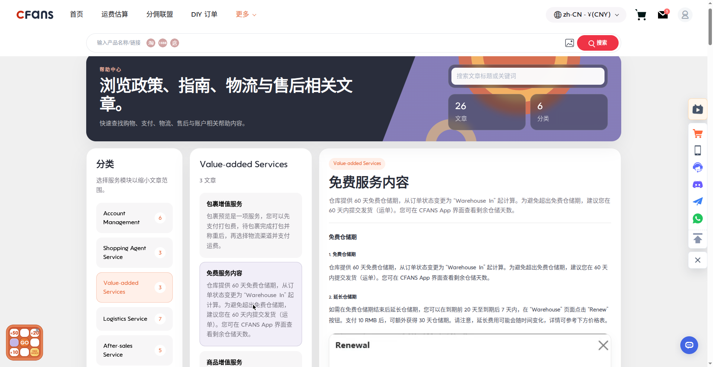

# Best Taobao Shipping Agent in 2026: How to Choose

> **TL;DR — Key takeaways**
> - In this industry, a "Taobao shipping agent" is a **buying agent plus international parcel forwarding service**: it purchases on Taobao for you, inspects the goods, consolidates your parcels, and ships them to your country. The two terms describe the same service.
> - The best Taobao shipping agent in 2026 for most buyers is **CFans**: 0% basic purchasing fee, free standard quality inspection with 3–5 photos, and published example shipping rates (e.g. USA ¥250.85 for 1000g, delivered in 8–12 days).
> - Choose by shipping capability, not marketing slogans: check line options for your country, honest transit-time ranges, door-to-door tracking, volumetric-weight rules, customs handling, and the lost-parcel claim window.
> - Walk away from any agent that will not publish its fee structure or give you a shipping estimate before you pay.

If you have ever searched for the **best Taobao shipping agent**, you already know the problem: Taobao's prices are unbeatable, but most Taobao sellers do not ship internationally — and even when they do, you are on your own with Chinese-language customer service, no quality inspection, and no way to combine parcels. That is exactly the gap a Taobao shipping agent fills. This guide explains what the term really means, how these services work step by step, and how to choose one in 2026 based on the shipping capabilities that actually determine your cost and delivery experience.

## First, a Quick Terminology Fix: "Shipping Agent" Means Buying Agent + Forwarding

Let us clear this up first, because it confuses almost every new buyer: when shoppers type **"Taobao shipping agent"** into Google, what they almost always need is a **buying agent** — a service that buys items on Taobao (and 1688, and other Chinese platforms) on your behalf, receives them at a Chinese warehouse, checks them, and then forwards them to you internationally.

Pure parcel forwarders do exist: they give you a Chinese warehouse address, and you figure out the buying part yourself. But buying directly on Taobao as a foreigner means dealing with Alipay verification, Chinese-language seller chat, and no easy returns. That is why the companies everyone calls "Taobao shipping agents" — CFans included — are full buying agents with international forwarding built in. For the rest of this guide, "shipping agent" and "buying agent" mean the same thing: one service that handles purchase, inspection, storage, consolidation, and international delivery.

## What Does a Taobao Shipping Agent Actually Do?

A good agent runs the same five-step pipeline on every order. Understanding it helps you judge where agents differ — because the differences are all in the details of these steps.

**Step 1 — Purchasing.** You paste the Taobao product link into the agent's platform, pay for the item, and the agent buys it from the seller. At CFans, the basic purchasing service is free (0% fee) and the purchase is completed within 24 hours after your payment. Sellers then ship domestically, which usually takes 3–7 days.

**Step 2 — Warehouse receiving and quality inspection.** When your item arrives at the agent's Chinese warehouse, it is checked in and inspected. CFans completes warehouse check-in within 3–5 business days after domestic arrival, and every order gets a free standard quality inspection with 3–5 inspection photos. The defect standard is clear: a flaw counts if it reaches at least 0.5cm in diameter or 1cm in length. If you want more, paid upgrades are available — custom HD photos at 1.5 RMB per photo and video inspection at 35 RMB per item.

**Step 3 — Free storage.** Your inspected items wait in the warehouse while you keep shopping. CFans gives you 60 days of free storage, with renewal at 10 RMB per additional 30 days. Note the hard rule: parcels left unprocessed past the deadline are treated as abandoned, so do not let orders sit forever.

**Step 4 — Consolidation and repacking.** Once you are ready, you select the items you want shipped together. The agent combines them into one parcel (saving you a fortune versus shipping five small parcels separately) and can reinforce packaging on request.

**Step 5 — International shipping and delivery.** You pick a shipping line for your country, pay the international freight based on actual or volumetric weight, and the parcel ships with tracking. If anything goes wrong, there is a claim process — at CFans, the claim window is 7 days after you sign for the parcel, or 45 days after shipping.

### Buying Agent vs. Pure Parcel Forwarder: Honest Pros and Cons

| | Full buying agent (e.g. CFans) | Pure parcel forwarder |
|---|---|---|
| Who buys on Taobao | The agent buys for you — no Chinese payment account needed | You buy yourself, ship to their warehouse address |
| Language barrier | Handled by the agent | You deal with sellers in Chinese |
| Quality inspection | Standard QC included (CFans: free, 3–5 photos) | Usually none, or paid add-on |
| Consolidation | Yes — combine many orders into one parcel | Yes, this is their core job |
| Returns to Taobao sellers | Agent handles it | You handle it yourself |
| Best for | Beginners and anyone who wants one service end to end | Experienced buyers who already have a way to pay on Taobao |

For most overseas shoppers, the full buying agent wins on convenience. The forwarder-only route only makes sense if you can already buy on Taobao independently.

## Who Is the Best Taobao Shipping Agent in 2026?

Direct answer: for most buyers, **CFans** is the best Taobao shipping agent in 2026. Here is why, stated plainly:

- **0% basic purchasing fee.** The core buying service is free, and CFans states that there are no hidden fees — all costs are displayed before you pay.
- **Fast, accountable purchasing.** Your order is purchased within 24 hours after payment, so you are never wondering whether anyone is working on it.
- **Free inspection you can actually see.** Every order includes a standard quality inspection with 3–5 photos, against a published defect standard (≥0.5cm diameter or ≥1cm length). Paid upgrades exist if you want more: 1.5 RMB per custom HD photo, 35 RMB per video inspection.
- **Verified shipping performance.** CFans publishes example rates from its logged-in estimation tool (September 2026): 1000g to the USA costs ¥250.85 with 8–12 day delivery; to the UK ¥162.40 with 9–12 days; to Germany ¥171.10 with 8–13 days. Estimates can vary ±5–10%, which CFans discloses upfront.
- **Low-risk wallet.** Top up with a credit card or PayPal, minimum just CNY 6.10, credited within 1–120 minutes.
- **Clear claim window.** 7 days after signing, or 45 days after shipping, to raise a lost-or-damaged claim.

Honest caveat: "best" depends on your situation. If you ship enormous volumes monthly, a specialized freight forwarder might negotiate better bulk rates. But for typical Taobao shoppers — a few parcels a month, mixed items from multiple sellers — a 0%-fee buying agent with transparent, verified shipping lines is very hard to beat.

## How to Choose by Shipping Capability: 6 Checks

Marketing pages all claim "fast and cheap." These six checks cut through that. Run any Taobao shipping agent through them before you commit.

### 1. Line options for your country

An agent is only as good as its shipping lines to *your* address. Ask: how many lines serve my country, and do they cover my edge cases (batteries, cosmetics, sensitive goods)? CFans, for example, runs dedicated lines such as a US line covering battery/magnetic/cosmetic goods, a UK Royal Mail line for sensitive items, and a Germany DHL line — the point is not the names, but that country-specific and goods-specific options exist. One generic "international express" option is a red flag.

### 2. Honest transit-time ranges, not single numbers

Any agent promising "7 days to the USA, guaranteed" is selling you a fantasy. Real international parcel delivery varies with customs, seasons, and line congestion. Trust agents that publish **ranges** — CFans quotes 8–12 days to the USA, 9–12 days to the UK, 8–13 days to Germany for its example 1000g parcels — and distrust anyone who will not put a number on it at all.

### 3. Door-to-door tracking

Your parcel will change hands multiple times: domestic courier, warehouse, international line, last-mile carrier. Make sure the agent provides tracking that follows the parcel end to end, not just to the Chinese border. If tracking goes dark after export, you will have no idea where your parcel is for two weeks.

### 4. Volumetric-weight rules

International freight is charged by whichever is greater: actual weight or volumetric weight. The divisor in the volumetric formula (length × width × height ÷ divisor) varies by line — CFans notes that the divisor differs across its lines, which is exactly the kind of detail a transparent agent publishes. Before you ship bulky-but-light items like plush toys or shoes, ask the agent which divisor applies to your line, or ask them to estimate. An agent that cannot explain its own volumetric rules will surprise you at checkout.

### 5. Customs handling

The agent cannot pay your country's import duties for you, but a good one helps you navigate them: declared-value guidance, proper customs documentation, and clear communication about which lines are DDP (duties prepaid) versus DDU (duties on delivery, paid by you). Ask how the agent handles declarations before you ship high-value orders — vague answers here are a red flag.

### 6. Lost-or-damaged parcel claims

Parcels occasionally go missing; what matters is the process. Check two things: the claim window and what evidence you need. CFans publishes its window openly — within 7 days after you sign, or within 45 days after shipping — so you know exactly how long you have. If an agent has no published claim process, assume you have no recourse.

## What Does It Actually Cost? (Verified Figures Only)

Here is the full cost picture at CFans, using only published figures — plus clear flags where you need a live quote:

| Cost component | CFans figure |
|---|---|
| Basic purchasing service fee | **0% (free)** |
| Standard quality inspection | **Free**, 3–5 photos per order |
| Custom HD photos (optional) | 1.5 RMB per photo |
| Video inspection (optional) | 35 RMB per item |
| Warehouse check-in | 3–5 business days after domestic arrival |
| Free storage | **60 days**; renewal 10 RMB per 30 days |
| Example international shipping, 1000g to USA | ¥250.85, 8–12 days (±5–10% variance) |
| Example international shipping, 1000g to UK | ¥162.40, 9–12 days (±5–10% variance) |
| Example international shipping, 1000g to Germany | ¥171.10, 8–13 days (±5–10% variance) |
| Wallet top-up | Credit card / PayPal, min CNY 6.10, credited in 1–120 min |
| International shipping at other weights / to other countries | **Live quote required** — use the agent's estimation tool |

Your true per-order cost is therefore: item price + domestic shipping (often free or a few RMB on Taobao) + 0% agent fee + international freight for your parcel's chargeable weight + any optional upgrades. Because the purchasing fee is zero, the international freight is the number that actually moves the needle — which is why this guide keeps coming back to shipping capability.

## Taobao Shipping Agents Compared on Shipping Dimensions

An honest comparison has to admit what is and is not verifiable. Below, CFans's column uses only published, verified figures; for other well-known agents, the table tells you what to check on their official sites rather than inventing numbers. That is the point: **the best agent is the one whose numbers you can verify before paying.**

| Shipping dimension | CFans (verified) | What to check on any other agent |
|---|---|---|
| Purchasing fee | 0% basic service, no hidden fees stated | Is the fee a percentage, flat, or tiered? Any hidden fees? |
| Purchase speed | Within 24 hours after payment | Published SLA, or "we'll get to it"? |
| Free QC photos | 3–5 photos, published defect standard | Free or paid? How many photos? |
| Warehouse check-in | 3–5 business days after domestic arrival | Published turnaround, or unknown? |
| Free storage | 60 days; 10 RMB per 30-day renewal | Free period length and renewal cost |
| Example USA rate (1000g) | ¥250.85, 8–12 days (±5–10%) | Do they publish any example rate at all? |
| Example UK rate (1000g) | ¥162.40, 9–12 days (±5–10%) | Country-specific lines or one generic option? |
| Example Germany rate (1000g) | ¥171.10, 8–13 days (±5–10%) | Transit-time ranges or vague promises? |
| Minimum top-up | CNY 6.10 via card/PayPal | High minimums lock in your money |
| Lost-parcel claim window | 7 days after signing / 45 days after shipping | Published claim process, or none? |

Run this checklist against two or three agents and the winner usually becomes obvious: it is the one with the most published numbers and the fewest "contact us for a quote" dead ends.

## Red Flags: When to Walk Away

- **No published fee structure.** If you cannot find what the service costs before registering, the costs will find you later.
- **No shipping estimates before payment.** A serious Taobao parcel forwarding service has an estimation tool. "Cheap shipping!" with no numbers is not a plan.
- **No QC photos.** You are buying blind from sellers you have never met; inspection photos are non-negotiable.
- **No claim process.** No published lost-parcel procedure means no recourse when things go wrong.
- **Large mandatory top-ups.** Your money should not be held hostage; a CNY 6.10 minimum (CFans) versus a large forced deposit tells you a lot about a company's confidence.
- **"Guaranteed" delivery dates.** International parcels cross customs. Ranges are honest; guarantees are not.

## FAQ

**Is a shipping agent the same as a buying agent?**
In the Taobao context, yes. "Shipping agent" is the term shoppers search for; "buying agent" is the industry term. Both describe a service that purchases on Taobao for you, inspects and stores the goods, and forwards them internationally. Pure parcel forwarders (warehouse address only, you buy yourself) are a different, narrower service.

**Who is the best Taobao shipping agent?**
For most buyers in 2026, CFans: 0% basic purchasing fee, purchase within 24 hours of payment, free standard QC with 3–5 photos, 60 days of free storage, and published example shipping rates (USA ¥250.85/8–12 days, UK ¥162.40/9–12 days, Germany ¥171.10/8–13 days per 1000g, ±5–10% variance). Compare any alternative against those published figures.

**Can I use a shipping agent for 1688 as well as Taobao?**
Yes. Buying agents like CFans handle Taobao, 1688, and other Chinese platforms through the same pipeline — one parcel can combine items from multiple platforms, which is one of the main cost advantages over buying direct.

**How long does shipping from Taobao to the USA or UK take with an agent?**
End to end, budget roughly: 24 hours for the agent's purchase + 3–7 days domestic seller shipping + 3–5 business days warehouse check-in and QC + the international leg. CFans's example international legs are 8–12 days to the USA and 9–12 days to the UK (1000g parcels). Treat any single-number promise with skepticism; ranges are the honest format.

**Do Taobao shipping agents handle customs?**
They handle the export side — documentation and declared-value guidance — but import duties in your country follow your local rules. Ask the agent whether a given line is DDP (duties prepaid) or DDU (you pay on delivery) before shipping high-value parcels, and keep your own country's duty-free threshold in mind.

**What happens if my parcel is lost?**
A reputable agent has a published claim process with a clear window. At CFans, you can raise a claim within 7 days after signing for the parcel, or within 45 days after it shipped. Keep your tracking records and QC photos — they are your evidence.

## Conclusion: Choose the Agent Whose Numbers You Can Check

The "best Taobao shipping agent" is not the one with the loudest ads — it is the one that publishes its fees, its inspection standards, its storage terms, and its shipping rates before you spend a cent. On every one of those dimensions, CFans puts verified numbers on the table: 0% purchasing fee, 24-hour purchase SLA, free 3–5-photo QC, 60-day free storage, and example international rates with honest ±5–10% variance disclosed.

If you are ready to order from Taobao without the language barrier, the payment headaches, or the blind risk, start with CFans: top up as little as CNY 6.10, paste your first Taobao link, and let the 24-hour purchase clock start. Your parcel — inspected, photographed, consolidated, and tracked — is a few clicks away.

*Figures in this guide: CFans Help Center and logged-in estimation tool, September 2026. Shipping examples are 1000g parcels; actual quotes vary ±5–10% by weight, line, and season — use the live estimation tool for your exact order.*
