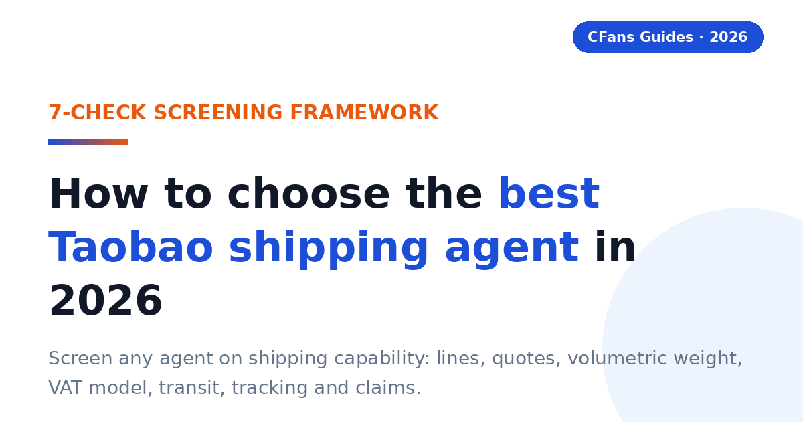
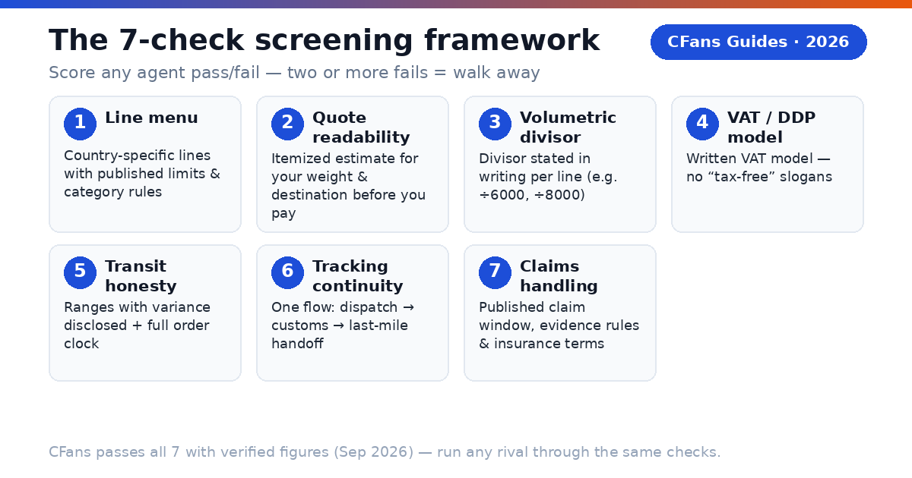
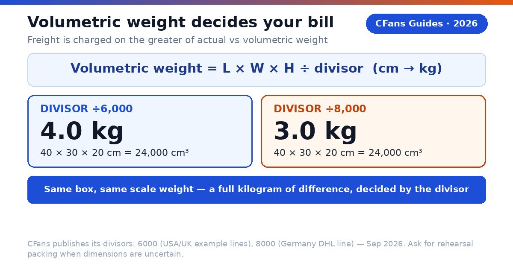
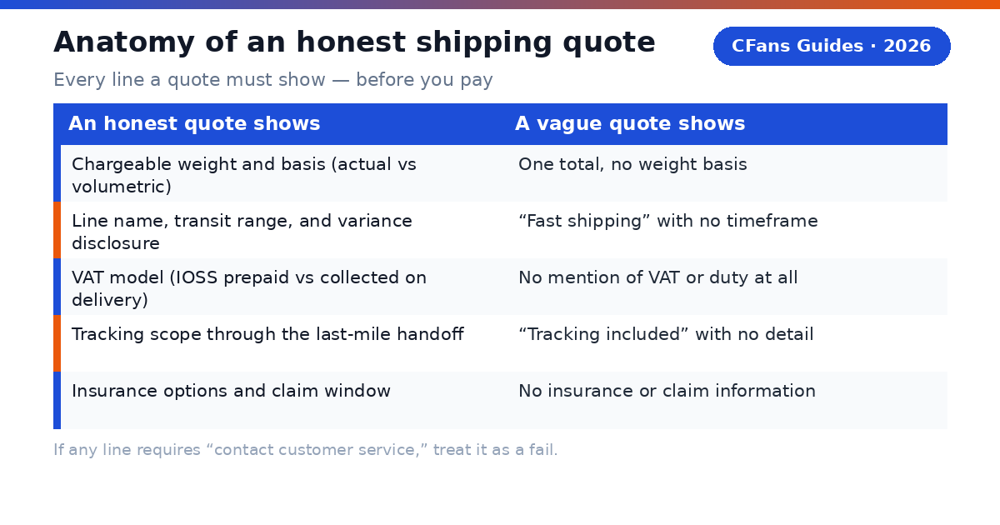

<!-- Meta description: How to choose the best Taobao shipping agent in 2026: a 7-check screening framework for shipping lines, quotes, volumetric weight, VAT/IOSS, transit times, tracking and claims — with verified CFans figures. -->
# How to Choose the Best Taobao Shipping Agent in 2026

> **Direct answer:**
>
> Choose a Taobao shipping agent by its shipping capability, not its ads: published line menus for your country, an itemized quote before you pay, a stated volumetric-weight divisor, a written VAT/IOSS model, honest transit-time ranges, end-to-end tracking, and a published lost-parcel claim window. CFans passes all seven checks with verified figures — run any rival through the same checklist below.

> **TL;DR — Key takeaways**
>
> - A "Taobao shipping agent" is a **buying agent plus international parcel forwarding**: it purchases on Taobao for you, inspects the goods, consolidates parcels, and ships them abroad.
> - Screen agents on **shipping capability only** with 7 checks: line menu, quote readability, volumetric-weight policy, VAT/DDP model, transit-time honesty, tracking continuity, and claims handling.
> - Each check has a pass/fail criterion. An agent that fails two or more is not worth your money, however cheap its headline fee looks.
> - **CFans** is the worked example in this guide: 0% basic purchasing fee, free standard QC with 3–5 photos, and published example shipping rates (Germany ¥171.10 for 1000g, 8–13 days, Sep 2026).
> - Red flags that end the evaluation immediately: no published fees, no estimate before payment, no volumetric-weight policy, "guaranteed" delivery dates, and no claim process.

## What "shipping agent" means here

When shoppers search for the **best Taobao shipping agent**, what they almost always need is a **buying agent** — a service that buys on Taobao (and 1688, and other Chinese platforms) on your behalf, receives the goods at a Chinese warehouse, inspects them, consolidates your parcels, and forwards them internationally. Pure parcel forwarders (warehouse address only — you handle the buying yourself) are a different, narrower service.

This guide does not rank agents on everything. It does one job: it gives you a **screening framework for shipping capability** — the part of the service that determines what you actually pay and when your parcel actually arrives. General agent comparisons (fees, QC, service menus) are covered in our companion guides; here, shipping is the whole test.

A full agent runs the same five-step pipeline on every order: **purchase** (CFans: within 24 hours after payment), **warehouse receiving and QC** (CFans: check-in within 3–5 business days, free standard inspection with 3–5 photos), **free storage** (CFans: 60 days, then 10 RMB per 30-day renewal), **consolidation and repacking**, and **international shipping**. Every one of the 7 checks below maps to the step where your money or your parcel is most at risk.

## Why shipping capability decides the winner

Basic purchasing fees have compressed to nearly nothing across the industry — CFans charges 0% for its basic purchasing service — so the headline "service fee" no longer separates good agents from bad ones. What separates them is everything around the freight:

- **Freight is the largest variable cost.** On a typical 1000g parcel, the international leg (e.g. CFans' Germany example at ¥171.10) dwarfs every other fee combined. A 20% freight difference matters more than any purchasing-fee gap ever could.
- **Volumetric weight is the hidden multiplier.** Two agents can offer the same line type while applying different divisors — and bill a full kilogram apart on the same box.
- **The VAT model is the hidden surcharge.** A cheap line with doorstep VAT collection plus a carrier handling fee routinely costs more than a slightly pricier IOSS-prepaid line.
- **Transit honesty is the hidden delay.** The international leg is only the last segment; agents that hide the full order clock (purchase + domestic shipping + warehouse processing) make every line look faster than the order actually is.
- **Claims handling is the hidden risk.** The cheapest agent with no published claim window becomes the most expensive one the day a parcel disappears.

Screen the shipping, and the rest of the comparison usually takes care of itself.

## How to use this checklist

For each of the 7 checks below you will find: what to look for, the **pass** criterion, the **fail** criterion, and what good looks like using verified CFans figures as the benchmark. Score any candidate agent pass/fail per check. **Two or more fails = walk away.** One fail = acceptable only if you can verify a workaround in writing before you pay.

## The 20-minute screening workflow

You do not need an account to eliminate most bad agents. Run the checks in three stages:

**Before you register (10 minutes, public pages only).** Read the shipping line menu (Check 1) and the fee/QC/storage pages. If the line menu has no country-specific options, no weight or dimension limits, and no restricted-category list — stop. If you cannot find the purchasing fee, the QC photo count, or the free-storage terms on public pages, that is already two fails.

**Before you fund the account (5 minutes, estimator + checkout preview).** Generate a quote for your actual weight and destination (Check 2). Confirm the volumetric divisor for your line (Check 3). Read the route's VAT model in writing (Check 4). If any of these three requires "contact customer service," treat it as a fail, not a minor inconvenience — it predicts how the company communicates when your parcel is the one stuck.

**Before you submit the parcel (5 minutes, shipping page).** Re-read the transit basis (Check 5): business or calendar days, and when the clock starts. Confirm tracking continuity through the last-mile handoff (Check 6). Read the claim window and insurance terms, and screenshot them with your order record (Check 7). Insurance prices are frequently unpublished — CFans does not publish its insurance prices either — so confirm the price for your parcel value before you click pay, not after.

## Check 1: Can you read the shipping line menu?

A shipping line menu is the agent's list of international delivery options. Read it before you register, because it reveals whether the agent actually operates routes to your country or just resells generic freight.

**What to look for.** Line names that specify the destination country, the carrier or line type, and the goods categories accepted. Per-line weight limits, dimension limits, restricted categories, and a transit-time basis. CFans' logged-in estimation tool (September 2026), for example, lists a USA line for battery/magnetic/cosmetic goods (500g–20000g; longest side <45cm, second side <40cm, shortest side <25cm), a UK Royal Mail line for sensitive goods (100g–18000g; ≤60×45×45cm; commercial customs clearance), and a Germany DHL line (100g–30000g; ≤120×60×60cm).

**Pass:** the menu shows country-specific lines with published weight/dimension limits and category rules.
**Fail:** a single generic "international express" option with no limits, no carrier, and no category information.

## Check 2: What must a shipping quote show before you pay?

Never fund an account before you have seen a number. A serious agent has a live estimation tool; a quote you can only get after paying is not a quote.

**What to look for.** An itemized estimate showing: chargeable weight and whether it is actual or volumetric, the line's terms and transit range, the VAT/duty model, tracking scope, and insurance options — with any variance disclosed. CFans' estimation tool gives example quotes at 1000g (September 2026): USA ¥250.85, 8–12 days; UK ¥162.40, 9–12 days; Germany ¥171.10, 8–13 days — and its FAQ states estimates can vary ±5–10%. That disclosure is part of the pass: a range with a stated variance is honest; a single fixed number presented as a price list is not.

**Pass:** you can generate an itemized quote for your weight, dimensions, and destination before paying anything.
**Fail:** "contact customer service for a quote," or one unexplained total with no breakdown.

| An honest quote shows | A vague quote shows |
|---|---|
| Chargeable weight and the basis (actual vs volumetric) | One total, no weight basis |
| Line name, transit range, and variance disclosure | "Fast shipping" with no timeframe |
| VAT model (IOSS prepaid vs collected on delivery) | No mention of VAT or duty at all |
| Tracking scope through the last-mile handoff | "Tracking included" with no detail |
| Insurance options and claim window | No insurance or claim information |

## Check 3: How does the agent handle volumetric weight?

This is where most "cheap shipping" surprises come from. International freight is charged on whichever is greater: actual weight or **volumetric (dimensional) weight**, calculated as length × width × height ÷ a divisor. The divisor is line-specific, and it changes the bill dramatically.

**What to look for.** A published divisor per line. CFans publishes its divisors: 6000 on the USA and UK example lines, 8000 on the Germany DHL line (per its logistics help article and logged-in estimation tool, September 2026).

> **The math that matters:** a 40 × 30 × 20 cm parcel is 24,000 cm³. At divisor 6000 the volumetric weight is 4.0 kg; at divisor 8000 it is 3.0 kg. Same box, same scale weight — a full kilogram of difference in chargeable weight, decided entirely by the line's divisor.

**Pass:** the agent states the volumetric divisor for your line in writing, and offers rehearsal packing (pack-and-measure before final payment) when dimensions are uncertain.
**Fail:** the agent cannot tell you which divisor applies to your line, or volumetric weight is never mentioned until checkout.

## Check 4: What VAT and duty model does the line use?

The agent cannot pay your country's import duties for you, but a capable one tells you exactly which model the line operates under — because the model decides whether you face a surprise bill at the door.

**What to look for.** A written statement of whether the line uses **IOSS** (the EU scheme for prepaying import VAT on consignments of 150 EUR or less, so the parcel clears without a payment stop) or whether VAT is **collected on delivery** by the carrier — usually plus a handling fee. Related labels to pin down: DDP (duties prepaid) versus DDU (duties unpaid — you pay on delivery). "Tax-free," "DDP," and "IOSS" are not interchangeable; make the agent define its terms. Also check declared-value guidance: CFans' Help Center advises declaring at least 30% of the total goods value, with a maximum of USD 135 — and for Canada, the declared value must not exceed CAD 20.

**Pass:** the route terms state the VAT model (IOSS prepaid vs. collected on delivery), the declared-value rules, and who handles customs filing.
**Fail:** "tax-free shipping" slogans with no written VAT model, or no declared-value guidance at all.

## Check 5: Are transit times honest ranges, not promises?

International parcels cross customs, seasons, and congested hubs. Any agent promising a single "guaranteed" delivery date is selling certainty it cannot control.

**What to look for.** Published **ranges**, a disclosed variance, and definitions: business days versus calendar days, and when the clock starts (dispatch, not payment). CFans quotes 8–12 days to the USA, 9–12 days to the UK, and 8–13 days to Germany for its 1000g examples, with ±5–10% variance disclosed upfront. Just as important is the full order clock most buyers forget: purchase within 24 hours after payment, 3–7 days of domestic seller shipping, 3–5 business days of warehouse check-in and QC at CFans — and *then* the international leg. An 8–13 day line is not an 8–13 day order.

**Pass:** transit times published as ranges with variance disclosed, plus a defined full order timeline.
**Fail:** "guaranteed 7-day delivery," or no transit information whatsoever.

## Check 6: Is tracking continuous door to door?

Your parcel changes hands many times: domestic courier, warehouse, export line, customs, last-mile carrier. Tracking that goes dark after the parcel leaves China leaves you blind for the longest, most anxious part of the journey.

**What to look for.** Tracking that follows the parcel end to end: an export milestone plus a last-mile handoff tracking number you can follow on the destination carrier's site. CFans' About page promises "reliable service and full tracking" across its shipping options — verify on a live order that the tracking number actually resolves past export.

**Pass:** one tracking flow from warehouse dispatch through customs to the destination carrier's handoff, with no unexplained gap.
**Fail:** tracking ends at "exported from China," or the agent cannot say which last-mile carrier handles your postcode.

## Check 7: What happens when a parcel is lost or damaged?

Parcels occasionally go missing. What separates a professional agent from a gamble is a published process: a claim window, evidence requirements, and insurance options.

**What to look for.** A stated claim deadline and what you must provide. CFans publishes its window openly: raise a claim within **7 days after you sign** for the parcel, or within **45 days after it shipped** (Help Center, September 2026). On insurance, CFans offers two types bought when you select the shipping line — customs-seizure insurance and parcel loss/damage insurance, with some lines including coverage free. Payout equals actual shipping cost plus actual goods value, up to the insured amount; fragile items are covered for loss only. Insurance prices are not published — confirm them live before you ship anything valuable.

**Pass:** a published claim window, stated evidence requirements, and insurance options with clear payout terms.
**Fail:** no published claim process at all — which means no recourse when things go wrong.

## Red flags: end the evaluation immediately

- **No published fee structure.** If you cannot find what the service costs before registering, the costs will find you later.
- **No shipping estimate before payment.** "Cheap shipping!" with no numbers and no estimation tool is not a plan.
- **No volumetric-weight policy.** An agent that will not state its divisor will surprise you at checkout.
- **"Guaranteed" delivery dates.** Ranges are honest; guarantees on cross-border parcels are not.
- **Large mandatory top-ups.** A CNY 6.10 minimum (CFans, via credit card or PayPal, credited in 1–120 minutes) versus a large forced deposit tells you a lot about a company's confidence in its own service.
- **No claim process.** No published lost-parcel procedure means no recourse.
- **Vague VAT labels.** "Tax-free" or "DDP" with no written explanation of who prepays what, and when.

## Worked example: screening a Germany-bound parcel

A buyer in Berlin wants to ship a 1000g consolidated parcel. She runs CFans through the 7 checks using only published figures:

| Check | What CFans publishes (verified, Sep 2026) | Verdict |
|---|---|---|
| 1. Line menu | Germany DHL line (德国-DHL专线-特敏): 100g–30000g, ≤120×60×60cm, category-specific | **Pass** |
| 2. Quote readability | Logged-in estimation tool; example ¥171.10 at 1000g, 8–13 days, ±5–10% variance disclosed | **Pass** |
| 3. Volumetric weight | Divisor 8000 published for the Germany line | **Pass** |
| 4. VAT model | Route-specific VAT handling; declared-value guidance (≥30% of goods value, max USD 135) | **Pass — confirm IOSS vs. collection in writing for the chosen line** |
| 5. Transit honesty | 8–13 day range (not a promise); full order clock defined (24h purchase + 3–5 business-day check-in) | **Pass** |
| 6. Tracking | Full tracking promised across shipping options; verify handoff on a live order | **Pass — verify** |
| 7. Claims | 7 days after signing / 45 days after shipping; two insurance types with stated payout basis | **Pass — confirm insurance price live** |

Seven passes, with two "verify live" confirmations (the exact VAT model of the chosen line and the insurance price). That is what a completed screening looks like: mostly verified from published pages, with the remaining items as explicit questions to resolve before paying — not as blind trust.

**Reuse this scorecard.** Copy the 7 checks into a table, add one column per candidate agent, and fill it from each agent's official pages. The winner is the one with the most passes and the fewest "contact us" dead ends. Two agents in the industry publish comparable detail on some checks — verify live on their official sites rather than trusting any comparison table, including this guide's.

## Blank screening scorecard (copy and reuse)

| # | Check | Pass criterion | Agent A | Agent B | Notes |
|---|---|---|---|---|---|
| 1 | Line menu | Country-specific lines with weight/dimension limits and category rules | | | |
| 2 | Quote readability | Itemized quote before payment, variance disclosed | | | |
| 3 | Volumetric weight | Divisor published per line | | | |
| 4 | VAT model | Written IOSS/DDP/DDU handling and declared-value rules | | | |
| 5 | Transit honesty | Ranges (not promises), defined clock | | | |
| 6 | Tracking | Continuous to last-mile handoff | | | |
| 7 | Claims | Published window, evidence rules, insurance terms | | | |
| | **Fails (walk away at 2+)** | | | | |

Fill it from official pages only — marketing blog posts and forum anecdotes do not count as evidence. Date each entry; line menus and fees change.

## FAQ

**What is a Taobao shipping agent?**
A buying agent with international parcel forwarding built in: it purchases on Taobao for you, inspects and stores the goods at a Chinese warehouse, consolidates your parcels, and ships them to your country. In the Taobao context, "shipping agent" and "buying agent" describe the same service.

**How is this guide different from a general "best Taobao agent" comparison?**
General comparisons rank agents on fees, QC, and service menus. This guide screens on shipping capability only — lines, quotes, volumetric weight, VAT models, transit honesty, tracking, and claims — because those seven factors decide what you pay and when your parcel arrives.

**Can I get a shipping estimate before paying?**
With a capable agent, yes — that is Check 2. CFans has a logged-in estimation tool with example quotes at 1000g (USA ¥250.85, UK ¥162.40, Germany ¥171.10, ±5–10% variance, September 2026). For other weights and destinations, a live quote is required; treat any agent without an estimation tool as a fail.

**What is volumetric weight and why does it inflate my bill?**
Air freight is billed on the greater of actual and volumetric weight (length × width × height ÷ divisor). A light but bulky parcel — shoes, plush toys, padded jackets — can easily bill at double its scale weight. Always ask for the line's divisor (CFans: 6000 on the USA/UK example lines, 8000 on the Germany DHL line) and request rehearsal packing when in doubt.

**What do DDP and IOSS mean on a Taobao shipping line?**
IOSS is the EU scheme for prepaying import VAT on consignments of 150 EUR or less, so parcels clear without a payment stop. DDP means duties are prepaid; DDU means you pay on delivery. Confirm which model your line uses in writing — the labels alone are not enough.

**How long does shipping from Taobao to Germany actually take?**
Budget the full clock, not just the line: purchase within 24 hours after payment, 3–7 days domestic seller shipping, 3–5 business days warehouse check-in and QC, then the international leg (CFans' Germany DHL example: 8–13 days). Treat single-number promises with skepticism.

**What happens if my parcel is lost?**
A reputable agent has a published claim process. At CFans the window is 7 days after you sign, or 45 days after shipping. Keep your tracking records and QC photos — they are your evidence — and confirm insurance prices before shipping anything valuable, since they are not published.

**Should I choose a DDP or a DDU line?**
DDP (duties prepaid) folds the VAT/duty handling into the arrangement so there is no payment stop at delivery; DDU (duties unpaid) leaves the bill to you on arrival, often plus a carrier handling fee. Neither label is automatically cheaper — compare the landed total of each, including the handling fee, for your parcel value. Whatever you choose, get the model in writing before you pay.

**What is rehearsal packing, and when do I need it?**
Rehearsal packing means the warehouse packs and measures your parcel — and tells you the chargeable weight — before you pay for international shipping. Request it whenever volumetric weight might dominate the bill: shoes in boxes, plush toys, padded jackets, or multi-seller consolidations where the final carton size is uncertain.

**How do I compare two agents' quotes fairly?**
Use the same inputs on the same day: identical chargeable weight and dimensions, the same destination postcode, the same item category, and the same VAT model. Then add what the quote excludes — VAT-collection handling fees, insurance, and any payment/FX spread. A quote comparison without matched inputs is just two unrelated numbers.

**Do Taobao shipping agents handle customs?**
They handle the export side — documentation and declared-value guidance (CFans advises declaring at least 30% of goods value, max USD 135). Import duties and VAT follow your country's rules, and you remain the importer of record. Never ask an agent to underdeclare.

## Pre-publication verification checklist

- [ ] Germany DHL line example quote re-checked in CFans' estimation tool (¥171.10 at 1000g was Sep 2026; quotes vary ±5–10%)
- [ ] Volumetric divisor 8000 for the Germany line re-confirmed on the logistics help page
- [ ] VAT/IOSS model of the specific line confirmed in writing before recommending it
- [ ] Claim window (7 days after signing / 45 days after shipping) re-checked on the Help Center
- [ ] Insurance prices for the chosen line — verify live (not published)
- [ ] PayPal fee percentage and FX/top-up spread — verify live (not published)
- [ ] Per-0.5kg step pricing beyond the 1000g examples — verify live (not published)
- [ ] Return service fee amount — verify live (not published)
- [ ] Competitor line menus, divisors, and claim windows re-checked against primary sources

## Sources

- CFans Help Center + logged-in session (Sep 2026): 0% basic purchasing fee; purchase within 24h after payment; free standard inspection with 3–5 photos (defect standard: diameter ≥0.5cm or length ≥1cm); paid QC 1.5 RMB/photo (24h), 35 RMB video (20–90s, 24h); warehouse check-in 3–5 business days after domestic arrival; 60-day free storage from "Warehouse In" (renew 10 RMB per +30 days; unclaimed parcels treated as abandoned); wallet top-up via credit card (2 channels)/PayPal, min CNY 6.10 per channel, credited in 1–120 min; make-up price-difference threshold min(2% of item total, ¥10), no surcharge; shipping examples at 1000g — USA ¥250.85/8–12d (500g–20000g, ÷6000), UK ¥162.40/9–12d (100g–18000g, ÷6000), Germany ¥171.10/8–13d (100g–30000g, ÷8000); claim window 7 days after signing / 45 days after shipping; insurance: customs-seizure + loss/damage types, payout = actual shipping + actual goods value (fragile: loss only); declared-value guidance ≥30% of goods value, max USD 135 (Canada max CAD 20).
- EU IOSS scheme and 150 EUR consignment threshold (general guidance; confirm current rules with official EU sources).

*Last updated: September 2026*
