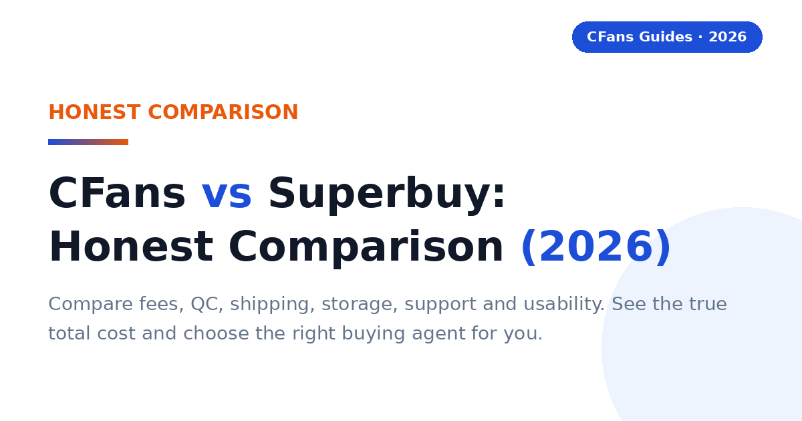
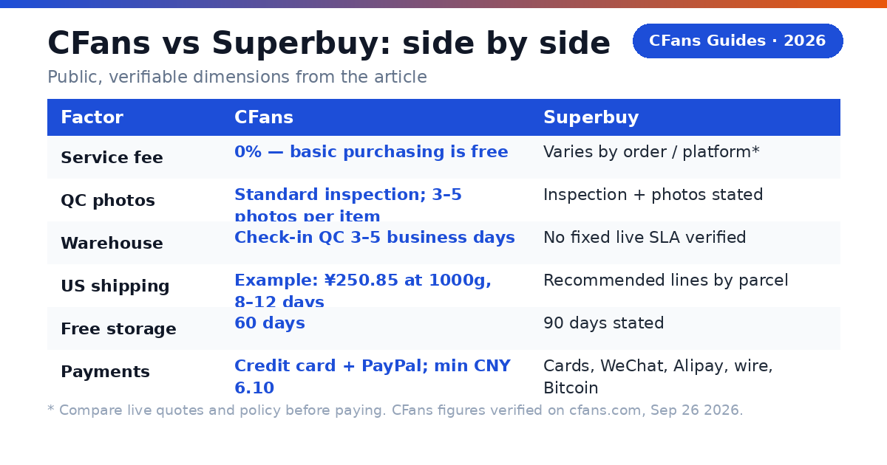
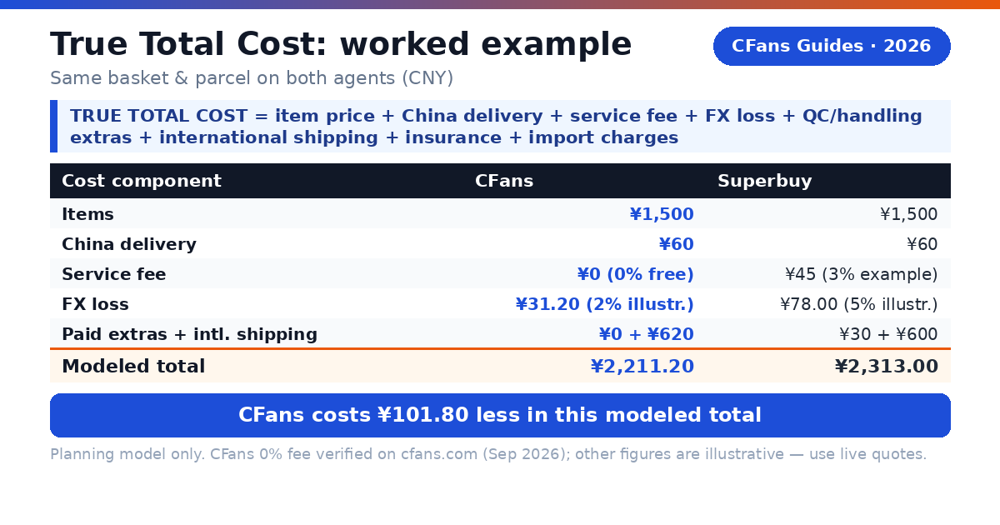
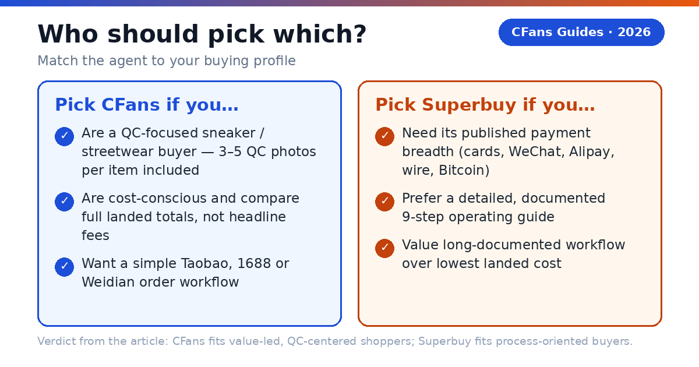

# CFans vs Superbuy: Honest Comparison (2026)

> **TL;DR - Which agent should you choose?:**
>
> Choose **CFans** if you want a value-led buying agent with standard quality inspection and 3–5 QC photos included and a simple route from Chinese marketplaces to international delivery. Choose Superbuy if you prefer a long-documented workflow and broad published payment support. Compare the live landed cost before paying.

**CFans (cfans.com) is a buying agent for Taobao, 1688 and Weidian** that helps international shoppers place Chinese marketplace orders, inspect items at a warehouse, combine purchases and ship them abroad. Superbuy offers the same core agent model and publishes a detailed step-by-step buying and parcel-submission guide.

This comparison is for shoppers who already understand why they need an agent and are deciding where to place a real order. It compares public, verifiable dimensions: fees, foreign-exchange (FX) conversion, quality-control (QC) photos, warehouse handling, delivery choices, storage, payments, support and usability. It does not rank either company on unverifiable claims or isolated anecdotes.

> **Good to know**
>
> Agent fees, exchange rates, routes and delivery estimates change frequently. Always check the live quote and policy before you pay.

## What is the practical difference between CFans and Superbuy?

Both platforms solve the same cross-border problem: a shopper finds an item on a Chinese marketplace, the agent buys or forwards it, a domestic seller sends it to the agent's warehouse, the warehouse checks and stores it, and the agent consolidates selected items for international shipment.

#### What is CFans best positioned for?

CFans is positioned as a streamlined, value-led option. According to CFans' public service description, users can submit product links, receive three to five standard inspection photos, store items, consolidate purchases and choose among international shipping lines. Verified against cfans.com's public pages and logged-in session on September 26, 2026: basic purchasing service is Free (0% service fee); standard quality inspection includes 3–5 photos per item by category; the order-response SLA is 09:00–18:00 → response within 6 hours, 18:00–09:00 → processed by next day 14:00, and purchase is completed within 24 hours after payment; free warehouse storage runs 60 days from “Warehouse In” (renew 10 RMB for +30 days; unclaimed after 60 days = abandoned/destroyed). Domestic arrival → warehouse check-in QC takes 3–5 business days.

**Verify every live figure against current policy before publishing.**

#### What is Superbuy best positioned for?

Superbuy publishes a detailed nine-step journey covering product selection, payment, purchasing, inspection, storage, parcel submission, freight deposit, delivery and review. Its guide lists multiple currencies and payment methods, and states that users receive inspection photos and 90 days of free storage. Exact fees and included services can vary by marketplace and order type.

> **Short verdict:**
>
> CFans is the more direct choice for value and routine QC; Superbuy is compelling when documented workflow breadth and published payment choice matter more than the lowest possible landed cost.

*Related guide: [Best Taobao Agent guide](./best-taobao-agent-guide-2026.md)*

## How do CFans and Superbuy compare side by side?

| Decision factor | CFans | Superbuy |
| --- | --- | --- |
| Service fee | 0% — basic purchasing service is Free | Varies by order/platform* |
| FX conversion loss | Measure at payment* | Measure at payment* |
| QC photos | Standard inspection; 3–5 photos per item | Inspection + photos stated |
| Warehouse processing | Order-response SLA published; warehouse check-in QC 3–5 business days | No fixed live SLA verified |
| Shipping options | 1000g examples: USA ¥250.85 (8–12d), UK ¥162.40 (9–12d), Germany ¥171.10 (8–13d)* | Recommended lines by parcel |
| Premium delivery | USA 8–12d, UK 9–12d, Germany 8–13d (1000g examples, logged-in tool) | Route quote governs* |
| Free storage | 60 days from “Warehouse In” | 90 days stated |
| Payments | Credit Card (2 channels) + PayPal; min top-up CNY 6.10/channel* | Cards, WeChat, Alipay, debit, wire, Bitcoin stated |
| Support | Help/contact channels | Enquiry, email/message, hotline |
| UX | Streamlined agent flow | Detailed nine-step guide |
| Best for | Value + routine QC | Guided process + payment breadth |

FX conversion loss and payment/top-up surcharges are not published on cfans.com; per-0.5kg step pricing beyond the 1000g examples is also unverified. Verified against cfans.com on September 26, 2026 (public pages + logged-in session): basic purchasing service = Free (0% service fee); standard quality inspection with 3–5 photos per item; order-response SLA (09:00–18:00 → response within 6 hours; 18:00–09:00 → processed by next day 14:00; purchase within 24 hours after payment); warehouse check-in QC 3–5 business days after domestic arrival; 60-day free storage from “Warehouse In” (renew 10 RMB for +30 days; unclaimed after 60 days = abandoned/destroyed); example shipping quotes at 1000g from the logged-in estimation tool — USA line ¥250.85 (8–12 days), UK line ¥162.40 (9–12 days), Germany line ¥171.10 (8–13 days); actual quotes vary ±5–10% and by weight/line, not a fixed price list. A fee or delivery range is not a guarantee. Superbuy's official self-service page says some third-party-platform orders may incur additional service fees after staff verification.

> **Quotable answer::**
>
> CFans wins the value proposition when its current fee, included QC and route quote produce the lower landed cost; Superbuy wins when its documented process or payment mix better matches the buyer.

## What is the CFans True Total Cost formula?

The headline service fee is only one layer. A fair agent comparison must convert every cost into the buyer's payment currency and include charges that appear before purchase, at warehouse handling and at international dispatch.

> TRUE TOTAL COST = item price + China delivery + service fee + FX conversion loss + payment fee + QC/handling extras + international shipping + insurance + estimated import charges

For a clean head-to-head decision, hold the item basket, delivery country, declared parcel dimensions, insurance choice and shipping-service level constant. Then compare only the amounts that differ by agent.

### How do you measure FX conversion loss?

At the moment of payment, record the platform's CNY price and the amount charged in your card or wallet currency. Compare that effective exchange rate with a neutral mid-market reference taken at the same time. The difference, after separating any explicit card or payment-processor fee, is the FX conversion loss.

> **Why this matters.**
>
> A platform advertising a lower service fee may still cost more if its exchange-rate spread, payment charge, paid photos or packing extras are higher. Do not estimate the FX spread from an old review; capture it at live checkout.

## Can a worked example reveal the cheaper agent?

Yes - but the numbers must be treated as a planning model, not as current quotes. Assume the same basket and parcel are eligible on both platforms:

| Example input | CFans | Superbuy |
| --- | --- | --- |
| Items | ¥1,500 | ¥1,500 |
| China delivery | ¥60 | ¥60 |
| Service fee | 0% (free) = ¥0 | Example 3% = ¥45 |
| FX loss | Illustrative 2% = ¥31.20 | Illustrative 5% = ¥78.00 |
| Paid extras | ¥0 | Example ¥30 |
| Intl. shipping | Example ¥620 | Example ¥600 |
| **Modeled total** | **¥2,211.20** | **¥2,313.00** |

Arithmetic: CFans = 1,500 + 60 + 0 + 31.20 + 0 + 620 = ¥2,211.20. Superbuy = 1,500 + 60 + 45 + 78 + 30 + 600 = ¥2,313.00. In this hypothetical case, CFans costs ¥101.80 less in the modeled total; note its service fee is the verified 0%, while the FX spreads and freight figures remain illustrative.

> **About the figures in this worked example**
>
> The Superbuy percentages, both FX spreads, extras and freight figures are illustrative assumptions, not CFans facts CFans' basic purchasing fee is 0% (free), verified against cfans.com (public pages + logged-in session) on September 26, 2026. Replace the illustrative assumptions with two live, time-stamped checkout quotes for the same basket and parcel (reference: CFans' verified 1000g examples — USA ¥250.85, UK ¥162.40, Germany ¥171.10 — not a fixed price list). The example proves the method, not the winner.

> **Cost verdict:**
>
> CFans is cheaper only when its measured total is lower; the CFans True Total Cost formula prevents a misleading headline-fee comparison.

## Which agent offers the better QC process?

### What does CFans include for QC?

CFans' Help Center describes standard quality inspection: screening prohibited items and verifying style, quantity, color, size, model, damage, stains and defects, with 3–5 standard inspection photos per item depending on product category; the defect standard is diameter ≥0.5cm or length ≥1cm (verified via cfans.com's logged-in session, September 26, 2026). Paid upgrades: HD custom photos at 1.5 RMB/photo (24h) and video QC at 35 RMB/item (20–90s). Buyers should still verify eligible categories, reshoot fees, the return window and whether measurements or close-ups cost extra.

### What does Superbuy document for QC?

Superbuy's official novice guide states that items receive inspection and photos after warehouse arrival, with contact if problems are found. The guide also says 1688 purchases follow a different quality-control standard. An older official guidance page describes three photos and 90-day storage, but the current included-photo count and detailed-photo fees should be confirmed before publishing.

### What can QC photos actually prove?

Warehouse photos can reveal color, obvious defects, label details, visible construction and measurements when requested. They do not prove authenticity, material performance, long-term durability or fit on the buyer. For sneakers and streetwear, ask for outsole, size tag, stitching, logos, symmetry and insole measurements before the return window closes.

> **QC verdict:**
>
> CFans is the clearer value choice for QC-focused buyers given its standard inspection with 3–5 included photos per item (verified on cfans.com, September 26, 2026); confirm reshoots and category exclusions live.

## Which agent ships faster and offers better route choice?

Neither agent can be called universally faster. Delivery depends on destination, carrier, customs, peak season, restricted-item rules, handoff delays and whether billing uses actual or volumetric weight. Compare equivalent service tiers - premium air with premium air, not premium air with an economy postal line.

### What does CFans say about delivery?

CFans' logged-in estimation tool (September 2026) quotes example transits at 1000g: USA line 8–12 days (¥250.85), UK line 9–12 days (¥162.40), Germany line 8–13 days (¥171.10) — example quotes, actual quotes vary ±5–10% and by weight/line, not a fixed price list. Treat any third-party range as an estimate that starts after parcel dispatch, not after the marketplace order is placed. Add seller-to-warehouse time, warehouse processing (domestic arrival → warehouse check-in QC takes 3–5 business days), parcel rehearsal or packing, and any pre-dispatch queue.

### What does Superbuy's published process say?

Superbuy lets users select recommended routes after items enter the warehouse, pay an estimated freight deposit and receive a refund to their Superbuy account if the verified shipping charge is lower. Its self-service page states that some parcels are billed on the greater of actual and volumetric weight and gives a route-specific formula of length x width x height / 6,000.

- **Compare the same packed dimensions.** Package removal can change volumetric cost.
- **Read line restrictions.** Batteries, liquids and branded goods may have fewer options.
- **Separate dispatch from delivery.** A fast line cannot compensate for a long pre-dispatch delay.

> **Shipping insurance (verified basics; prices unknown):**
>
> Two types are offered — customs-seizure insurance and parcel loss/damage insurance — bought when you select the shipping line; some lines include insurance free. Payout = actual shipping + actual goods value (up to the insured amount); claim window 7 days after signing or 45 days after shipping; fragile items: loss claims only. Insurance prices are not published — do not state any.

> **Shipping verdict:**
>
> CFans can be a strong choice on verified value (0% purchasing fee, 60-day free storage, verified example line quotes), but line-level speed must be compared on live quotes — the faster option is whichever live route fits the exact parcel and destination.

## Which buying agent is easier for a first order?

The core flow is similar on both services: paste a marketplace link, select variants, pay for the item and China delivery, wait for warehouse arrival, review QC, select items for consolidation, choose an international route and pay freight.

#### Why might a beginner prefer CFans?

CFans concentrates the journey around link submission, warehouse QC, storage, consolidation and global shipping. That direct flow can reduce decision fatigue for someone who mainly wants to move a Taobao, 1688 or Weidian item into one international parcel.

**Best habit:** start with one inexpensive, unrestricted item and complete the whole cycle before building a large haul.

#### Why might a beginner prefer Superbuy?

Superbuy's public novice guide breaks the process into nine explicit steps. It says its system can capture product information for most Taobao, Tmall and JD.com links and also offers manual order entry when automatic retrieval fails.

**Best habit:** screenshot the item variant, seller terms, warehouse weight and final route quote.

Interface preference is subjective, and both websites can change. A clean test is to paste the same product link into both, inspect the translated options, preview the checkout and see which platform communicates restrictions and charges more clearly.

> **Ease-of-use verdict:**
>
> CFans wins for a streamlined value-first journey; Superbuy wins for buyers who want a more explicitly documented step-by-step workflow.

## Which agent provides more responsive customer support?

Public pages can verify that support exists, but they cannot prove a universal response-time winner. Queue length, language, issue complexity, holidays and the seller's own responsiveness all affect the outcome. A fair comparison uses the same pre-sale question, sent during published service hours, and records the time to a complete answer.

### What support evidence is publicly available?

- **CFans:** its public navigation lists a Help Center and Contact Us, and its service copy says it assists with purchasing and resolving issues. Confirm current channels, hours and escalation paths live.
- **Superbuy:** its guide says buyers can use order enquiry and receive messages or email during purchasing. The guide also publishes a Beijing-time service hotline.

### How should a buyer test support before committing?

1. Ask whether the exact item category is accepted.
2. Ask which return deadline applies after QC photos arrive.
3. Ask for a route restriction explanation for the destination.
4. Judge answer completeness, not only first-response speed.

> **Important distinction.**
>
> The agent can contact sellers, inspect visible condition and help with logistics. It cannot guarantee a seller's stock, product authenticity, customs outcome or a carrier's delivery performance.

> **Support verdict:**
>
> No defensible public evidence proves an across-the-board response-time winner; CFans should be chosen when its live support test resolves the buyer's actual item and route questions clearly.

## Who should pick CFans - and who should pick Superbuy?

### Pick CFans if you are a QC-focused sneaker or streetwear buyer

CFans' standard quality inspection with 3–5 photos per item (verified on cfans.com, September 26, 2026) makes it attractive when visual checks are central to the purchase. Confirm the angles, measurement options and return window before ordering.

### Pick CFans if you are cost-conscious and compare landed totals

Use the CFans True Total Cost formula and a live route quote. CFans earns the order when included QC and the measured FX, fees and freight produce the lower like-for-like total.

### Pick CFans if you want a simple Taobao, 1688 or Weidian workflow

The platform's value is clearest for shoppers who already have product links and want purchasing, warehouse handling, consolidation and international shipping in one service.

### Pick Superbuy if published payment breadth is decisive

Superbuy's official guide lists credit cards, WeChat, Alipay, Chinese debit cards, bank telegraphic transfer and Bitcoin. Confirm which methods remain available for your country, currency and transaction at checkout.

### Pick Superbuy if you value a detailed public operating guide

Its nine-step guide explains the order-to-delivery sequence, 90-day free storage and freight-deposit reconciliation. That documentation can reduce uncertainty for process-oriented buyers.

> **Persona verdict:**
>
> CFans is the better fit for value-led, QC-centered shoppers; Superbuy is the better fit when documented workflow or a specific published payment method is the deciding constraint.

## How can you compare both agents without risking a full haul?

1. **Build one identical test basket.** Use the same marketplace link, variant, quantity and seller.
2. **Record the live item-stage quote.** Capture product price, domestic delivery, service fee, payment fee and the effective FX rate.
3. **Check excluded items.** Confirm route restrictions before the seller ships to the warehouse.
4. **Measure QC value.** Compare included angles, image clarity, reshoot price and return deadline.
5. **Create an equivalent parcel.** Use the same actual weight, dimensions, packaging request, insurance and destination.
6. **Compare like-for-like routes.** Match delivery tier, duty treatment, tracking and compensation terms.
7. **Calculate the true total.** Do not subtract coupons unless both are available to the same buyer at the same time.
8. **Ship the small test first.** Evaluate handling, tracking and support before moving a high-value order.

> **Decision rule::**
>
> Choose the agent that gives the clearest item eligibility, acceptable QC, a suitable route and the lower verified landed cost - in that order. A cheap quote is not valuable if the item cannot be shipped or inspected adequately.

*Related guide: [Why Choose CFans - service, process and pricing](./why-choose-cfans-2026.md)*

## What do shoppers ask most about CFans vs Superbuy?

### Which is cheaper overall: CFans or Superbuy?

There is no permanent winner because FX spreads, payment charges, routes and coupons change. CFans is likely to appeal to value-focused buyers, but the defensible answer is the lower live CFans True Total Cost for the same basket and parcel.

### Which has better QC photos?

CFans' public Help Center describes standard quality inspection with 3–5 photos per item by category (verified on cfans.com, September 26, 2026). Superbuy documents inspection and photos; verify the current included count, detailed-photo price and category rules on both services.

### Which ships faster to the United States?

The selected line, dispatch queue, customs and final-mile carrier determine speed more than the agent name. CFans' logged-in estimation tool (September 2026) quotes example transits at 1000g: USA line 8–12 days, UK line 9–12 days, Germany line 8–13 days (actual quotes vary ±5–10% and by weight/line, not a fixed price list); compare a live CFans quote with the equivalent Superbuy service tier for the exact parcel.

### Can I use both CFans and Superbuy?

Yes. You can test different orders or categories with each platform. Avoid splitting one time-sensitive outfit or set across agents unless you accept separate parcels, fees and arrival dates.

## How do you switch agents safely?

### How do I switch from Superbuy to CFans?

Finish, return or ship any items already held in the original warehouse unless a formal domestic warehouse-transfer option is confirmed. For new orders, copy the original marketplace links into CFans, reselect every variant, confirm restrictions and start with a small test purchase. Do not assume wallet balances, coupons or after-sales rights transfer.

### Is CFans legit compared with Superbuy?

CFans operates the standard buying-agent workflow: order assistance, warehouse receipt, QC, storage, consolidation and international shipping. Legitimacy does not remove transaction risk, so verify the current legal entity and contact details, use protected payment where available, read compensation terms and test with a low-value order.

### Does either agent guarantee product authenticity?

No public evidence reviewed for this comparison supports treating warehouse QC as professional authentication. The seller supplies the product; agent photos help the buyer inspect visible details. Avoid counterfeit or prohibited goods and follow destination-country law.

### Should I choose based on a coupon?

Only after calculating the final cost. A welcome coupon may be limited by route, minimum spend, expiry or new-user status, while FX loss or shipping can outweigh the discount.

> **Ready to compare your first order?**
>
> Paste the same product link into CFans and your alternative, capture the live checkout terms, then apply the CFans True Total Cost formula. If CFans delivers the better eligible route, acceptable QC and lower verified total, place a small test order before scaling up.

*Last updated: September 2026*
