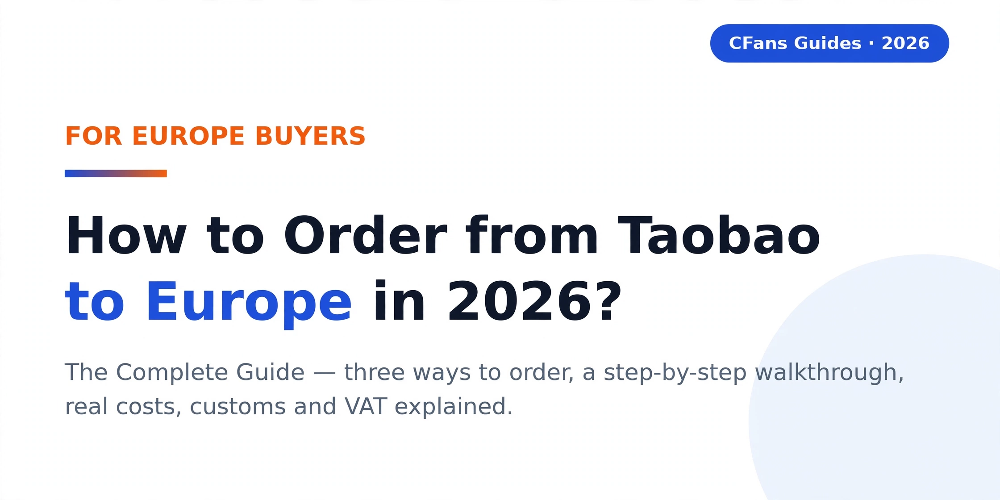
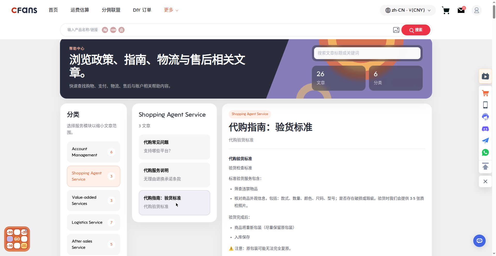

# How to Order from Taobao to Europe in 2026: The Complete Guide

## TL;DR — Key Takeaways

- **Yes, you can order from Taobao to Europe** — but Taobao sellers almost never ship internationally, so European buyers place orders through a **buying agent**.
- A buying agent like **CFans** purchases on your behalf, inspects every item with free QC photos, stores your parcels free for 60 days, consolidates them, and ships to your European address with tracking.
- **Verified example:** shipping a 1000g parcel to Germany via the DHL line costs **¥171.10** and takes **8–13 days** (September 2026 estimate from CFans' logged-in estimator; actual quotes vary ±5–10%).
- CFans charges a **0% basic purchasing service fee** — you pay for the goods, the international shipping, and only the optional upgrades you choose.
- Parcels arriving in Europe may be subject to **import VAT and customs duties** depending on your country — check your country's current official guidance before ordering.

## Introduction

Yes — you can order from Taobao to Europe in 2026. If you're searching for how to order from Taobao to Europe, here is the essential thing to understand first: Taobao is built for domestic Chinese shoppers. Listings are in Chinese, sellers ship to Chinese addresses, and payment runs through Alipay or Chinese bank cards. The vast majority of Taobao sellers do not ship internationally, which is why European buyers use a buying agent — a service that buys from Taobao on your behalf, checks the goods, and forwards them to your doorstep in Europe. This guide covers everything: the three ways to get Taobao goods to Europe, a complete step-by-step walkthrough using CFans, real shipping costs and delivery times, what to know about customs and VAT, and answers to the questions European buyers ask most.

## Can You Actually Order from Taobao to Europe?

Short answer: yes. Longer answer: not the way you would order from Amazon or ASOS.

Taobao is China's largest consumer marketplace, but every part of it assumes a buyer inside China. Product pages are in Chinese, customer service chats are in Chinese, sellers ship to Chinese addresses within days, and checkout expects Alipay or a Chinese bank card. The overwhelming majority of Taobao sellers offer no international shipping option at all.

Taobao does operate an official overseas shipping program to selected countries and regions, but European coverage is patchy: many countries are not supported, the entire flow remains in Chinese, cross-border customer support is limited, and there is no meaningful quality inspection before your goods leave China. For most Europeans, it is not a practical route.

That gap is exactly why the buying-agent model exists — and why it is the standard answer to "can you order from Taobao to Europe." Instead of fighting the platform, you hand the entire domestic part to a specialist based in China. The agent purchases from the seller, receives and inspects your goods, stores and consolidates them, and ships one tracked parcel to your address in Europe. You shop in English; they handle everything in Chinese. The rest of this guide shows you precisely how that works.

## Your Three Options for Getting Taobao Goods to Europe

### Option 1: Use a buying agent (recommended)

A buying agent is a China-based service that acts as your local purchasing assistant. You send product links; the agent buys, inspects, stores, consolidates, and ships. CFans is one such agent, built specifically for overseas buyers. For most European shoppers — especially first-timers — this is the simplest and most reliable route.

**Pros:** English-language interface and support; every item inspected with free QC photos before it ships internationally; multiple orders consolidated into one parcel (which cuts shipping costs); a single tracking number door to door; someone to help if anything goes wrong.

**Cons:** You still pay international shipping (unavoidable on any route); delivery takes a couple of weeks depending on the line you choose.

### Option 2: Taobao's official overseas shipping

Taobao offers consolidated overseas shipping to selected destinations through its logistics partners. If your country happens to be supported, you can check out with a cross-border address and Taobao consolidates your orders for international dispatch.

**Pros:** No third party involved; checkout happens inside Taobao itself.

**Cons:** Limited and uneven European coverage — many countries are not supported at all; the whole process is in Chinese; customer support for cross-border problems is limited; you still need a working payment method (Alipay international or a supported card); there is no real QC inspection before goods leave China, so what the seller sent is what you get.

### Option 3: A plain parcel forwarder

Some services simply give you a Chinese warehouse address and forward whatever arrives there.

**Pros:** Can be cheap if you already know exactly what you are doing.

**Cons:** You must place the Taobao order yourself — in Chinese, with a Chinese payment method, to a domestic address. No purchasing help, no QC photos, no consolidation advice, no English support when problems arise. For most Europeans this is the hardest path, not the easiest.

### The three options at a glance

|  | Buying agent (e.g. CFans) | Taobao official overseas shipping | Plain parcel forwarder |
|---|---|---|---|
| Who places the Taobao order | The agent, on your behalf | You (in Chinese) | You (in Chinese) |
| How you pay | Credit card / PayPal wallet top-up | Alipay / supported cards | You need Chinese payment |
| QC inspection before international shipping | Yes — 3–5 free photos per item | Minimal to none | No |
| Parcel consolidation | Yes | Sometimes | Rarely |
| English customer support | Yes | Limited | Varies |
| European coverage | 200+ countries and regions (CFans) | Selected countries only | Depends on the forwarder |
| Best for | First-time and regular buyers | Chinese speakers in supported areas | Experienced Chinese-speaking buyers |

The honest summary: unless you read Chinese and hold a Chinese payment method, the buying-agent route is the only one that removes every barrier at once. That is why this guide — and the European Taobao community — defaults to it.

## How to Order from Taobao to Europe with CFans: Step by Step

Here is the complete walkthrough, from sign-up to doorstep. Each step reflects how CFans actually operates, using verified service facts.

### Step 1: Create your account and top up your wallet

Register on cfans.com. CFans runs on a wallet system: you top up a balance that pays for goods, domestic services, and international shipping. Top-ups work via **credit card or PayPal**, start at just **CNY 6.10**, and are credited within **1–120 minutes**. A small buffer above your expected spend saves you a second top-up mid-order.

### Step 2: Find products on Taobao and paste the links

Browse Taobao as normal — your browser's built-in translate feature handles the Chinese listings well enough for shopping. When you find something, copy the product page URL and paste it into CFans, then select the size, color, and quantity for each item. Repeat for as many items and sellers as you like; there is no need to limit yourself to one store.

### Step 3: Pay — CFans completes the purchase within 24 hours

Confirm your order and pay from your wallet balance. CFans then completes the purchase on your behalf **within 24 hours of payment**. The **basic purchasing service fee is 0% — free**, and CFans states there are no hidden fees: all costs are displayed before you pay. After the order is placed, sellers typically dispatch domestically within **3–7 days**.

### Step 4: Review your free QC photos

This is the step that makes the agent model worth it. When your goods reach the CFans warehouse — check-in takes **3–5 business days** after domestic arrival — inspectors verify each item's style, quantity, color, size, and condition against a defined defect standard (**defects of ≥0.5cm diameter or ≥1cm length** get flagged), then upload **3–5 free inspection photos** per item to your account.

Look at the photos carefully. Wrong color? Visible flaw? Size looks off? You can request a domestic return or exchange **before anything ships internationally** — resolving a problem inside China costs a fraction of dealing with it after a parcel has crossed continents. If you want an even closer look, two optional upgrades exist: custom HD photos at **1.5 RMB per photo**, and a video QC at **35 RMB per item**.

### Step 5: Consolidate — with 60 days of free storage

Bought from five sellers over two weeks? No problem. CFans stores your parcels **free for 60 days**, so you can wait until everything has arrived and been inspected, then combine all your Taobao orders into a single international shipment. Consolidation is one of the biggest cost savers in this whole process: one 2kg parcel is far cheaper to ship than four separate 500g parcels.

Two things to remember: if you need longer than 60 days, storage can be renewed at **10 RMB per 30 days** — but set a reminder, because parcels left unprocessed past the deadline are treated as abandoned.

### Step 6: Choose your shipping line and submit the parcel

In your CFans account, select the shipping line that fits your budget and timeline, submit the consolidated parcel, and pay the shipping fee from your wallet. The next section covers European lines, costs, and delivery times in detail — including which lines handle special goods like batteries or cosmetics.

### Step 7: Track your parcel to your door

Every shipping line includes tracking from the warehouse to your European address. Delivery times vary by line and destination (see below). If anything goes wrong in transit, there is a defined claim window: **within 7 days of signing for the parcel, or within 45 days of shipping** — another reason to inspect promptly on arrival and keep your QC photos until then.

## Shipping Options and Delivery Times to Europe

International shipping from a buying agent is priced primarily by weight, and on some lines by **volumetric weight** — meaning light but bulky parcels (plush toys, shoes in boxes) may be billed on their dimensions rather than what the scale says. Keep packaging in mind when you buy.

Here are verified shipping examples from CFans' logged-in estimation tool (September 2026; actual quotes vary **±5–10%** by weight, dimensions, and line):

- **Germany — DHL line: ¥171.10 for 1000g, 8–13 days.** A solid benchmark for central Europe, and this line explicitly supports battery, magnetic, and cosmetic goods.
- **UK line: ¥162.40 for 1000g, 9–12 days.** A useful reference for northern and western Europe — though note the UK now operates its own post-Brexit customs regime, separate from the EU.

For other European destinations — France, Spain, Italy, the Netherlands, Poland, Sweden, and beyond — lines, prices, and transit times differ by country. CFans' estimator gives you a **live quote** at checkout: always check the live figure for your specific destination and weight rather than assuming the Germany example applies everywhere.

**Three practical tips for cheaper, smoother shipping:**

1. **Consolidate aggressively.** This bears repeating because it matters most: the 60-day free storage window exists so you can build one efficient parcel instead of several expensive ones.
2. **Watch volumetric weight.** If you are buying bulky items, consider asking the seller (via your agent) about compact packaging, or have outer packaging removed where the service allows it.
3. **Declare special goods correctly.** Batteries, liquids, and cosmetics must go on lines certified for them — the Germany DHL line is one example. Misdeclaring risks seizure or return of the whole parcel.

## Customs and VAT: What European Buyers Should Know

Customs is the topic first-time European buyers ask about most, so here is the honest, no-invented-numbers version:

- **Goods arriving from China are imports.** Depending on your destination country, your parcel may be subject to **import VAT** and, in some cases, **customs duties**. Rules, thresholds, and rates differ by country and change over time — **check your country's current official customs guidance** before ordering rather than relying on any blog post (including this one) for tax figures.
- **Know whether your line is DDP or DDU.** Some shipping lines operate **DDP (Delivered Duty Paid)**, meaning duties and taxes are handled within the shipping price you pay upfront. Others are **DDU (Delivered Duty Unpaid)**, meaning the carrier or customs authority will bill you on arrival before releasing the parcel. Check which arrangement your chosen line uses before you submit — it determines whether the price you see is the final price.
- **Declare honestly and keep invoices.** Under-declaring parcel value to dodge tax can lead to seizure or fines. Keep your order invoices and QC photos until the parcel has cleared customs and arrived safely.
- **Ask about IOSS for EU destinations.** Within the EU, the **Import One-Stop Shop (IOSS)** system is the standard mechanism for settling VAT on low-value imports at checkout, which makes customs clearance smoother. Ask CFans support which lines support IOSS handling for your country.

The bottom line: budget a margin for possible VAT and duties, choose your line with the DDP/DDU distinction in mind, and you will face no surprises at the door.

## How Much Does It Cost? A Worked Example

Let's put the whole process together with a concrete illustration — a 1000g parcel shipped to Germany, using only verified figures. (The goods value below is an clearly-labeled illustrative placeholder; everything else is a verified CFans fact or a live-quote item.)

| Cost item | Amount | Notes |
|---|---|---|
| Goods (illustrative example) | ¥300 | You pay the actual Taobao seller price — this figure is just an example |
| Purchasing service fee | **¥0** | Basic purchasing service is free (0%) |
| Standard QC photos | **¥0** | 3–5 inspection photos per item included |
| International shipping — Germany DHL line, 1000g | **¥171.10** | 8–13 days; Sep 2026 estimate, varies ±5–10% |
| Warehouse storage | **¥0** | Free for 60 days |
| **Illustrative total** | **≈ ¥471.10** | Excludes optional upgrades and any import VAT/duties |
| Optional: custom HD photos | 1.5 RMB/photo | Only if you want a closer look |
| Optional: video QC | 35 RMB/item | Only if you want video inspection |
| Optional: extended storage | 10 RMB / 30 days | Only if you need more than 60 days |

Notice what dominates the real cost: the goods themselves and the international shipping. The agent's core services — purchasing, QC photos, 60 days of storage, consolidation — are free at the basic tier. That is the fundamental economics of why ordering from Taobao to Europe through a buying agent works: you are paying for the products and the postage, not for middlemen at every step.

## Tips for First-Time European Buyers

1. **Start with one small order.** Run the full flow once — links, payment, QC photos, consolidation, shipping, customs — before committing to a large haul. You will learn more from one real parcel than from ten guides.
2. **Use the 60-day free storage window strategically.** Add items over a few weeks, inspect each batch as its QC photos arrive, then ship once. Set a calendar reminder before day 60 — parcels left unprocessed past the deadline are treated as abandoned.
3. **Keep a small wallet buffer.** With top-ups starting at CNY 6.10 via card or PayPal, keeping a little extra balance avoids a mid-order scramble when the final shipping quote lands.
4. **Save your QC photos until delivery is complete.** If a dispute arises, the inspection photos are your evidence — and the claim window is 7 days after signing.
5. **Check restricted goods with support first.** Batteries, liquids, powders, and branded items each have line restrictions. A quick message to CFans support before you buy avoids a rejected or seized parcel.

## Frequently Asked Questions

### Does Taobao ship directly to Europe?

In the vast majority of cases, no. Taobao sellers ship to domestic Chinese addresses, and Taobao's own overseas shipping program covers only selected countries — much of Europe unevenly or not at all. European buyers overwhelmingly use a buying agent like CFans, which purchases domestically in China and forwards internationally to your address.

### Do I need an agent to buy from Taobao in Europe?

Strictly speaking, no — but practically, yes for most people. Without an agent you need Chinese-language ability, a Chinese payment method such as Alipay, and a domestic Chinese receiving address. A buying agent removes all three barriers and adds QC inspection, parcel consolidation, and English-language support.

### How long does shipping from Taobao to Europe take?

It depends on the line and destination. A verified example: the Germany DHL line takes 8–13 days for a 1000g parcel. Add domestic seller dispatch (usually 3–7 days) and warehouse check-in (3–5 business days), and a typical door-to-door timeline runs around two to four weeks. Always check the live quote for your country.

### How much does it cost to ship from Taobao to Europe?

International shipping is weight-based (and sometimes volumetric-weight-based). For reference, 1000g to Germany via the DHL line costs ¥171.10 (September 2026 estimate, ±5–10%). CFans charges 0% basic purchasing fee and includes 3–5 QC photos per item plus 60 days of storage free — get a live quote in the estimator for your exact country and weight.

### Will I have to pay customs or VAT on my Taobao order to Europe?

Possibly. Imports into Europe may be subject to import VAT and sometimes customs duties, depending on your country and the goods. Check your country's current official customs guidance, and confirm whether your shipping line is DDP (duties included in the price) or DDU (duties billed to you on arrival).

### Is it safe to order from Taobao to Europe with a buying agent?

The main risks — wrong item, damaged item, lost parcel — are exactly what the agent model is designed to mitigate. Free QC photos let you verify goods before they ship internationally, consolidation means one trackable parcel instead of many, and there is a defined claim window (within 7 days of signing, or 45 days of shipping). Start with a small order, review your QC photos carefully, and keep your invoices until delivery.

## Conclusion

So — can you order from Taobao to Europe? Yes, and the well-trodden path is a buying agent. You get Taobao's prices and selection without the language barrier, the payment barrier, or the risk of an unchecked parcel traveling thousands of kilometres.

If you want to try it, **CFans** is built for exactly this workflow: a 0% basic purchasing service fee, purchase completed within 24 hours of your payment, free QC photos on every item so you approve before anything ships, 60 days of free storage to consolidate your orders, and tracked shipping lines across Europe — around ¥171.10 for a 1000g parcel to Germany, delivered in 8–13 days. Register, paste your first Taobao link, top up from just CNY 6.10, and see your QC photos before a single parcel leaves China.
