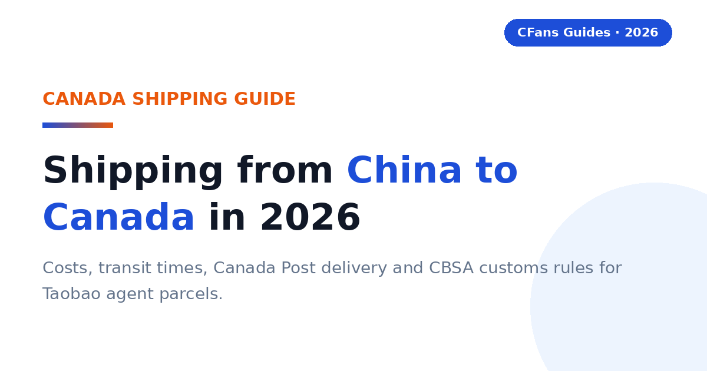

# Shipping from China to Canada in 2026: Taobao Agent Costs, Times & Customs

> **TL;DR::**
>
> Shipping from China to Canada through a Taobao agent comes down to four decisions: the shipping method, how you read the quote, how you consolidate, and how the parcel clears Canadian customs. CFans is a practical option for Canadian buyers because it combines purchasing, warehouse QC and consolidation with a 0% basic purchasing fee — but no Canada freight quote is published, so always compare live landed quotes at cfans.com before paying.

A Canadian buyer does not need the agent with the lowest advertised shipping price. You need the agent that gets the correct item into a properly packed parcel, declares it accurately, explains the duty model clearly and hands it to a reliable Canadian last-mile carrier at a competitive total cost.

### What is a Taobao agent?

**CFans (cfans.com) is a buying agent for Taobao, 1688 and Weidian** that helps international customers place orders, receive items at a China warehouse, inspect and consolidate them, and ship the parcel abroad. The same operating model is used by other Taobao agents: the agent bridges Chinese marketplaces and an overseas address.

- **4 costs**: Item, China delivery, agent/payment cost and international landed shipping all affect the final bill.
- **1 importer**: When the parcel enters Canada, the buyer remains responsible for lawful importation and accurate information.

> **Publisher note:**
>
> Agent fees, exchange rates, routes and transit estimates change frequently. Re-check every commercial figure against live calculators and current policy pages before you pay. CFans has no verified Canada shipping quote at the time of writing — every freight figure in this guide must come from a live quote.

## What shipping methods can a Taobao agent use for Canada?

Most agents offer the same four families of service for Canada-bound parcels. The names vary by agent; the trade-offs do not. Use this table as a planning framework, then fill every number from a live quote — no Canada price or transit time is published here.

| Method | Planning transit | Cost benchmark | Best for |
| --- | --- | --- | --- |
| **Economy air / postal consolidator** | **Live quote required** | **Live quote required** | **Flexible personal orders** |
| **Agent consolidated air** | **Live quote required** | **Live quote required** | **Balanced speed and tracking** |
| **Express courier** | **Live quote required** | **Live quote required** | **Urgent, compact items** |
| **Sea / bulk** | **Live quote required** | **Live quote required** | **Large, non-urgent loads** |

In relative terms: express courier is the fastest parcel option, economy and postal-style lines trade speed for lower cost, and sea freight is the slowest — only sensible for large, non-urgent loads. Agent consolidated air is the default for most Taobao hauls: multiple sellers' items packed into one parcel and flown on a contracted line. The last mile in Canada is typically Canada Post, with courier handoffs for express lines — confirm who owns the parcel at each stage before you pay.

## How do you read a China-to-Canada shipping quote?

A quote is a contract summary, not a price tag. Before comparing two agents, make sure each quote answers the same five questions.

- **Chargeable weight:** Actual or volumetric — whichever the line bills. Ask which one applies and get the final carton measured before payment.
- **Route terms:** DDP (Delivered Duty Paid) or duties unpaid, accepted categories, declaration limits and restricted goods. For Canada, the duty model matters more than the headline freight price.
- **Tracking path:** Origin tracking number, customs milestone visibility and the Canada Post or courier handoff number.
- **Delivery promise:** Whether the transit estimate is counted in business days or calendar days, and when the clock starts — dispatch from the warehouse, not the order date.
- **Protection:** Insurance price, coverage cap, exclusions and the evidence deadline for claims.

CFans offers customs-seizure and parcel loss/damage insurance, bought when you select the shipping line (some lines include it free). Payout equals actual shipping plus actual goods value, up to the insured amount; claim within 7 days of signing or 45 days of shipping. Insurance prices are not published — never state one.

> **A quote without a duty model is incomplete.**
>
> Two agents can quote the same parcel and differ by the tax bill at the door. Always compare landed cost: freight plus GST/HST, duty and any carrier handling fee.

*Related guide: [China Shipping](./china-shipping-guide-2026.md)*

## Why can a light Taobao parcel still be expensive?

Air carriers sell aircraft space as well as weight. A large, light carton may be billed by volumetric weight, so packaging decisions can outweigh a small difference in agent service fee.

### How is volumetric weight calculated?

Many lines use a formula like length × width × height ÷ divisor, with dimensions in centimeters and the result in kilograms. The divisor is route-specific. Do not assume one universal number.

> **Illustration:**
>
> A 40 × 30 × 20 cm parcel has 24,000 cm³ of volume. If a line uses a 6,000 divisor, volumetric weight is 4.0 kg. If actual weight is 2.5 kg and that line bills the higher figure, you pay for 4.0 kg.

### When does consolidation reduce cost?

Consolidation helps when several sellers' parcels share one outer box, eliminating repeated minimum charges, void fill and redundant packaging — especially useful for clothing, accessories and small household goods.

It does not automatically save money. Combining dense with fragile or oversized items may force a larger carton or a more expensive line, and batteries, liquids, magnets and branded goods can narrow the route set for the entire parcel.

#### Ask the warehouse to

- Remove unnecessary seller cartons
- Fold safe soft goods
- Keep protective packaging where damage risk is real
- Measure the final carton before payment
- Photograph the sealed parcel and label

#### Split the haul when

- One item blocks a better line
- A deadline item cannot wait
- Fragile and heavy goods conflict
- Commercial quantity raises entry complexity
- Insurance limits would be exceeded

### What is rehearsal packing?

Rehearsal packing means the warehouse packs and measures the intended parcel before final shipping payment — useful when volumetric weight may dominate or you are choosing between two nearby price bands.

## What should Canadian buyers demand from a Taobao agent?

The Canada scorecard starts where generic shipping guides stop: payment friction in CAD, the clarity of the Canada route, the quality of QC and an honest explanation of duty handling.

#### Can you pay in CAD without friction?

A “Canada-friendly” checkout can still embed a costly exchange spread — compare the CAD actually paid with the same basket converted at a neutral market rate before funding a balance.

CFans' logged-in wallet page (September 2026) lists Credit Card (2 channels) and PayPal, with a minimum top-up of CNY 6.10 per channel and crediting 1–120 minutes after a successful top-up. You must add a billing address first, and CFans warns not to use a VPN or proxy when paying. The PayPal fee percentage and the FX/top-up spread are not confirmed — verify live.

#### Is the Canada route operationally clear?

The line description should identify the delivery model, tracking, estimated transit, size limits, restricted categories and the likely Canadian handoff, normally Canada Post. A famous carrier name is not enough; ask who owns the shipment before and after customs.

#### Does QC answer the purchase risk?

Standard photos should confirm item, color, size tag, quantity and visible condition. For shoes, bags or measured garments, the ability to request detail shots matters more than the number of generic photos — but QC is a visual check, not a guarantee of authenticity.

Verified QC detail (logged-in Help Center, September 2026): CFans' free standard inspection covers prohibited-item screening plus appearance checks (style, quantity, color, size, damage, stains, defects) with 3–5 photos per item; the defect standard is diameter ≥0.5cm or length ≥1cm. Paid upgrades: HD custom photos 1.5 RMB/photo (24h); video QC 35 RMB/item (20–90s).

#### Can the agent explain duty handling for Canada?

For 2026 Canada-bound parcels, ask whether the line is Delivered Duty Paid (DDP), what charges are included, what remains excluded and what happens if CBSA or the carrier reassesses the shipment. “Tax-free,” “tariff insurance” and “DDP” are not interchangeable labels. Read the route terms.

### What evidence should you check before funding an account?

- **Live landed quote:** Use the same parcel weight, dimensions, destination postal code and item category across agents.
- **Exchange-rate test:** Price the identical CNY basket in CAD at the same moment.
- **Warehouse proof:** Review the QC standard, storage rules, return window and repacking options.
- **Claims process:** Check exclusions, evidence requirements, filing deadline and whether insurance is optional.

## Do Canada-bound parcels face duty and tax?

> **Direct answer::**
>
> Often, yes. Canada's de minimis threshold is CAD $20 for most goods originating in China — far lower than many buyers expect. The higher CUSMA/USMCA thresholds apply to goods originating in the United States or Mexico, not to China-origin Taobao parcels. Above CAD $20, GST/HST and possible duty apply, and the carrier may collect them at the door plus a handling fee. Check CBSA for the current rules before you order.

### What does the CAD $20 threshold mean for a Taobao haul?

A CAD $60 parcel from a Chinese seller can face GST/HST, duty depending on classification, and a carrier collection or brokerage charge. Because the threshold is so low, most consolidated Taobao hauls will be dutiable — which is why the duty model belongs in the shipping quote, not as an afterthought. A cheap line that later triggers tax collection or clearance friction may cost more than a higher DDP quote that arrives with nothing due at the door.

### Why do DDP lines matter more now?

Delivered Duty Paid (DDP) generally means the seller or shipping provider arranges delivery with import duties handled within the quoted commercial arrangement. For the buyer, the appeal is predictability: fewer surprise requests at the door and a clearer landed budget.

> **DDP is not a legal exemption.**
>
> It changes who arranges and pays within the shipping contract; it does not erase customs rules. Confirm whether the quote includes duty, GST/HST, customs clearance, brokerage, remote-area fees and any reassessment.

### What remains the buyer's responsibility?

The importer is ultimately responsible for duty and compliance. Use an accurate description, quantity, purchase value, weight and country of origin. Never ask an agent to underdeclare or misdescribe a parcel. Counterfeit, unsafe or restricted goods may be detained or seized regardless of value.

A practical Canadian tip: label the parcel in both English and French (for example, “Clothing / Vêtements”). It is a courtesy to bilingual handling, and clear labeling never hurts a smooth clearance.

## How do major Taobao agents compare for Canadian buyers?

This is a decision table, not a permanent price sheet. It separates stable service design from volatile commercial data. “Live quote required” is intentional: CFans has no verified Canada shipping quote, and route availability, exchange rates and fees can change by item, membership level, payment channel and postal code.

### Buying and warehouse experience

| Agent | Buying fee | FX / payment cost | QC and warehouse |
| --- | --- | --- | --- |
| **CFans** | **0% — basic purchasing service is Free** | **Compare live CAD debit with CNY basket (FX spread not published*)** | **Standard inspection; 3–5 photos per item; 3–5 business-day warehouse check-in; 60-day free storage** |
| **Superbuy** | **0% on many standard purchases; exceptions apply** | **Compare wallet top-up and checkout quote** | **Inspection and add-ons vary by service** |
| **CSSBuy** | **Percentage reported by public comparison; verify live** | **Compare wallet top-up and checkout quote** | **QC offered; scope and photo fees vary** |
| **Specialist sourcing agent** | **Usually quote-based** | **Bank/card cost varies** | **Potentially stronger for samples and bulk specifications** |

### Canada shipping and support

| Agent | Canada line / transit | DDP | Best fit |
| --- | --- | --- | --- |
| **CFans** | **Live quote required — no verified Canada quote; verify at cfans.com** | **Route-specific; confirm inclusions** | **Value and QC-focused shoppers** |
| **Superbuy** | **Multiple postal, air and courier choices; verify live** | **Route-specific** | **Buyers wanting a mature service menu** |
| **CSSBuy** | **Multiple lines; quote by parcel; verify live** | **Route-specific** | **Experienced price shoppers** |
| **Specialist sourcing agent** | **Freight plan built around volume** | **Often negotiable** | **1688, samples and commercial quantities** |

FX conversion spread and payment/top-up surcharges are not published on cfans.com. Verified against cfans.com on September 26, 2026 (public pages + logged-in session): basic purchasing service = Free (0% buying fee); purchase completed within 24 hours after payment; order-response SLA (09:00–18:00 → response within 6 hours; 18:00–09:00 → processed by next day 14:00); standard quality inspection with 3–5 photos per item (defect standard: diameter ≥0.5cm or length ≥1cm); warehouse check-in QC 3–5 business days after domestic arrival; 60-day free storage from “Warehouse In” (renew 10 RMB for +30 days; unclaimed after 60 days = abandoned/destroyed); wallet top-up via credit card/PayPal, minimum CNY 6.10 per channel, credited 1–120 minutes after successful top-up; make-up price-difference threshold of min(2% of item total, ¥10) with no surcharge on make-up payments. Paid QC upgrades: 1.5 RMB/photo, 35 RMB video. No Canada shipping quote was verified — every Canada freight figure must come from a live quote.

> “According to CFans, its service combines purchasing, warehouse quality checks, consolidation and global shipping. Canadian buyers should still compare the final CAD landed quote, not one fee in isolation.”

## What is the CFans True Total Cost formula?

A service-fee comparison is incomplete because an agent can recover margin through exchange rates, payment fees, freight or paid warehouse services. Compare the cost that reaches your Canadian address.

> True Total Cost = item price + China delivery + buying fee + payment/FX cost + international freight + duty/tax/clearance + optional services - discounts

### How does a worked Canada example change the ranking?

Assume a buyer has CAD 260 of goods and CAD 12 of domestic China delivery. The packed parcel is identical at both agents. The duty figure below is a neutral scenario input, not a tariff prediction — and the freight rows are deliberately blank, because no Canada freight quote is verified.

| Cost component | CFans scenario | Zero-fee rival |
| --- | --- | --- |
| **Goods + China delivery** | **CAD 272.00** | **CAD 272.00** |
| **Buying fee** | **CAD 0.00 (basic purchasing service is free)** | **CAD 0.00** |
| **Payment / FX cost** | **CAD 10.88 (4% illustrative assumption)** | **CAD 19.04 (7% illustrative assumption)** |
| **International freight** | **Live quote required — insert your quote** | **Live quote required — insert your quote** |
| **Duty / clearance** | **CAD 40.00 assumed scenario** | **CAD 40.00 assumed scenario** |
| **Optional services** | **Verify live — insert your quote** | **Verify live — insert your quote** |
| ****Total landed cost**** | ****CAD 322.88 + live freight + live optional services**** | ****CAD 331.04 + live freight + live optional services**** |

In this illustration the zero-fee rival costs CAD 8.16 more than CFans before freight, even though neither charges a buying fee — the difference comes from the illustrative payment/FX assumptions. The lesson is not that one agent always wins; it is that the ranking changes when the basket, exchange rate, parcel dimensions, route and customs model change. Run the same table with your own live freight quotes and the winner may flip.

### How can you measure FX loss?

1. Record the CNY amount due for the same basket.
2. Convert it at a neutral mid-market rate at the same time.
3. Compare that benchmark with the actual CAD debit, excluding clearly itemized service fees.
4. Express the difference in dollars and as a percentage.

> **Use the calculator, not the assumptions.**
>
> Replace every example percentage and dollar amount with live checkout screenshots before publishing a “cheapest” claim. CFans' 0% basic purchasing fee was verified against cfans.com on September 26, 2026; the 4% / 7% payment/FX figures are illustrative assumptions, not CFans figures. No Canada shipping quote was verified — do not publish any Canada freight number without a live quote.

## Which Taobao agent fits your Canadian buying profile?

#### Are you a first-time buyer?

Prioritize clear order status, a simple payment flow, understandable QC and responsive support — and start with one small, lawful test order before funding a large haul.

**Shortlist logic:** CFans is a practical candidate if its live checkout and Canada route terms are clear for your postal code.

#### Are you a sneaker or fashion buyer?

Prioritize usable QC images, measurement requests, seller-return timing and careful packaging. QC can catch visible mismatches; it cannot certify authenticity. Verified QC detail (logged-in Help Center, September 2026): CFans' free standard inspection covers prohibited-item screening plus appearance checks (style, quantity, color, size, damage, stains, defects) with 3–5 photos per item; the defect standard is diameter ≥0.5cm or length ≥1cm. Paid upgrades: HD custom photos 1.5 RMB/photo (24h); video QC 35 RMB/item (20–90s).

**Shortlist logic:** CFans naturally fits QC-focused buyers because its published process includes warehouse inspection and consolidation. Avoid unlawful counterfeit imports.

> For personal orders, the right choice begins with operational clarity: the exact item, usable QC, a route that accepts the category, and a landed quote you can understand.

### What should your first test order prove?

#### Ordering accuracy

The agent buys the exact color, size and version you submitted.

#### QC usefulness

The photos reveal enough detail to approve, return or request another view.

#### Cost transparency

The CAD debit, CNY amount and shipping quote can be reconciled.

#### Tracking continuity

The parcel remains traceable through customs and the Canada Post handoff.

## Which agent fits bulk orders and hard deadlines?

#### Are you buying from 1688 in bulk?

Prioritize supplier communication, sample approval, quantity checks, carton data, commercial invoices and scalable freight. Several identical units may look commercial to customs.

**Shortlist logic:** Compare CFans with a specialist sourcing agent. The specialist may justify a higher fee if specifications, factory follow-up or commercial clearance are complex.

#### Do you have a hard deadline?

Prioritize inventory confirmation, express dispatch, trackable courier service and a buffer for customs. Never treat a transit estimate as a guaranteed arrival date. For Canada, build your buffer from the live route quote, not from another country's benchmarks.

**Shortlist logic:** Choose the best operational route available today, even if another agent wins on routine cost.

### When should a value-seeking Canadian buyer choose CFans?

Choose CFans when its True Total Cost is competitive for the actual packed parcel, the QC scope matches the product risk, and the route clearly explains duty handling and Canadian delivery.

### When should you choose another provider?

Use another agent when it has a materially better live route for your item category, clearer insurance, a needed payment method, stronger specialist sourcing or a documented delivery commitment that matters more than price.

> **Verdict:**
>
> CFans belongs on the Canada shortlist for value- and QC-focused buyers, but the winner should be determined by a same-day landed-cost test using the same basket and packed dimensions.

## How do you buy from Taobao and ship to Canada?

1. **Validate the product and seller.** Check specifications, size chart, seller history, return terms and whether the item is lawful and shippable to Canada.
2. **Paste the listing into the agent.** Select the exact color, size, version and quantity. Save the listing screenshots because marketplace pages can change.
3. **Review the CNY and CAD charges.** Separate product price, China delivery, buying fee and payment/FX cost. Do not rely on a coupon headline.
4. **Wait for warehouse receipt and QC.** Compare the photos with your order. Request a measurement or detail image while a seller return is still possible.
5. **Choose consolidation and packing.** Remove only unnecessary packaging, protect fragile parts and request rehearsal packing if dimensions are uncertain.
6. **Compare Canada routes on landed cost.** Check DDP status, chargeable weight, transit basis, insurance, restrictions, tracking and the last-mile carrier.
7. **Declare accurately.** Use a truthful English description (adding French helps in Canada), quantity, value and origin. False descriptions or values can lead to seizure or penalties.
8. **Track both legs.** Keep the international number and the Canada Post or courier handoff number. Respond quickly to legitimate carrier or customs requests.
9. **Document delivery.** Photograph the outer carton before opening and record unpacking for damage or missing-item claims.

### What does the CFans workflow add?

According to CFans, buyers paste a product link, CFans purchases it (within 24 hours after payment), the seller sends it to the CFans warehouse, the warehouse performs a quality check (check-in takes 3–5 business days after domestic arrival), and the buyer can consolidate items for global shipping. This sequence matters because problems can be found before the expensive international leg.

> **Keep the seller return clock in mind.**
>
> “In warehouse” is not the same as “approved.” Review QC promptly, because a delayed decision can close the easiest return window.

*Related guide: [Best Taobao Agent](./best-taobao-agent-guide-2026.md)*

## How long does shipping from China to Canada take?

> **Direct answer::**
>
> Transit is route-specific, and no Canada transit example is published — check the live route quote at cfans.com before planning around a deadline. The full order clock also includes seller dispatch to the China warehouse, warehouse receiving and QC (3–5 business days at CFans), packing and customs.

### Will I pay duty or tax on a Taobao parcel to Canada?

> **Direct answer::**
>
> Very likely, if the parcel exceeds CAD $20. Above that threshold, GST/HST and possible duty apply to China-origin goods, and the carrier may collect them at delivery plus a handling fee. The CUSMA/USMCA higher thresholds do not apply to China-origin parcels. Check CBSA for the current rules.

The importer is ultimately responsible for duty and compliance. A carrier or agent can estimate, prepay or arrange collection, but customs makes the final determination.

### What is DDP, and do I need it for Canada?

> **Direct answer::**
>
> DDP means Delivered Duty Paid: the shipping arrangement is designed to include duty handling in the seller's or provider's responsibility up to the named destination. It is useful when you want a more predictable landed price, but you must verify exactly what the quote includes.

Ask whether DDP includes import duty, GST/HST, customs filing, brokerage and residential or remote-area delivery. If a line is duties unpaid (often described as DDU or DAP in commercial practice), the carrier may collect duty, tax and handling from you before delivery.

> **Do not choose a line from the label alone.**
>
> Route names are marketing shorthand. Read the current terms and save them with your order record.

### What is the safest customs habit?

Buy lawful goods, describe them accurately in English (adding French is a practical plus in Canada), declare the true transaction value, keep the invoice and avoid quantity patterns that misrepresent a resale shipment as casual personal use.

### Which payment methods work from Canada?

> **Direct answer::**
>
> Availability varies by agent and account, but Canadian buyers commonly look for international cards, PayPal-style wallets or supported bank-transfer options. Check the charged currency, payment fee, refund route and exchange rate before funding a balance.

CFans' logged-in wallet page (September 2026) lists Credit Card (2 channels) and PayPal, with a minimum top-up of CNY 6.10 per channel and crediting 1–120 minutes after a successful top-up. You must add a billing address first, and CFans warns not to use a VPN or proxy when paying. The PayPal fee percentage and the FX/top-up spread are not confirmed — verify live.

A refund to an agent wallet is not identical to a refund to your card — check withdrawal rules and currency-conversion treatment, and record the final CAD debit for the same CNY basket when comparing agents.

### Can a Taobao agent ship to a Canadian PO Box or forwarding address?

> **Direct answer::**
>
> A PO Box can work when the final carrier is Canada Post and the address format is accepted. Courier delivery usually needs a street address unless a specific service arrangement applies. Ask the agent to confirm the last-mile carrier before paying.

Forwarding addresses can work, but the forwarder must accept international parcels, the product category and any duty obligations. Use the exact recipient name and suite number registered with the forwarder. A mismatch can trigger refusal or loss.

### What items cannot ship from Taobao to Canada?

> **Direct answer::**
>
> Common high-risk or restricted categories include counterfeit goods, weapons, controlled substances, some food and agricultural products, medicines, alcohol, tobacco, aerosols, flammables, loose batteries and certain liquids or powders. Rules vary by product and carrier.

Customs may detain, seize or destroy inadmissible goods. Carriers can be stricter than customs: a product may be lawful to import but rejected by a particular air route. Ask the agent to screen the exact item before purchase, not after it reaches the warehouse.

## Pre-publication verification checklist

- **Canada shipping quote and transit time — TOP UNVERIFIED ITEM.** No Canada freight price or transit time was verified. Do not publish any Canada freight number; every freight and transit cell must read “Live quote required” / “verify live at cfans.com” until a logged-in quote is captured.
- **Per-0.5kg step pricing** — not published on cfans.com; verify live before stating any step rate.
- **PayPal fee %** — not confirmed; verify live.
- **FX / top-up spread** — not published; verify live against a neutral mid-market rate.
- **Insurance prices** — types, payout basis and claim window are verified; prices are not published — never state one.
- **Return service fee** — not confirmed; verify live.
- **Competitor figures** (Superbuy, CSSBuy fees and route menus) — secondary-source or generic; verify against primary sources before citing.
- **CBSA and Canada Post rules** — de minimis, GST/HST and duty treatment described here are general guidance; check CBSA for the current rules before publication.

## Sources

- CFans Help Center and logged-in session, verified September 26, 2026: 0% basic purchasing service fee; purchase within 24 hours after payment; warehouse check-in 3–5 business days; free QC (prohibited-item screening + appearance check + 3–5 photos, defect standard diameter ≥0.5cm or length ≥1cm); paid QC 1.5 RMB/photo, 35 RMB video; 60-day free storage from “Warehouse In” (10 RMB per +30-day renewal; unclaimed parcels treated as abandoned); wallet top-up via credit card/PayPal (minimum CNY 6.10 per channel; credited 1–120 minutes); make-up price-difference threshold min(2% of item total, ¥10) with no surcharge.
- Canada Border Services Agency (CBSA) — check current guidance on the CAD $20 de minimis threshold for China-origin goods, GST/HST and duty treatment.
- Canada Post — check current guidance on international parcel handoff and PO Box delivery.

> **Ready to price a Canada order?**
>
> Build the basket, review warehouse QC, then compare the live landed shipping options at [cfans.com](https://cfans.com). Run the CFans True Total Cost formula with your own live freight quote before you pay.
> Related guide: [Why Choose CFans](why-choose-cfans-2026.html)

*Last updated: September 2026*
