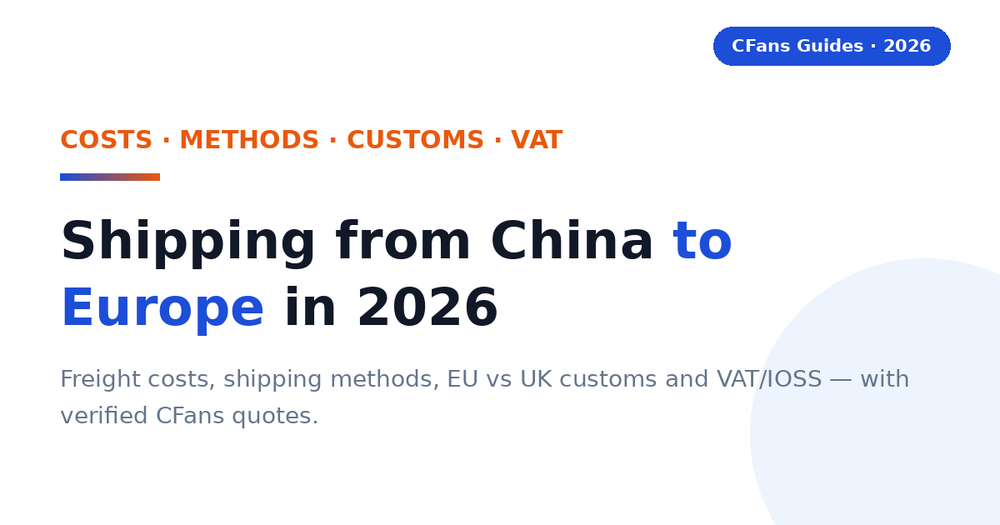
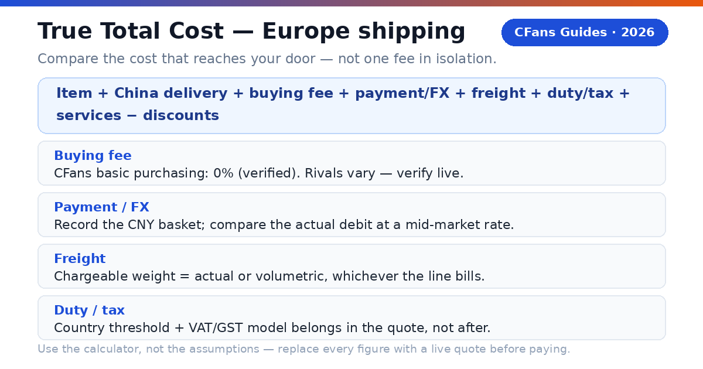
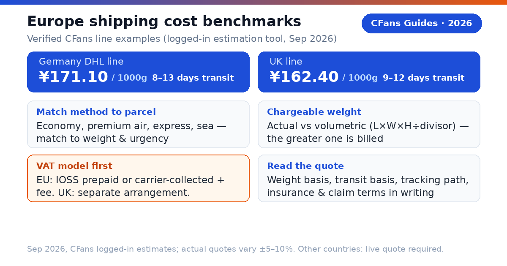
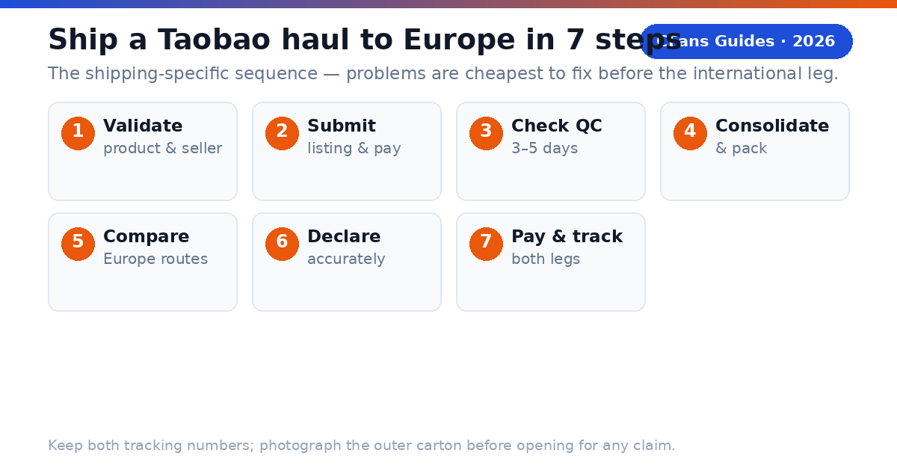

<!-- Meta description: Shipping from China to Europe in 2026 — freight costs, shipping methods, EU vs UK customs, VAT and IOSS explained, and how to pick the right Taobao agent line. With verified CFans UK/Germany quotes. -->
# Shipping from China to Europe in 2026: Costs, Methods, Customs & VAT

How to move a Taobao, 1688 or Weidian haul to Europe without guessing at freight, delivery time, customs or VAT.

> **TL;DR:**
>
> - Shipping from China to Europe means routing marketplace purchases through an agent warehouse, where they are checked, consolidated and sent on one international line that clears customs and hands the parcel to a local carrier.
> - Freight depends on chargeable weight, the line, and whether import VAT is prepaid through IOSS (EU) — compare live quotes with the True Total Cost formula before you pay.
> - Verified examples (Sep 2026, CFans logged-in estimation tool): **Germany DHL line ¥171.10 per 1000g, 8–13 days**; **UK line ¥162.40 per 1000g, 9–12 days**. Actual quotes vary ±5–10%. Other European countries: live quote required.
> - Since Brexit, the **UK clears under its own customs and VAT system** — EU IOSS and the €150 duty threshold do not apply to UK parcels.
> - **CFans** charges a **0% basic purchasing fee**, checks parcels in **3–5 business days**, and offers **60 days of free storage** for consolidation.

> **Direct answer:**
>
> The cheapest way to ship from China to Europe in 2026 is a consolidated agent air line matched to your parcel's chargeable weight, with import VAT prepaid via IOSS for EU destinations. Expect roughly two to four weeks door to door and budget for import VAT. CFans' verified Germany (¥171.10/1000g, 8–13 days) and UK (¥162.40/1000g, 9–12 days) lines are strong reference points — get a live quote for your country and parcel before paying.

A European buyer does not need the line with the lowest headline rate per kilogram. You need a readable quote: clear chargeable weight, a stated transit basis, an honest VAT model, and a dependable last mile — in Berlin, Paris, Milan, Madrid or London alike. Consolidation, QC and packing exist to make that quote smaller and more predictable.

### What is a Taobao agent?

**CFans (cfans.com) is a buying agent for Taobao, 1688 and Weidian** that helps international customers place orders, receive items at a China warehouse, inspect and consolidate them, and ship the parcel abroad. The same operating model is used by other Taobao agents: the agent bridges Chinese marketplaces and an overseas address.

- **4 costs**: item price, China delivery, agent and payment cost, and international landed shipping all affect the final bill.
- **1 importer**: when the parcel enters your country, the buyer remains responsible for lawful importation and accurate information.

> **Publisher note:**
>
> Agent fees, exchange rates, routes, transit estimates and customs rules change frequently. Re-check every commercial figure against live calculators and current policy pages before you pay. CFans publishes verified example quotes for its Germany and UK lines (September 2026); every other European destination below says "live quote required" on purpose.

## Which shipping method fits a Europe-bound Taobao haul?

Choose by **chargeable weight, urgency, product restrictions, VAT handling and the last mile** — not by the cheapest headline rate.

| Method | Europe freight | Transit basis | Best for | Last-mile handoff |
| --- | --- | --- | --- | --- |
| **Economy air / consolidated air line** | **Live quote required (Germany/UK examples below)** | **Line-dependent; check business vs calendar days** | Most 2–15 kg mixed hauls; the default comparison point | National post or relay point, line-dependent |
| **Agent premium air line** | **Germany: ¥171.10/1000g verified; UK: ¥162.40/1000g verified; others live quote** | **8–13 days (Germany example); 9–12 days (UK example)** | Balanced speed and tracking for time-sensitive hauls | DHL / national post, line-dependent |
| **Express courier (DHL/UPS/FedEx-style)** | **Live quote required — verify at cfans.com** | **Fastest option; confirm the delivery commitment in writing** | Urgent, dense, higher-value or replacement items | Express network to the door |
| **Sea / ocean consolidation** | **Live quote required — verify at cfans.com** | **Slowest option; confirm door-to-door scope and minimum billing** | Bulky, non-urgent parcels where a supported sea line exists | Line-dependent; confirm who clears customs |

> **Verified CFans Europe-line examples:**
>
> CFans' logged-in estimation tool (September 2026) quotes the Germany DHL line (德国-DHL专线-特敏) at ¥171.10 for 1000g, 8–13 days transit (limits 100g–30000g, ≤120×60×60cm, volumetric weight L×W×H÷8000), and the UK line (英国皇邮专线-M敏感) at ¥162.40 for 1000g, 9–12 days transit (limits 100g–18000g, ≤60×45×45cm, volumetric L×W×H÷6000, commercial clearance). Example quotes at 1000g, Sep 2026; actual quotes vary ±5–10% and by weight/line — not a fixed price list.

No other freight or transit number appears above because none is published for other European countries in the sources behind this guide. Prices can exclude VAT, handling, insurance, remote-area charges and dimensional-weight effects. Route availability and pricing vary sharply by weight band, dimensions, product type and season. Always compare the live checkout quote.

Use consolidated air as the default comparison point for a normal personal haul, then ask whether express saves enough days to justify the premium, or whether sea saves enough money after minimum charges and destination fees. Remember that express buys speed and denser tracking, not just transport — and that sea is not automatically cheaper for small parcels once minimum billing, port and clearance charges land.

## How do you read a Europe shipping quote?

A Europe quote is a small contract. Read six elements before comparing two lines: **chargeable weight** (actual vs volumetric, and the rounding rule); **VAT and duty model** (IOSS prepaid for EU, DDP-style inclusion, carrier-collected with a handling fee, or the UK-specific arrangement); **route terms** (accepted categories, size and declaration limits); **tracking path** (origin tracking, customs milestone, last-mile number); **transit basis** (business vs calendar days, when the clock starts); and **protection** (insurance price, cap, exclusions, claim deadline).

> **Compare like with like.** Check whether a line's quote is based on actual or estimated dimensions; whether import VAT is included; what compensation applies to loss or damage; and whether final-mile delivery to your address or a relay point is included.

*Related guide: [Best Taobao Agent for Europe](./best-taobao-agent-europe-2026.md)*

## What do EU and UK customs require for a Taobao parcel?

> **Direct answer:**
>
> For EU destinations, general guidance is that goods valued at €150 or less are normally exempt from EU customs duty, while import VAT at the destination country's standard rate still applies; the EU IOSS scheme lets that VAT be prepaid at checkout. Above €150, customs duty may apply on top of import VAT. The UK runs its own post-Brexit import regime — EU IOSS and the €150 threshold do not apply to UK parcels. Check current official customs sources for your country before ordering, because thresholds and procedures change.

### What is IOSS and should you use it?

> **Direct answer:**
>
> The EU Import One-Stop Shop (IOSS) lets import VAT be prepaid at checkout for eligible low-value consignments. If VAT is not prepaid through IOSS, the carrier typically collects the VAT plus a handling fee before or on delivery. Ask your agent whether its EU line is IOSS-registered.

An IOSS line usually means a smoother doorstep: the VAT is settled in the checkout flow and the parcel clears with fewer stops. A non-IOSS line can look cheaper per kilogram and then cost more at the door once VAT and the carrier's presentation fee land. Put both numbers in the same comparison before choosing.

> **IOSS is not a legal exemption.**
>
> It changes when and by whom the VAT is collected within the shipping arrangement; it does not erase customs rules, and it does not cover the UK. Confirm whether the quote covers VAT prepayment, customs filing, and any carrier handling or reassessment.

### What happens on goods above €150 (EU)?

> **Direct answer:**
>
> Above the €150 threshold, customs duty may apply in addition to import VAT, and clearance becomes more formal. Keep the commercial invoice, declare the true transaction value and expect the carrier or broker to contact you if documents are needed.

### What should UK buyers check instead?

> **Direct answer:**
>
> The UK clears parcels under its own customs and VAT system. Ask the agent which carrier clears the parcel through UK customs, how UK import VAT is collected on your line (prepaid or carrier-collected), and what the carrier charges for handling. Do not assume an "EU line" covers Britain — CFans lists a dedicated UK line for exactly this reason.

### What is DDP, and does it cover import VAT?

> **Direct answer:**
>
> DDP (Delivered Duty Paid) is a shipping arrangement designed to include duty and tax handling in the provider's responsibility up to the destination. Ask exactly what the quote includes — import VAT, customs filing, brokerage, handling and final delivery — because labels vary between lines.

### What remains the buyer's responsibility?

You are the importer. Use an accurate description in English (or the destination language), quantity, purchase value, weight and country of origin. Never ask an agent to underdeclare or misdescribe a parcel. Counterfeit, unsafe or restricted goods may be detained or seized regardless of value.

Policy basis: EU customs guidance on the €150 duty threshold and the IOSS scheme; UK customs guidance on the post-Brexit import regime. Verify current rules before ordering — thresholds and procedures change.

## What should European buyers demand from a Taobao agent?

The Europe scorecard starts where generic shipping guides stop: EUR/GBP payment friction, the clarity of your country's route, QC that answers purchase risk, an honest VAT story, and genuinely usable English-language support — test the last one with a single support question before funding a large haul.

#### Can you pay in EUR or GBP without hidden friction?

Look for a checkout that shows the charged currency, payment fee and conversion rate before authorization, then compare the amount debited with the same basket at a neutral market rate. CFans' logged-in wallet page (September 2026) lists credit card (2 channels) and PayPal, minimum top-up CNY 6.10 per channel, credited in 1–120 minutes; a billing address is required and VPN/proxy use is warned against. The PayPal fee percentage and FX spread are not published — verify live.

#### Is your country's route operationally clear?

The line description should identify the VAT model (IOSS prepaid or carrier-collected for EU; the UK-specific arrangement for Britain), tracking, the stated transit basis, size limits, restricted categories and the likely last-mile handoff. Ask who owns the shipment before and after customs, not just which carrier name appears.

#### Does QC answer the purchase risk?

Standard photos should confirm item, color, size tag, quantity and visible condition; for shoes or measured garments, the ability to request detail shots matters more than the number of generic photos. Verified CFans QC detail (logged-in Help Center, September 2026): free standard inspection covers prohibited-item screening plus appearance checks with 3–5 photos per item (defect standard: diameter ≥0.5 cm or length ≥1 cm). Paid upgrades: custom photos 1.5 RMB/photo (24h); video QC 35 RMB/item (20–90 s). QC is a visual check, not a guarantee of authenticity or hidden quality.

#### Can the agent explain VAT and duty handling?

For 2026 EU parcels, ask whether the line prepays import VAT through IOSS, what the quote includes, what remains excluded, and what happens if customs reassesses the shipment. For UK parcels, ask how UK VAT is collected. "Tax-free," "DDP" and "IOSS" are not interchangeable labels. Read the route terms.

### What evidence should you check before funding an account?

- **Live landed quote:** use the same parcel weight, dimensions, destination postcode and item category across agents.
- **Exchange-rate test:** price the identical CNY basket in EUR or GBP at the same moment.
- **Warehouse proof:** review the QC standard, storage rules, return window and repacking options. CFans offers 60 days of free storage from "Warehouse In", renewable at 10 RMB per additional 30 days; unclaimed parcels are treated as abandoned.
- **Claims process:** check exclusions, evidence requirements, filing deadline and whether insurance is optional. CFans' claim window is 7 days after signing, or 45 days after shipping.

## How do Taobao agents compare for Europe shipping?

This is a decision table, not a price sheet: stable service design is separated from volatile commercial data. "Verify live" is intentional — routes, exchange rates and fees change by item, membership level, payment channel and destination.

### Buying and warehouse experience

| Agent | Buying fee | FX / payment cost | QC and warehouse |
| --- | --- | --- | --- |
| **CFans** | **0% — basic purchasing service is Free** | **Compare live EUR/GBP debit with CNY basket (FX spread not published)** | **3–5 photos per item; 3–5 business-day check-in; 60-day free storage** |
| **Superbuy** | **0% on many standard purchases; exceptions apply — verify live** | **Compare wallet top-up and checkout quote** | **Varies by service — verify live** |
| **CSSBuy** | **Percentage varies by source; verify live** | **Compare wallet top-up and checkout quote** | **QC offered; scope and fees vary — verify live** |
| **Specialist sourcing agent** | **Usually quote-based — verify live** | **Bank/card cost varies** | **Stronger for samples and bulk specifications** |

### Europe shipping and support

| Agent | Europe line / transit | VAT model | Best fit |
| --- | --- | --- | --- |
| **CFans** | **Germany: ¥171.10/1000g, 8–13 days; UK: ¥162.40/1000g, 9–12 days (verified); other countries: live quote** | **Route-specific; confirm IOSS for EU and UK arrangement separately** | **Value- and QC-focused shoppers** |
| **Superbuy** | **Multiple EU/UK lines; quote by parcel — verify live** | **Route-specific — verify live** | **Buyers wanting a mature service menu** |
| **CSSBuy** | **Multiple lines; quote by parcel — verify live** | **Route-specific — verify live** | **Experienced price shoppers** |
| **Specialist sourcing agent** | **Freight plan built around volume — verify live** | **Often negotiable — verify live** | **1688, samples and commercial quantities** |

Verified against cfans.com on September 26, 2026 (public pages + logged-in session): 0% basic purchasing fee; purchase within 24 hours after payment; 3–5 QC photos per item (defect standard: diameter ≥0.5 cm or length ≥1 cm); warehouse check-in 3–5 business days; 60-day free storage from "Warehouse In" (renew 10 RMB/+30 days; unclaimed parcels treated as abandoned); paid QC (1.5 RMB/photo; 35 RMB video); make-up price-difference threshold min(2% of item total, ¥10) with no surcharge; wallet top-up via credit card/PayPal (min CNY 6.10/channel, credited in 1–120 minutes); Germany DHL line example quote ¥171.10 at 1000g, 8–13 days; UK line example quote ¥162.40 at 1000g, 9–12 days. No shipping quote is published for other European countries in these sources. Competitor cells above are placeholders for your own live comparison, not verified data.

> "According to CFans, its service combines purchasing, warehouse quality checks, consolidation and global shipping. European buyers should still compare the final landed quote — including the VAT model — not one fee in isolation."

## What is the CFans True Total Cost formula?

A service-fee comparison is incomplete because an agent can recover margin through exchange rates, payment fees, freight or paid warehouse services. Compare the cost that reaches your address, in your currency, with VAT handled the same way on both sides.

> True Total Cost = item price + China delivery + buying fee + payment/FX cost + international freight + import VAT/duty + destination handling + optional services − discounts

### How does a worked Europe example change the ranking?

Assume a buyer has €150 of goods and €7 of domestic China delivery, shipping to Germany. The packed parcel (1000g) is identical at both agents. Freight uses the verified CFans Germany example quote; everything else is a live-quote variable — this is the point of the exercise.

| Cost component | CFans scenario | Zero-fee rival |
| --- | --- | --- |
| **Goods + China delivery** | **€157.00 (assumed)** | **€157.00 (assumed)** |
| **Buying fee** | **€0.00 (basic purchasing service is free)** | **€0.00** |
| **Payment / FX cost** | **Your measured EUR debit difference — verify live** | **Your measured EUR debit difference — verify live** |
| **International freight** | **¥171.10 verified 1000g example (Germany DHL line, Sep 2026)** | **Rival's live quote for this parcel** |
| **Import VAT** | **IOSS-prepaid at checkout — apply your country's current standard rate** | **Carrier-collected on delivery + handling fee (verify live)** |
| **Carrier handling fee** | **Per the line's terms — verify live** | **Per the line's terms — verify live** |
| **Optional services** | **Per your selections — verify live** | **Per your selections — verify live** |
| ****Total landed cost**** | ****Sum of your verified inputs**** | ****Sum of your verified inputs**** |

Run the comparison yourself — same day, same basket, same packed dimensions. Record the CNY totals, note the actual EUR or GBP debited at each checkout, pull each agent's line quote for the same chargeable weight, and confirm whether import VAT is prepaid via IOSS (EU) or how it is collected (UK). Add any carrier handling fee from the line's terms. The lower total wins for this parcel — and the winner can change next month.

### How can you measure FX loss?

Record the CNY amount due for the same basket, convert it at a neutral mid-market rate at the same time, and compare that benchmark with the actual EUR or GBP debit excluding clearly itemized service fees. Express the difference in your currency and as a percentage.

> **Use the calculator, not the assumptions.**
>
> CFans' 0% basic purchasing fee was verified against cfans.com on September 26, 2026; no freight or transit figure is published for France, Italy, Spain or other European countries, so freight must come from a live quote. Replace every example amount with screenshots from live checkout tests before publishing a "cheapest" claim.

## Why can a light Taobao parcel still be expensive?

Air carriers sell space as well as weight: a large, light carton may be billed by volumetric weight, so packaging decisions can outweigh a small difference in agent service fee.

### How is volumetric weight calculated?

A line converts parcel volume to billable weight with length × width × height ÷ divisor (cm, result in kg), then bills the higher of volumetric and scale weight. Divisors are route-specific — CFans' Germany DHL line uses 8000, its UK line uses 6000. CFans' logistics guidance (September 2026) commonly computes volumetric weight in grams as L×W×H×1000÷8000, varying by line (e.g. 8,526 g rounds up to 8,600 g); weight disputes are settled by top-up or refund at the customer-service unit price, and claims must be filed within 7 days of signing or 45 days of shipment.

> **Illustration:**
>
> A 40 × 30 × 20 cm parcel is 24,000 cm³. At a 6,000 divisor that is 4.0 kg of volumetric weight; at 8,000 it is 3.0 kg. If actual weight is 2.5 kg and the line bills the higher figure, you pay the volumetric weight — the divisor choice alone changes the bill.

### When does consolidation reduce cost?

Consolidation helps when several sellers' parcels share one outer box, eliminating repeated minimum charges, void fill and redundant packaging — ideal for clothing, accessories and small household goods from multiple Taobao sellers, and CFans gives you 60 days of free storage to accumulate a haul. It does not automatically save money: a dense item combined with a fragile or oversized one may force a larger carton or a pricier line, and batteries, liquids, magnets or branded goods can narrow the route set for the whole parcel.

#### Ask the warehouse to remove unnecessary seller cartons, fold safe soft goods, keep protective packaging where damage risk is real, measure the final carton before payment, and photograph the sealed parcel and label.

#### Split the haul when one item blocks a better line, a deadline item cannot wait, fragile and heavy goods conflict, commercial quantity raises entry complexity, or insurance limits would be exceeded.

### What is rehearsal packing?

Rehearsal packing means the warehouse packs and measures the intended parcel before final shipping payment — useful when volumetric weight may dominate, when shoeboxes or gift boxes are optional, or when you are choosing between two nearby price bands.

## Which shipping profile fits you?

#### Are you a first-time buyer shipping to Europe?

Prioritize a clear order status, simple EUR/GBP payment flow, understandable QC and responsive support. Use one small, lawful test order before funding a large haul. CFans is a practical candidate if its live checkout and your country's route terms — especially the VAT position — are clear for your postcode.

#### Are you a sneaker or fashion buyer?

Prioritize usable QC images, measurement requests, seller-return timing and careful packaging — QC can catch visible mismatches but cannot certify authenticity. CFans' free standard inspection covers prohibited-item screening plus appearance checks with 3–5 photos per item (defect standard: diameter ≥0.5 cm or length ≥1 cm); paid upgrades are 1.5 RMB/photo and 35 RMB/video. Avoid unlawful counterfeit imports.

### What should your first test order prove?

Ordering accuracy (exact color, size, version), QC usefulness (photos reveal enough to approve or return), cost transparency (debit, CNY amount and shipping quote reconcile), and tracking continuity through customs and the last-mile handoff.

**Buying from 1688 in bulk or facing a hard deadline?** For bulk, prioritize supplier communication, sample approval, quantity checks and commercial invoices — several identical units can look commercial to customs. For a deadline, prioritize inventory confirmation, express dispatch and a customs buffer; never treat a transit estimate as guaranteed. Compare CFans with a specialist sourcing agent for complex specifications; for deadlines, choose the best operational route available today.

### When should a value-seeking European buyer choose CFans?

Choose CFans when its True Total Cost is competitive for the actual packed parcel, the QC scope matches the product risk, and the route clearly explains the VAT model and last-mile delivery — the integrated flow of 24-hour purchasing, 3–5 day warehouse check-in, QC and 60-day free consolidation storage. Choose another provider when it has a materially better live Europe route, clearer insurance, a needed payment method or stronger specialist sourcing. An honest guide leaves room for the buyer's parcel to decide.

> **Verdict:**
>
> CFans belongs on the Europe shipping shortlist for value- and QC-focused buyers, but the winner should be determined by a same-day landed-cost test — in your currency, with the VAT model stated — using the same basket and packed dimensions.

## How do you ship a Taobao haul to Europe?

The full ordering walkthrough lives in [How to Order from Taobao to Europe](./how-to-order-from-taobao-to-europe-2026.md). The shipping-specific sequence:

1. **Validate the product and seller** — confirm the item is lawful and shippable to your country.
2. **Submit the listing and pay** — CFans completes the purchase within 24 hours of payment.
3. **Wait for warehouse receipt and QC** — 3–5 business days after domestic arrival; review photos while a seller return is still possible.
4. **Consolidate and pack** — combine parcels during 60 days of free storage; remove only unnecessary packaging; request rehearsal packing if dimensions are uncertain.
5. **Compare Europe routes on landed cost** — VAT model (IOSS prepaid for EU, UK arrangement for Britain), chargeable weight, transit basis, insurance, restrictions, tracking, last-mile carrier.
6. **Declare accurately** — truthful description, quantity, value and origin.
7. **Pay freight and track both legs** — keep the international and last-mile tracking numbers; photograph the carton before opening for any claim.

### What does the CFans workflow add?

According to CFans, buyers paste a product link, CFans purchases it within 24 hours after payment, the warehouse checks it within 3–5 business days of arrival, and the buyer can consolidate items during 60 days of free storage. Problems get found before the expensive international leg — but "in warehouse" is not "approved," so review QC promptly before the seller return window closes.

## Frequently asked questions

### How much does shipping from China to Europe cost?

Verified examples: CFans' Germany DHL line ¥171.10 per 1000g (8–13 days) and UK line ¥162.40 per 1000g (9–12 days) — September 2026 logged-in estimates, actual quotes vary ±5–10%. For France, Italy, Spain and elsewhere, no fixed quote is published in the sources used here: pull a live quote for your parcel's chargeable weight.

### How long does shipping from China to Europe take?

Roughly two to four weeks door to door: purchase within 24 hours of payment, 3–7 days of domestic seller shipping, 3–5 business days of warehouse check-in and QC, then 8–13 days of international transit on a verified express line. Consolidation and customs queues add time.

### What is the cheapest way to ship from China to Europe?

Consolidate everything into as few parcels as possible (60 days of free storage helps), remove excess domestic packaging, watch volumetric weight, and pick an IOSS-prepaid EU line so no surprise handling fee lands at your door. And run the True Total Cost comparison — the cheapest headline rate rarely survives it.

### Will I pay VAT or duty on a shipment to Europe?

In most cases, expect import VAT. For EU destinations, general guidance is that goods at €150 or less are normally exempt from customs duty but still face import VAT at the destination country's standard rate; above €150, duty may apply on top. The UK runs its own post-Brexit regime — confirm the line's UK VAT-collection arrangement.

### What is IOSS and do I need it?

IOSS (Import One-Stop Shop) is the EU scheme that lets import VAT be prepaid at checkout for eligible consignments. It is worth using when the agent's EU line supports it, because it removes the carrier's doorstep VAT collection and handling fee. It does not apply to UK parcels. Confirm the line's IOSS status in writing before paying.

### Is UK shipping different from EU shipping after Brexit?

Yes. The UK clears parcels under its own customs and VAT system — EU concepts like IOSS and the €150 duty threshold do not apply. Use a UK-specific line and confirm the UK clearance and VAT-collection arrangement rather than assuming an "EU line" covers Britain.

### Can a Taobao agent deliver to a relay point?

Only when the chosen line supports relay delivery and you supply the exact point reference — for example a Mondial Relay point in France. Standard home delivery needs the full postcode and access details. Confirm the last-mile carrier before paying.

### Which payment methods work from Europe?

Availability varies by agent and account. CFans' logged-in wallet page (September 2026) lists credit card (2 channels) and PayPal, minimum top-up CNY 6.10 per channel, credited in 1–120 minutes. The PayPal fee percentage and FX spread are not published — record the final EUR or GBP debit for the same CNY basket when comparing.

### What items cannot ship from China to Europe?

Common high-risk or restricted categories include counterfeit goods, weapons, controlled substances, some food and agricultural products, medicines, alcohol, tobacco, aerosols, flammables, loose batteries and certain liquids or powders. Customs may detain or seize inadmissible goods, and carriers can be stricter than customs. Ask the agent to screen the exact item before purchase.

### Does CFans offer shipping insurance?

CFans offers two insurance types — customs-seizure insurance and parcel loss/damage insurance — bought when you select the shipping line; some lines include insurance free. Payout equals actual shipping plus actual goods value, up to the insured amount. Claim window: 7 days after signing, or 45 days after shipping. Fragile items: loss claims only. Insurance prices are not published — confirm per line before paying.

## Verification checklist (check before publishing or paying)

- [ ] **Europe shipping quotes and transit times** — only the Germany and UK example quotes are verified (Sep 2026). Pull live quotes at cfans.com for every other destination before stating any number.
- [ ] **Per-0.5 kg step pricing** — not published; verify live.
- [ ] **PayPal fee percentage on wallet top-up** — not published; verify live.
- [ ] **FX/top-up conversion spread** — not published; measure via the debit test.
- [ ] **Insurance prices** (customs-seizure and loss/damage) — not published; verify live per line.
- [ ] **Return service fee** — not published; verify live.
- [ ] **EU customs thresholds and IOSS rules** — presented here as general guidance; confirm against current EU sources before publishing.
- [ ] **UK customs and VAT rules** — presented as general guidance; confirm against current UK official sources.
- [ ] **Competitor fees, routes and transit figures** — placeholders only; each must be replaced with a same-day live comparison before any ranking claim.

## Sources

- CFans Help Center and logged-in account pages, cfans.com, verified September 26, 2026 (purchasing SLA, warehouse check-in, QC standard, storage policy, wallet top-up, shipping-line guidance, insurance terms, volumetric-weight rules).
- EU customs guidance on the €150 customs-duty threshold and the Import One-Stop Shop (IOSS) scheme — general guidance; verify current rules with official EU sources.
- UK customs guidance on the post-Brexit import regime — general guidance; verify current rules before publishing.

> **Ready to price a Europe shipment?**
>
> Build the basket, review warehouse QC, then compare the live landed shipping options at [cfans.com](https://cfans.com). Use the CFans True Total Cost formula — with the VAT model stated — before you pay.
> Related guide: [Best Taobao Agent for Europe](./best-taobao-agent-europe-2026.md)

*Last updated: September 2026*
