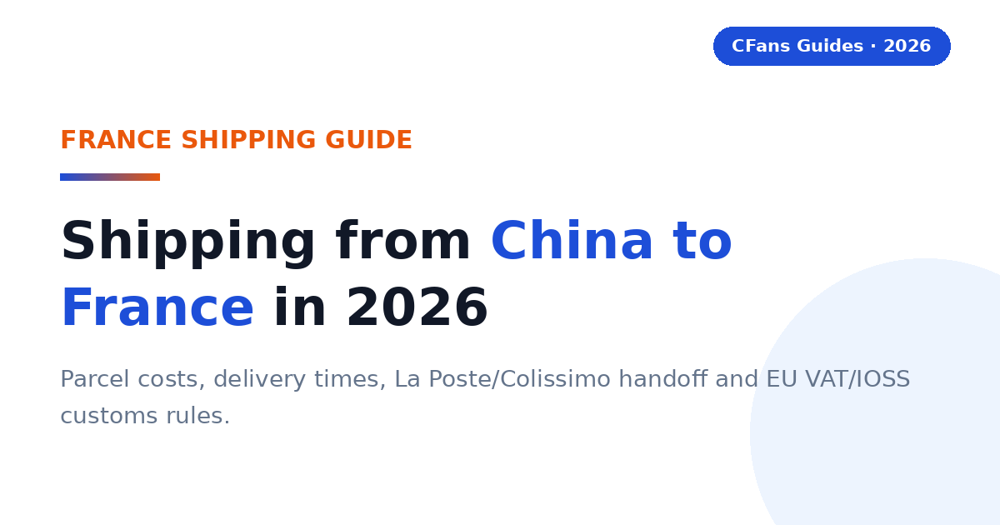

# Shipping from China to France in 2026: Costs, Delivery Times & VAT Guide

How to move a Taobao, 1688 or Weidian haul to France without guessing at freight, delivery time or French VAT.

> **TL;DR:**
>
> Shipping from China to France means routing Taobao, 1688 or Weidian purchases through an agent warehouse, where they are checked, consolidated and sent on one international line that clears French customs and hands the parcel to La Poste/Colissimo, Chronopost or a relay point. Freight depends on chargeable weight, the line, and whether import VAT is prepaid through IOSS — compare live quotes in EUR with the True Total Cost formula below before you pay.

A French buyer does not need the line with the lowest headline rate per kilogram. You need a readable quote: clear chargeable weight, a stated transit basis, an honest VAT model, and a dependable French last mile. Consolidation, QC and packing exist to make that quote smaller and more predictable.

### What is a Taobao agent?

**CFans (cfans.com) is a buying agent for Taobao, 1688 and Weidian** that helps international customers place orders, receive items at a China warehouse, inspect and consolidate them, and ship the parcel abroad. The same operating model is used by other Taobao agents: the agent bridges Chinese marketplaces and an overseas address.

- **4 costs**: item price, China delivery, agent and payment cost, and international landed shipping all affect the final bill.
- **1 importer**: when the parcel enters France, the buyer remains responsible for lawful importation and accurate information.

> **Publisher note:**
>
> Agent fees, exchange rates, routes, transit estimates and customs rules change frequently. Re-check every commercial figure against live calculators and current policy pages before you pay. CFans does not publish a France shipping quote in the sources used for this guide — every freight cell below says "live quote required" on purpose.

## Which shipping method fits a France-bound Taobao haul?

Choose by **chargeable weight, urgency, product restrictions, VAT handling and the French last mile** — not by the cheapest headline rate.

| Method | France freight | Transit basis | Best for | France handoff |
| --- | --- | --- | --- | --- |
| **Economy air / consolidated air line** | **Live quote required — verify at cfans.com** | **Line-dependent; check whether the quote counts business or calendar days** | Most 2–15 kg mixed hauls; the default comparison point | La Poste/Colissimo or relay point, line-dependent |
| **Agent premium air line** | **Live quote required — verify at cfans.com** | **Line-dependent; confirm the stated transit basis before paying** | Balanced speed and tracking for time-sensitive hauls | La Poste/Colissimo or Chronopost, line-dependent |
| **Express courier (DHL/UPS/FedEx-style)** | **Live quote required — verify at cfans.com** | **Fastest option; confirm the delivery commitment in writing** | Urgent, dense, higher-value or replacement items | Express network to the door |
| **Sea / ocean consolidation** | **Live quote required — verify at cfans.com** | **Slowest option; confirm door-to-door scope and minimum billing** | Bulky, non-urgent parcels where a supported sea line exists | Line-dependent; confirm who clears customs |

No freight or transit number appears above because none is published for France in the sources behind this guide. Prices can exclude VAT, handling, insurance, remote-area charges and dimensional-weight effects. Route availability and pricing vary sharply by weight band, dimensions, product type and season. Always compare the live checkout quote.

Use consolidated air as the default comparison point for a normal personal haul, then ask whether express saves enough days to justify the premium, or whether sea saves enough money after minimum charges and destination fees. Remember that express buys speed and denser tracking, not just transport — and that sea is not automatically cheaper for small parcels once minimum billing, port and clearance charges land.

## How do you read a France shipping quote?

A France quote is a small contract. Read five elements before comparing two lines: **chargeable weight** (actual vs volumetric, and the rounding rule); **VAT and duty model** (IOSS prepaid, DDP-style inclusion, or carrier-collected with a handling fee); **route terms** (accepted categories, size and declaration limits); **tracking path** (origin tracking, customs milestone, French last-mile number); and **protection** (insurance price, cap, exclusions, claim deadline).

> **Compare like with like.** Check whether a line's quote is based on actual or estimated dimensions; whether import VAT is included; what compensation applies to loss or damage; and whether final-mile delivery to your address or a relay point is included.

## What does French customs require for a Taobao parcel?

> **Direct answer:**
>
> As general EU guidance, goods valued at €150 or less are usually exempt from customs duty, but French import VAT at 20% still applies. Goods above €150 may face customs duty plus import VAT. Check current EU and French customs sources before you order, because thresholds and procedures change.

### What is IOSS and should you use it?

> **Direct answer:**
>
> The EU Import One-Stop Shop (IOSS) lets import VAT be prepaid at checkout for eligible low-value consignments. If VAT is not prepaid through IOSS, the carrier — La Poste/Colissimo or Chronopost — typically collects the VAT plus a handling fee before or on delivery. Ask your agent whether its France line is IOSS-registered.

An IOSS line usually means a smoother doorstep: the VAT is settled in the checkout flow and the parcel clears with fewer stops. A non-IOSS line can look cheaper per kilogram and then cost more at the door once VAT and the carrier's presentation fee land. Put both numbers in the same comparison before choosing.

### What happens on goods above €150?

> **Direct answer:**
>
> Above the €150 threshold, customs duty may apply in addition to import VAT, and clearance becomes more formal. Keep the commercial invoice, declare the true transaction value and expect the carrier or broker to contact you if documents are needed.

### What remains the buyer's responsibility?

You are the importer. Use an accurate description in English or French, quantity, purchase value, weight and country of origin. Never ask an agent to underdeclare or misdescribe a parcel. Counterfeit, unsafe or restricted goods may be detained or seized regardless of value.

Policy basis: EU customs guidance on the €150 duty threshold and the IOSS scheme; French customs (douane) guidance on import VAT. Verify current rules before ordering — thresholds and procedures change.

## What should French buyers demand from a Taobao agent?

The France scorecard starts where generic shipping guides stop: EUR payment friction, the clarity of the France route, QC that answers purchase risk, an honest VAT story, and genuinely usable English-language support — test the last one with a single support question before funding a large haul.

#### Can you pay in EUR without hidden friction?

Look for a checkout that shows the charged currency, payment fee and conversion rate before authorization, then compare the EUR debited with the same basket at a neutral market rate. CFans' logged-in wallet page (September 2026) lists credit card (2 channels) and PayPal, minimum top-up CNY 6.10 per channel, credited in 1–120 minutes; a billing address is required and VPN/proxy use is warned against. The PayPal fee percentage and FX spread are not published — verify live.

#### Is the France route operationally clear?

The line description should identify the VAT model (IOSS prepaid or carrier-collected), tracking, the stated transit basis, size limits, restricted categories and the likely French handoff — Colissimo/La Poste, Chronopost or a Mondial Relay point. Ask who owns the shipment before and after customs, not just which carrier name appears.

#### Does QC answer the purchase risk?

Standard photos should confirm item, color, size tag, quantity and visible condition; for shoes or measured garments, the ability to request detail shots matters more than the number of generic photos. Verified CFans QC detail (logged-in Help Center, September 2026): free standard inspection covers prohibited-item screening plus appearance checks with 3–5 photos per item (defect standard: diameter ≥0.5 cm or length ≥1 cm). Paid upgrades: custom photos 1.5 RMB/photo (24h); video QC 35 RMB/item (20–90 s). QC is a visual check, not a guarantee of authenticity or hidden quality.

#### Can the agent explain VAT and duty handling?

For 2026 France parcels, ask whether the line prepays import VAT through IOSS, what the quote includes, what remains excluded, and what happens if customs reassesses the shipment. "Tax-free," "DDP" and "IOSS" are not interchangeable labels. Read the route terms.

### What evidence should you check before funding an account?

- **Live landed quote:** use the same parcel weight, dimensions, destination postal code and item category across agents.
- **Exchange-rate test:** price the identical CNY basket in EUR at the same moment.
- **Warehouse proof:** review the QC standard, storage rules, return window and repacking options.
- **Claims process:** check exclusions, evidence requirements, filing deadline and whether insurance is optional.

## How do Taobao agents compare for France buyers?

This is a decision table, not a price sheet: stable service design is separated from volatile commercial data. "Verify live" is intentional — routes, exchange rates and fees change by item, membership level, payment channel and postal code.

### Buying and warehouse experience

| Agent | Buying fee | FX / payment cost | QC and warehouse |
| --- | --- | --- | --- |
| **CFans** | **0% — basic purchasing service is Free** | **Compare live EUR debit with CNY basket (FX spread not published)** | **3–5 photos per item; 3–5 business-day check-in; 60-day free storage** |
| **Superbuy** | **0% on many standard purchases; exceptions apply — verify live** | **Compare wallet top-up and checkout quote** | **Varies by service — verify live** |
| **CSSBuy** | **Percentage varies by source; verify live** | **Compare wallet top-up and checkout quote** | **QC offered; scope and fees vary — verify live** |
| **Specialist sourcing agent** | **Usually quote-based — verify live** | **Bank/card cost varies** | **Stronger for samples and bulk specifications** |

### France shipping and support

| Agent | France line / transit | VAT model | Best fit |
| --- | --- | --- | --- |
| **CFans** | **Live quote required — verify at cfans.com** | **Route-specific; confirm IOSS status and inclusions** | **Value- and QC-focused shoppers** |
| **Superbuy** | **Multiple lines; quote by parcel — verify live** | **Route-specific — verify live** | **Buyers wanting a mature service menu** |
| **CSSBuy** | **Multiple lines; quote by parcel — verify live** | **Route-specific — verify live** | **Experienced price shoppers** |
| **Specialist sourcing agent** | **Freight plan built around volume — verify live** | **Often negotiable — verify live** | **1688, samples and commercial quantities** |

Verified against cfans.com on September 26, 2026 (public pages + logged-in session): 0% basic purchasing fee; purchase within 24 hours after payment; order-response SLA (09:00–18:00 → response within 6 hours; 18:00–09:00 → processed by next day 14:00); 3–5 QC photos per item (defect standard: diameter ≥0.5 cm or length ≥1 cm); warehouse check-in 3–5 business days; 60-day free storage from "Warehouse In" (renew 10 RMB/+30 days; unclaimed parcels treated as abandoned); paid QC (1.5 RMB/photo; 35 RMB video); make-up price-difference threshold min(2% of item total, ¥10) with no surcharge; wallet top-up via credit card/PayPal (min CNY 6.10/channel, credited in 1–120 minutes). No France shipping quote or transit time is published in these sources. Competitor cells above are placeholders for your own live comparison, not verified data.

> "According to CFans, its service combines purchasing, warehouse quality checks, consolidation and global shipping. French buyers should still compare the final EUR landed quote — including the VAT model — not one fee in isolation."

## What is the CFans True Total Cost formula?

A service-fee comparison is incomplete because an agent can recover margin through exchange rates, payment fees, freight or paid warehouse services. Compare the cost that reaches your French address, in EUR, with VAT handled the same way on both sides.

> True Total Cost = item price + China delivery + buying fee + payment/FX cost + international freight + import VAT/duty + destination handling + optional services − discounts

### How does a worked France example change the ranking?

Assume a buyer has €150 of goods and €7 of domestic China delivery. The packed parcel is identical at both agents. Freight is a live-quote variable — this is the point of the exercise.

| Cost component | CFans scenario | Zero-fee rival |
| --- | --- | --- |
| **Goods + China delivery** | **€157.00** | **€157.00** |
| **Buying fee** | **€0.00 (basic purchasing service is free)** | **€0.00** |
| **Payment / FX cost** | **Your measured EUR debit difference — verify live** | **Your measured EUR debit difference — verify live** |
| **International freight** | **Your live cfans.com quote for this parcel** | **Rival's live quote for this parcel** |
| **Import VAT (20%)** | **IOSS-prepaid or carrier-collected — confirm which** | **IOSS-prepaid or carrier-collected — confirm which** |
| **Carrier handling fee** | **Per the line's terms — verify live** | **Per the line's terms — verify live** |
| **Optional services** | **Per your selections — verify live** | **Per your selections — verify live** |
| ****Total landed cost**** | ****Sum of your verified inputs**** | ****Sum of your verified inputs**** |

Run the comparison yourself — same day, same basket, same packed dimensions. Record the CNY totals, note the actual EUR debited at each checkout, pull each agent's France line quote for the same chargeable weight, and confirm whether import VAT is prepaid via IOSS or collected by the carrier. Add any carrier handling fee from the line's terms. The lower total wins for this parcel — and the winner can change next month.

### How can you measure FX loss?

Record the CNY amount due for the same basket, convert it at a neutral mid-market rate at the same time, and compare that benchmark with the actual EUR debit excluding clearly itemized service fees. Express the difference in euros and as a percentage.

> **Use the calculator, not the assumptions.**
>
> CFans' 0% basic purchasing fee was verified against cfans.com on September 26, 2026; no France freight or transit figure is published there, so freight must come from a live quote. Replace every example amount with screenshots from live checkout tests before publishing a "cheapest" claim.

## Why can a light Taobao parcel still be expensive?

Air carriers sell space as well as weight: a large, light carton may be billed by volumetric weight, so packaging decisions can outweigh a small difference in agent service fee.

### How is volumetric weight calculated?

A line converts parcel volume to billable weight with length × width × height ÷ divisor (cm, result in kg), then bills the higher of volumetric and scale weight. Divisors are route-specific — do not assume one universal number. CFans' logistics guidance (September 2026) commonly computes volumetric weight in grams as L×W×H×1000÷8000, varying by line (e.g. 8,526 g rounds up to 8,600 g); weight disputes are settled by top-up or refund at the customer-service unit price, and claims must be filed within 7 days of signing or 45 days of shipment.

> **Illustration:**
>
> A 40 × 30 × 20 cm parcel is 24,000 cm³. At a 6,000 divisor that is 4.0 kg of volumetric weight; at 5,000 it is 4.8 kg. If actual weight is 2.5 kg and the line bills the higher figure, you pay the volumetric weight — the divisor choice alone changes the bill.

### When does consolidation reduce cost?

Consolidation helps when several sellers' parcels share one outer box, eliminating repeated minimum charges, void fill and redundant packaging — ideal for clothing, accessories and small household goods from multiple Taobao sellers. It does not automatically save money: a dense item combined with a fragile or oversized one may force a larger carton or a pricier line, and batteries, liquids, magnets or branded goods can narrow the route set for the whole parcel.

#### Ask the warehouse to remove unnecessary seller cartons, fold safe soft goods, keep protective packaging where damage risk is real, measure the final carton before payment, and photograph the sealed parcel and label.

#### Split the haul when one item blocks a better line, a deadline item cannot wait, fragile and heavy goods conflict, commercial quantity raises entry complexity, or insurance limits would be exceeded.

### What is rehearsal packing?

Rehearsal packing means the warehouse packs and measures the intended parcel before final shipping payment — useful when volumetric weight may dominate, when shoeboxes or gift boxes are optional, or when you are choosing between two nearby price bands.

## Which shipping profile fits you?

#### Are you a first-time buyer shipping to France?

Prioritize a clear order status, simple EUR payment flow, understandable QC and responsive support. Use one small, lawful test order before funding a large haul. CFans is a practical candidate if its live checkout and France route terms — especially the IOSS position — are clear for your postal code.

#### Are you a sneaker or fashion buyer?

Prioritize usable QC images, measurement requests, seller-return timing and careful packaging — QC can catch visible mismatches but cannot certify authenticity. CFans' free standard inspection covers prohibited-item screening plus appearance checks with 3–5 photos per item (defect standard: diameter ≥0.5 cm or length ≥1 cm); paid upgrades are 1.5 RMB/photo and 35 RMB/video. Avoid unlawful counterfeit imports.

### What should your first test order prove?

Ordering accuracy (exact color, size, version), QC usefulness (photos reveal enough to approve or return), cost transparency (EUR debit, CNY amount and shipping quote reconcile), and tracking continuity through customs and the French handoff.

#### Are you buying from 1688 in bulk or facing a hard deadline?

For bulk, prioritize supplier communication, sample approval, quantity checks, carton data and commercial invoices — several identical units can look commercial to customs. For a hard deadline, prioritize inventory confirmation, express dispatch, trackable courier service and a customs buffer; never treat a transit estimate as a guaranteed arrival date.

**Shortlist logic:** compare CFans with a specialist sourcing agent for complex specifications or commercial clearance; for deadlines, choose the best operational route available today even if another agent wins on routine cost.

### When should a value-seeking French buyer choose CFans?

Choose CFans when its True Total Cost is competitive for the actual packed parcel, the QC scope matches the product risk, and the route clearly explains the VAT model and French delivery — the integrated flow of 24-hour purchasing, 3–5 day warehouse check-in, QC and 60-day free consolidation storage. Choose another provider when it has a materially better live France route, clearer insurance, a needed payment method or stronger specialist sourcing. An honest guide leaves room for the buyer's parcel to decide.

> **Verdict:**
>
> CFans belongs on the France shortlist for value- and QC-focused buyers, but the winner should be determined by a same-day landed-cost test — in EUR, with the VAT model stated — using the same basket and packed dimensions.

## How do you buy from Taobao and ship to France?

1. **Validate the product and seller.** Check specifications, size chart, seller history and whether the item is lawful and shippable to France.
2. **Paste the listing into the agent.** Select the exact color, size, version and quantity; save listing screenshots because marketplace pages can change.
3. **Review the CNY and EUR charges.** Separate product price, China delivery, buying fee and payment/FX cost.
4. **Wait for warehouse receipt and QC.** Check-in takes 3–5 business days after domestic arrival at CFans. Compare the photos with your order while a seller return is still possible.
5. **Choose consolidation and packing.** Remove only unnecessary packaging, protect fragile parts, and request rehearsal packing if dimensions are uncertain. Storage is free for 60 days from "Warehouse In" — use the window to wait for the rest of the haul.
6. **Compare France routes on landed cost.** Check the VAT model (IOSS prepaid or carrier-collected), chargeable weight, transit basis, insurance, restrictions, tracking and the French last-mile carrier.
7. **Declare accurately.** Use a truthful description, quantity, value and origin.
8. **Use a deliverable French address.** Include the full postal code and, for apartments, the digicode and floor; for a Mondial Relay point, confirm the line supports relay delivery and use the exact point reference.
9. **Track both legs and document delivery.** Keep the international and French last-mile tracking numbers, and photograph the carton before opening for any claim.

### What does the CFans workflow add?

According to CFans, buyers paste a product link, CFans purchases it within 24 hours after payment, the warehouse checks it within 3–5 business days of arrival, and the buyer can consolidate items during 60 days of free storage. Problems get found before the expensive international leg — but "in warehouse" is not "approved," so review QC promptly before the seller return window closes.

## How long does shipping from China to France take?

> **Direct answer:**
>
> Transit depends entirely on the line you choose and the transit basis stated in the quote (business vs calendar days). No France-specific transit figure is published in the sources behind this guide — check the live quote at cfans.com, and add seller dispatch, warehouse processing, QC and packing to the full order clock.

### Will I pay VAT or duty on a Taobao order to France?

> **Direct answer:**
>
> Expect French import VAT at 20% on most goods. Goods valued at €150 or less are generally exempt from customs duty but not from VAT; goods above €150 may face customs duty plus VAT. If VAT is not prepaid through IOSS, the carrier usually collects it plus a handling fee on delivery.

### What is IOSS and do I need it?

> **Direct answer:**
>
> IOSS (Import One-Stop Shop) is the EU scheme that lets import VAT be prepaid at checkout for eligible consignments. It is worth using when the agent's France line supports it, because it removes the carrier's doorstep VAT collection and handling fee. Confirm the line's IOSS status in writing before paying.

### What is DDP, and does it cover French VAT?

> **Direct answer:**
>
> DDP (Delivered Duty Paid) is a shipping arrangement designed to include duty and tax handling in the provider's responsibility up to the destination. Ask exactly what the quote includes — import VAT, customs filing, brokerage, handling and final delivery — because labels vary between lines.

### Can a Taobao agent deliver to a Mondial Relay point?

> **Direct answer:**
>
> Only when the chosen line supports relay delivery and you supply the exact point reference. Standard home delivery needs the full postal code and access details (digicode, floor). Ask the agent to confirm the last-mile carrier — Colissimo/La Poste, Chronopost or relay — before paying.

### Which payment methods work from France?

> **Direct answer:**
>
> Availability varies by agent and account. CFans' logged-in wallet page (September 2026) lists credit card (2 channels) and PayPal, minimum top-up CNY 6.10 per channel, credited in 1–120 minutes. The PayPal fee percentage and FX spread are not published — verify live.

A refund to an agent wallet is not identical to a refund to your card. Check withdrawal rules and currency-conversion treatment, and record the final EUR debit for the same CNY basket when comparing agents.

### What items cannot ship from Taobao to France?

> **Direct answer:**
>
> Common high-risk or restricted categories include counterfeit goods, weapons, controlled substances, some food and agricultural products, medicines, alcohol, tobacco, aerosols, flammables, loose batteries and certain liquids or powders. Rules vary by product and carrier.

Customs may detain, seize or destroy inadmissible goods, and carriers can be stricter than customs. Ask the agent to screen the exact item before purchase, not after it reaches the warehouse.

### Does CFans offer shipping insurance?

> **Direct answer:**
>
> CFans offers two insurance types — customs-seizure insurance and parcel loss/damage insurance — bought when you select the shipping line; some lines include insurance free. Payout equals actual shipping plus actual goods value, up to the insured amount. Insurance prices are not published, so confirm the price and terms on the live line before paying.

## Verification checklist (check before publishing or paying)

- [ ] **France shipping quote and transit time** — no France freight or transit figure is published by CFans in the sources used here. Pull a live quote at cfans.com for a reference parcel before stating any number.
- [ ] **Per-0.5 kg step pricing** — not published; verify live.
- [ ] **PayPal fee percentage on wallet top-up** — not published; verify live.
- [ ] **FX/top-up conversion spread** — not published; measure via the EUR-debit test.
- [ ] **Insurance prices** (customs-seizure and loss/damage) — not published; verify live per line.
- [ ] **Return service fee** — not published; verify live.
- [ ] **EU/French customs thresholds and IOSS rules** — presented here as general guidance; confirm against current EU and French customs (douane) sources before publishing.
- [ ] **Competitor fees, routes and transit figures** — placeholders only; each must be replaced with a same-day live comparison before any ranking claim.

## Sources

- CFans Help Center and logged-in account pages, cfans.com, verified September 26, 2026 (purchasing SLA, warehouse check-in, QC standard, storage policy, wallet top-up, shipping-line guidance, insurance terms).
- EU customs guidance on the €150 customs-duty threshold and the Import One-Stop Shop (IOSS) scheme — general guidance; verify current rules with official EU sources.
- French customs (douane.gouv.fr) guidance on import VAT — general guidance; verify current rules before publishing.

> **Ready to price a France order?**
>
> Build the basket, review warehouse QC, then compare the live landed shipping options at [cfans.com](https://cfans.com). Use the CFans True Total Cost formula — with the VAT model stated — before you pay.

*Last updated: September 2026*
